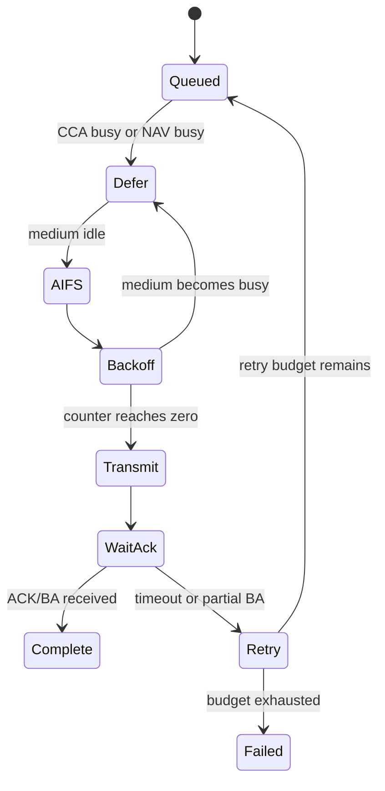

# Hardware MAC 实时路径

Hardware MAC 的价值不只是“收发 802.11 帧”，而是在严格时限内执行介质访问、响应、重试、加解密和统计。Host 可以决定策略，但无法参与每个 SIFS 级动作。

## 普通 EDCA TX



实现评审不应只看状态名，还要核对：AIFS 与 backoff 在 medium busy 时如何冻结；四个 AC 是否发生 internal collision；TXOP 剩余时间是否允许下一个 PPDU；retry chain 如何关联原 MPDU；Channel Switch/DFS/PS 是否能原子地阻止新 TX。

## SIFS 响应路径

RX PHY 在解出足够字段后，MAC 就要并行准备响应：地址匹配、FCS 状态、ACK policy、BA bitmap、NAV 和 TXVECTOR。数据上送 Firmware/Host、RX reorder 与协议栈处理不在这条关键时序上。

```text
RX PPDU end
  ├─ fast path: parse → response decision → TXVECTOR → ACK/BA/CTS
  └─ slow path: descriptor → Firmware/Driver → reorder → network stack
```

因此调试“收到了包但没有回 BA”时，要观察 fast-path reason：FCS、RA/BSSID、BA context、response enable、SIFS deadline、PHY ready，而不是只查 Host RX 包数。

## Context 查表

Hardware MAC 通常按 `VIF/Peer/TID/Key` 查表。表项更新必须具备生效点：

- 新 Key 写完后何时允许 Protected TX；
- DELBA 后旧 bitmap/reorder context 何时失效；
- roam/reset 后旧 Peer ID 是否可能命中新会话；
- PN/Sequence 由 Host、Firmware 或 MAC 哪一侧递增。

可靠实现会为上下文增加 generation，或在重建时先冻结队列、等待旧事务排空，再切换表项。

## 最小硬件 Trace

一次 TX 至少保留 packet/cookie、queue、peer/TID、CCA/NAV、backoff、TXVECTOR、retry、ACK/BA 与最终 reason；一次 RX 至少保留 RXVECTOR、FCS、filter、decrypt/replay、BA response 与上送 reason。只有计数而没有关联 ID，无法重建单包路径。
