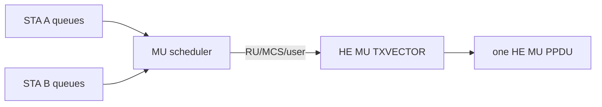
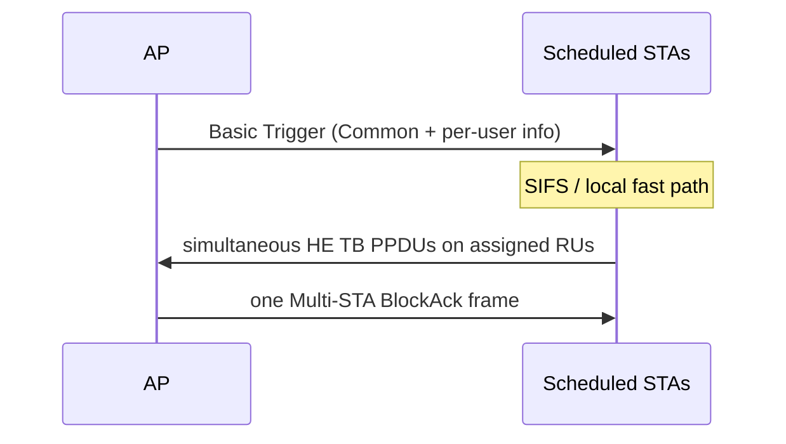

# 802.11ax OFDMA 与 Trigger 实时路径

OFDMA 的核心不是“把带宽切成 RU”，而是让多个 STA 在同一个 PPDU 时间窗口内满足频率、时间和功率对齐。

## 下行 HE MU

AP Scheduler 从各 STA/TID 队列选择用户，为每个用户分配 RU、MCS/NSS，并统一 PPDU duration。HE-SIG-B 用于 HE MU PPDU 的用户与 RU 信令；HE SU、HE ER SU 与 HE TB 不能套用同一解析路径。



## 上行 Trigger-Based PPDU



Host 应提前准备候选数据和上下文。收到 Trigger 后，Device fast path 完成 AID12 匹配、RU/MCS、SS allocation、UL length、GI/LTF、coding/DCM 和 target RSSI 处理，并在 SIFS 后发射。把 AP→多个 STA 画成多条逻辑关系没有问题，但空口上是一个 Trigger；确认阶段也应理解为一个 Multi-STA BA 携带多个确认信息，而不是逐 STA 发送三帧。

## Scheduler 的约束

- 所选 MPDU 必须落在 BA window 内；
- 用户数据长度要通过 padding 对齐到共同 duration；
- RU 越小，单用户速率越低，链路预算与功率控制更敏感；
- Buffer Status 可能已过期，不能把 BSR 当作当前队列的绝对真值；
- Trigger 收到与成功响应要分别计数，失败需要 reason histogram。

## 调试不变量

```text
trigger_matched
= response_sent + no_buffer + context_invalid
 + phy_not_ready + deadline_miss + unsupported
```

若 Sniffer 看见 Trigger、Device 也计数 `trigger_matched`，但空口没有 HE TB，应继续查 response selection、TXVECTOR 和 SIFS deadline；若 AP 收到 HE TB 却没有正确确认，则查 RU/user mapping、FCS 与 Multi-STA BA 生成。

## 代际边界

802.11ax 的 preamble puncturing 主要服务 DL OFDMA 的 pre-HE 部分；802.11be 将 punctured transmission 扩展到更广的非 OFDMA 场景。文章应分别描述，避免用“Wi-Fi 6/7 都支持”掩盖语义差异。

## 参考

- [IEEE 802.11 TGbe：HE-SIG-B 与 HE MU PPDU 讨论](https://www.ieee802.org/11/email/stds-802-11-tgbe/msg00629.html)
- [IEEE 802.11 TGax：Multi-STA BlockAck 交互图](https://www.ieee802.org/11/email/stds-802-11-tgax/msg00457.html)
- [IEEE 802.11 TGbe：802.11ax 与 802.11be puncturing 语义差异](https://www.ieee802.org/11/email/stds-802-11-tgbe/msg02597.html)
