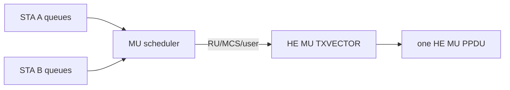
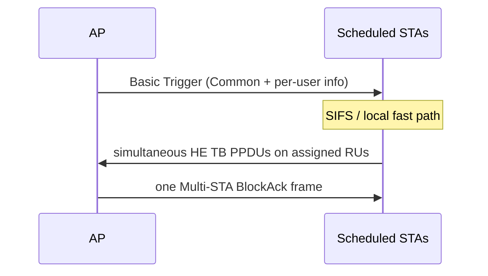

# 802.11ax OFDMA 与 Trigger 实时路径

OFDMA 的核心不是“把带宽切成 RU”，而是让多个 STA 在同一个 PPDU 时间窗口内满足频率、时间和功率对齐。

## 下行 HE MU

AP Scheduler 从各 STA/TID 队列选择用户，为每个用户分配 RU、MCS/NSS，并统一 PPDU duration。HE-SIG-B 用于 HE MU PPDU 的用户与 RU 信令；HE SU、HE ER SU 与 HE TB 不能套用同一解析路径。



## 上行 Trigger-Based PPDU



Host 应提前准备候选数据和上下文。收到 Trigger 后，Device fast path 完成 AID12 匹配、RU/MCS、SS allocation、UL length、GI/LTF、coding/DCM 和 target RSSI 处理，并在 SIFS 后发射。把 AP→多个 STA 画成多条逻辑关系没有问题，但空口上是一个 Trigger；确认阶段也应理解为一个 Multi-STA BA 携带多个确认信息，而不是逐 STA 发送三帧。

## Scheduler 的约束

- 所选 MPDU 必须落在 BA window 内；
- 用户数据长度要通过 padding 对齐到共同 duration；
- RU 越小，单用户速率越低，链路预算与功率控制更敏感；
- Buffer Status 可能已过期，不能把 BSR 当作当前队列的绝对真值；
- Trigger 收到与成功响应要分别计数，失败需要 reason histogram。

## 调试不变量

```text
trigger_matched
= response_sent + no_buffer + context_invalid
 + phy_not_ready + deadline_miss + unsupported
```

若 Sniffer 看见 Trigger、Device 也计数 `trigger_matched`，但空口没有 HE TB，应继续查 response selection、TXVECTOR 和 SIFS deadline；若 AP 收到 HE TB 却没有正确确认，则查 RU/user mapping、FCS 与 Multi-STA BA 生成。

## 代际边界

802.11ax 的 preamble puncturing 主要服务 DL OFDMA 的 pre-HE 部分；802.11be 将 punctured transmission 扩展到更广的非 OFDMA 场景。文章应分别描述，避免用“Wi-Fi 6/7 都支持”掩盖语义差异。

## 参考

- [IEEE 802.11 TGbe：HE-SIG-B 与 HE MU PPDU 讨论](https://www.ieee802.org/11/email/stds-802-11-tgbe/msg00629.html)
- [IEEE 802.11 TGax：Multi-STA BlockAck 交互图](https://www.ieee802.org/11/email/stds-802-11-tgax/msg00457.html)
- [IEEE 802.11 TGbe：802.11ax 与 802.11be puncturing 语义差异](https://www.ieee802.org/11/email/stds-802-11-tgbe/msg02597.html)

## RU、数据子载波与速率的区别

RU tone 数包含数据和导频。以普通 HE、242-tone RU、234 个数据子载波、1 spatial stream、MCS 11（10 bit/QAM、5/6 coding）、GI=0.8 μs、无 DCM 为例：

```text
N_DBPS = 234 × 10 × 5/6 = 1950 bit/symbol
T_symbol = 12.8 + 0.8 = 13.6 μs
R_data ≈ 1950 / 13.6 = 143.38 Mbit/s
```

这是数据 symbol 承载速率，不扣 preamble、padding、竞争和确认。实际长度还涉及 FEC 和 PHY padding，不能把 `payload_bits / R_data` 直接当完整 PPDU duration。

## Trigger 的字段怎样落到 Device

Common Info 描述共同 UL Length、带宽、GI/LTF、AP TX power 等；User Info 描述 AID12、RU、MCS、stream allocation、target RSSI 等。Device 必须校验组合是否合法，并在响应前锁定本次使用的 Peer/Key/queue context。

AP 可利用 BSR/BSRP 了解 STA 缓存，但这些报告存在时间延迟。BSRP 请求状态报告与 Basic Trigger 请求普通上行数据的目的不同；不能看到任意 Trigger 就期待相同 payload 和 BA 交换。

UL power 可抽象为 `STA target TX ≈ desired AP RX + estimated path loss`，最终还受本地可用功率与适用限制约束。RSSI 测量误差、AP TX power 参考点和功率饱和都会导致多用户到达功率不均。

## UORA 与空间复用补齐

Scheduled RU 明确分配给 STA；random-access RU 可供符合条件的 STA 按 UORA 过程竞争。UORA 使用 OFDMA backoff 与 eligible RA-RU 计数，不能直接套用 EDCA 的逐时间 slot 退避。多个 STA 选择同一 RA-RU 仍可能碰撞。

BSS Color 帮助区分 BSS，OBSS_PD 在满足条件时改变对 inter-BSS 信号的接入判断；它不是忽略邻居信号的开关。更激进的复用与发射功率约束、接收端干扰一起影响实际 Goodput。应同时测本 BSS 和邻居 BSS 的吞吐/重试。

Packet Extension 为符合条件的接收处理提供额外时间，其取值由协议参数决定；不是 MAC payload，也不能随意当作 SIFS 延长。Preamble puncturing 的具体允许组合应按 HE/EHT 格式逐项核对。

## 复习追问与答案

**为什么 RU 变小不一定让总吞吐下降？** 多个短业务共享一次 PPDU 可摊薄竞争与前导码，但低缓存用户、padding 和调度开销也会抵消收益。

**怎样证明 OFDMA 生效？** 需要 HE MU/HE TB 格式、User/RU 解析、Trigger/实际响应与 per-user 结果；能力 IE 和一个“11ax connected”标签不够。

**Trigger 已匹配但没有响应，下一步是什么？** 依次查候选队列、Vector 合法性、power/channel gate、deadline、PHY-start，而不是先调 Host 吞吐参数。

参考：[MathWorks 空间复用仿真](https://www.mathworks.com/help/wlan/ug/spatial-reuse-with-bss-coloring-in-an-80211ax-network-simulation.html)。该仿真用于研究机制，具体协议约束以相应 IEEE 802.11 版本为准。
