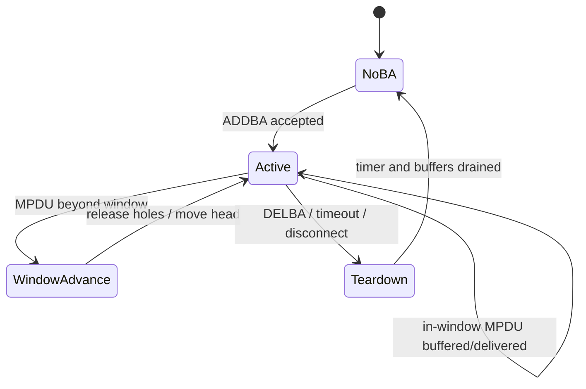

# BlockAck、Sequence 与 Reorder Engine

BA 问题的难点不是 ADDBA 两个 Action Frame，而是 12-bit Sequence Number 回绕、滑动窗口、选择性重传与 teardown 竞态。

## Sequence 空间

QoS Data 通常按 Traffic Identifier 使用独立的序列空间；Non-QoS Data、Management、Fragment 和硬件代填序列号需要单独定义，不能笼统写成“所有 TID/帧各有一个 Sequence Number”。12-bit Sequence Number 按模 4096 比较，直接用普通整数大小判断会在 `4095 → 0` 时出错。

```text
delta = (seq - head) & 0xfff
0 <= delta < 2048   → seq 在 head 前方或等于 head
delta >= 2048       → seq 属于旧窗口方向
```

实际实现应复用已验证的 modulo helper，并明确 half-range 边界。

## RX reorder 状态



每个 `peer + TID` 至少维护 `head_seq`、window size、slot bitmap/buffer、reorder timer 和 generation。硬件、Firmware、Driver 或 mac80211 都可能承担 reorder；架构文档必须明确位置以及 RX descriptor 是否已经完成去重、PN 校验和重排。

## BA 与上送是两条路径

BlockAck bitmap 的生成是 SIFS fast path；把连续 MPDU 上送网络栈是 slow path。后者被 NAPI、内存或 Host 总线阻塞，不应反向拖延 BA 响应。

## 典型故障

- ADDBA 成功但 TX/RX 两侧 window size 或 SSN 不一致；
- 某个洞永不释放，后续 DHCP/TCP 全部滞留；
- timer 在 DELBA 后仍访问已释放 Peer；
- reconnect 复用了旧 TID context，第一批 Sequence 被判 duplicate；
- BAR 推进窗口时 buffer 与 bitmap 更新顺序错误；
- A-MSDU 子帧共享 MPDU 的 Sequence/PN，却被重复执行 replay/duplicate 检查。

## 必备统计

按 Peer/TID 记录 ADDBA reason、window occupancy/high-watermark、holes、duplicate、old/out-of-window、BAR、timeout release、DELBA 和 generation mismatch。只统计“reorder drop”不足以解释窗口为何停止推进。

## 参考

- [Linux mac80211：RX aggregation 与 reorder offload 接口](https://www.kernel.org/doc/html/latest/driver-api/80211/mac80211.html)
