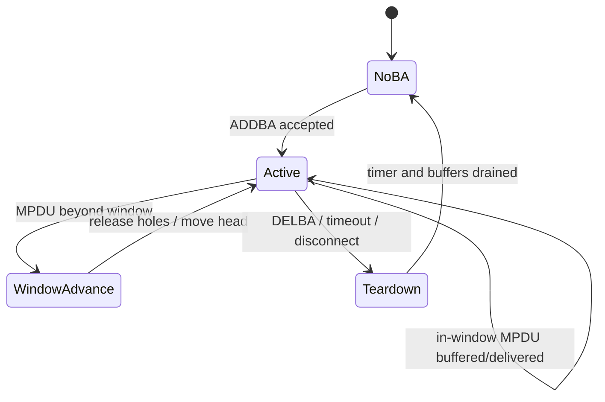

# BlockAck、Sequence 与 Reorder Engine

BA 问题的难点不是 ADDBA 两个 Action Frame，而是 12-bit Sequence Number 回绕、滑动窗口、选择性重传与 teardown 竞态。

## Sequence 空间

QoS Data 通常按 Traffic Identifier 使用独立的序列空间；Non-QoS Data、Management、Fragment 和硬件代填序列号需要单独定义，不能笼统写成“所有 TID/帧各有一个 Sequence Number”。12-bit Sequence Number 按模 4096 比较，直接用普通整数大小判断会在 `4095 → 0` 时出错。

```text
delta = (seq - head) & 0xfff
0 <= delta < 2048   → seq 在 head 前方或等于 head
delta >= 2048       → seq 属于旧窗口方向
```

实际实现应复用已验证的 modulo helper，并明确 half-range 边界。

## RX reorder 状态



每个 `peer + TID` 至少维护 `head_seq`、window size、slot bitmap/buffer、reorder timer 和 generation。硬件、Firmware、Driver 或 mac80211 都可能承担 reorder；架构文档必须明确位置以及 RX descriptor 是否已经完成去重、PN 校验和重排。

## BA 与上送是两条路径

BlockAck bitmap 的生成是 SIFS fast path；把连续 MPDU 上送网络栈是 slow path。后者被 NAPI、内存或 Host 总线阻塞，不应反向拖延 BA 响应。

## 典型故障

- ADDBA 成功但 TX/RX 两侧 window size 或 SSN 不一致；
- 某个洞永不释放，后续 DHCP/TCP 全部滞留；
- timer 在 DELBA 后仍访问已释放 Peer；
- reconnect 复用了旧 TID context，第一批 Sequence 被判 duplicate；
- BAR 推进窗口时 buffer 与 bitmap 更新顺序错误；
- A-MSDU 子帧共享 MPDU 的 Sequence/PN，却被重复执行 replay/duplicate 检查。

## 必备统计

按 Peer/TID 记录 ADDBA reason、window occupancy/high-watermark、holes、duplicate、old/out-of-window、BAR、timeout release、DELBA 和 generation mismatch。只统计“reorder drop”不足以解释窗口为何停止推进。

## 参考

- [Linux mac80211：RX aggregation 与 reorder offload 接口](https://www.kernel.org/doc/html/latest/driver-api/80211/mac80211.html)

## 窗口演算：回绕、缺口和推进

采用教学窗口 W=8、head=4094，缓存按 Sequence 标记，收到 4095、0 时暂存；收到 4094 后可连续交付 4094、4095、0，head 变为 1。

| 输入 | 相对 head 的 delta | 动作 |
|---|---:|---|
| 初始收到 4095 | 1 | 缓存，等待 4094 |
| 再收到 0 | 2 | 缓存，跨回绕但仍在窗内 |
| 再收到 4094 | 0 | 连续交付，head→1 |
| 再收到 4095 | 4094 | 旧序列方向，不作为新包 |
| 再收到 12 | 11 | 超出窗口，按协定推进/释放 |

对最后一行，若采用常见窗口推进模型 `new_head=(12-W+1) mod 4096=5`，旧区间 1..4 中已缓存的可释放、缺口记作跳过；具体 BAR、timer 和上送规则以实现及协议为准。不能清空整个缓存而不记录丢失范围。

## 概念算法与槽位陷阱

```text
validate peer/TID/session
d = (seq - head) & 4095
if d >= 2048: reject old-direction frame
else:
    if d >= W: advance to seq-W+1, handling buffered range
    if slot already contains this seq: duplicate
    else: store buffer + full sequence + arrival time
    release consecutive valid buffers starting from head
```

不能假定 `slot=seq%W` 在任意 W 和 4096 回绕下都安全。实现可用相对 head 的循环索引，并保留完整 Sequence tag 识别复用槽；对非 2 次幂窗口单独验证。模空间 half-range 的比较有适用范围，正好相差 2048 不能按普通“未来包”处理。

## BA 反馈、重试与安全交付分开

BA bitmap 告诉发送方哪些 MPDU 被确认，RX reorder 决定交付顺序。加密、MIC、PN 错误仍可能阻止最终交付。MAC 已确认不意味着应用收到，安全失败也不能简单通过修改 BA 位图来解决。

BA 格式与窗口上限有代际差异，64 位 Compressed BA 只是一种常见实例。读取 bitmap 前要验证 BA variant、TID、SSN 和长度，禁止所有格式硬编码 8 byte。

## Timer、DELBA 与 Reset 的互斥

Reorder timeout 的目的是避免某个洞长期阻塞后续包；不是把整个 BA session 自动判为无效。Timer 应绑定 session identity，在释放缓存时与 RX/BAR/DELBA 使用同一同步规则。

测试重点包括：timeout 与最后一个缺包同时到达、DELBA 后 timer 触发、Peer ID 被新连接复用、BAR 跨回绕、窗口满时内存不足。每次 Buffer 必须恰好上送或丢弃一次。

## 复习追问与答案

**BA 中有洞一定是空口丢包吗？** 还可能是未发送、接收过滤、抓包遗漏或 bitmap/session 解析错误，需要逐 MPDU attempt 与接收记录。

**为什么 DHCP 能被 BA 问题拖住？** DHCP 所在 TID 的 reorder 窗口若停在旧洞上，即便该数据完整到达也可能暂存；需证实 head 与释放时间。

**最有价值的计数是什么？** per-session head、occupied slots、old/duplicate/out-of-window、timeout/BAR release、drop reason，加上 generation。
