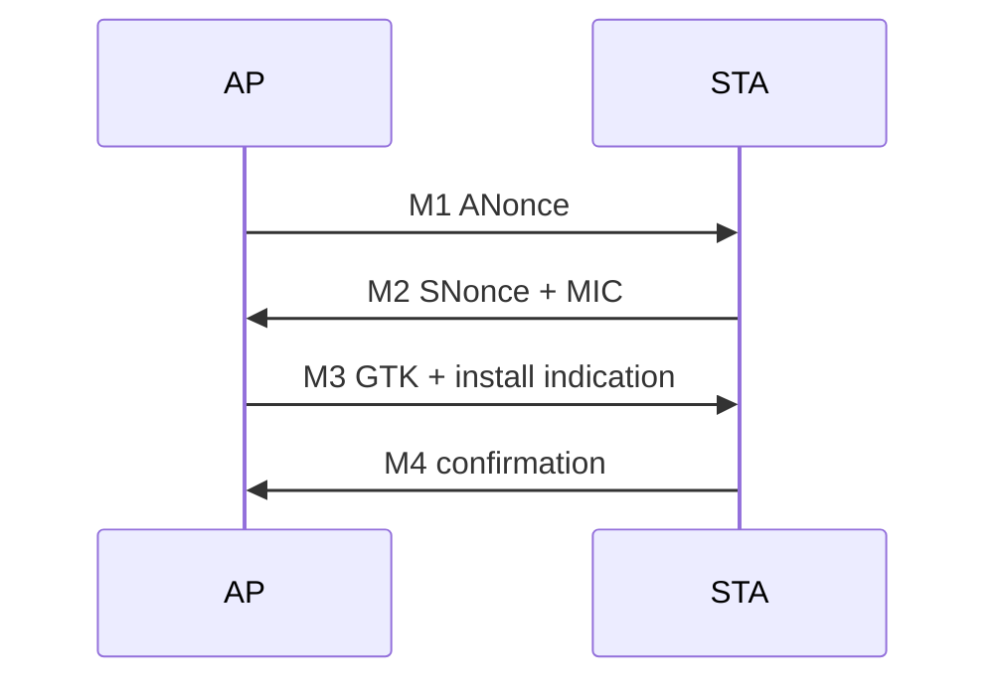

# 扫描到可用网络的完整生命周期

## 1. 扫描与候选网络

被动扫描监听 Beacon；主动扫描发送 Probe Request 并接收 Probe Response。扫描结果不仅包含 SSID/RSSI，还包含信道、能力、加密套件与负载等信息。扫描不到时先检查 regulatory domain、信道、扫描 dwell、并发角色和设备是否处于可扫描状态。

## 2. 认证与关联

常见 Open System Authentication 只是 802.11 管理过程，不等同于 WPA 密钥认证。Association Request/Response 协商能力、速率、HT/VHT/HE、QoS 等参数，并由 AP 分配 Association ID。

## 3. 密钥握手

WPA2-Personal 的四次握手可抽象为：

排查时比“第几次握手”更重要的是：Replay Counter 是否单调、MIC 是否有效、密钥安装时机是否正确、重传后双方状态是否一致。WPA3/SAE 还增加提交/确认等流程，应先确认双方实际选择的 AKM。

## 4. 受控端口与 IP

关联完成后，普通业务通常仍受 Port Control 限制；EAPOL 需要被特殊放行。握手成功后才进入 DHCP：Discover、Offer、Request、ACK。若抓到 EAPOL 完成却没有 DHCP，应转向数据队列、聚合/重排序、桥接、防火墙和 DHCP 服务，而不是继续追认证帧。

## 5. 连通性与漫游

获得地址不代表 DNS、网关和公网连通。平台可能执行 captive portal 检测并决定 UI 状态。漫游时还要处理旧 BSS 的队列、密钥、BA Session 与新 BSS 的快速建链，状态清理不完整容易造成“看似已漫游但业务断流”。

## 最小故障表

| 最后成功事件 | 下一项证据 |
|---|---|
| 扫描完成 | 候选 BSS 是否被过滤、拒绝原因 |
| Authentication Response | Association status code |
| Association Response | EAPOL M1/M2、AKM 与 cipher |
| 四次握手完成 | 密钥安装事件、controlled port |
| DHCP Discover 发出 | 空口是否出现、AP 是否返回 Offer |
| 获得地址 | ARP/ND、DNS、网关与连通性探测 |
