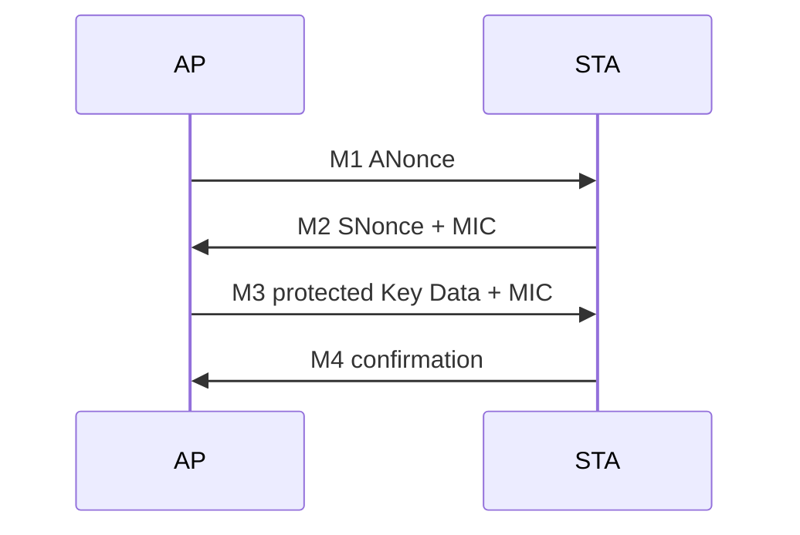

# 扫描到可用网络的完整生命周期

## 1. 扫描与候选网络

被动扫描监听 Beacon；主动扫描发送 Probe Request 并接收 Probe Response。扫描结果不仅包含 SSID/RSSI，还包含信道、能力、加密套件与负载等信息。扫描不到时先检查 regulatory domain、信道、扫描 dwell、并发角色和设备是否处于可扫描状态。

## 2. 认证与关联

常见 Open System Authentication 只是 802.11 管理过程，不等同于 WPA 密钥认证。Association Request/Response 协商能力、速率、HT/VHT/HE、QoS 等参数，并由 AP 分配 Association ID。

## 3. 密钥握手

WPA2-Personal 的四次握手可抽象为：

排查时比“第几次握手”更重要的是：Replay Counter 是否单调、MIC 是否有效、密钥安装时机是否正确、重传后双方状态是否一致。WPA3/SAE 还增加提交/确认等流程，应先确认双方实际选择的 AKM。

## 4. 受控端口与 IP

关联完成后，普通业务通常仍受 Port Control 限制；EAPOL 需要被特殊放行。握手成功后才进入 DHCP：Discover、Offer、Request、ACK。若抓到 EAPOL 完成却没有 DHCP，应转向数据队列、聚合/重排序、桥接、防火墙和 DHCP 服务，而不是继续追认证帧。

## 5. 连通性与漫游

获得地址不代表 DNS、网关和公网连通。平台可能执行 captive portal 检测并决定 UI 状态。漫游时还要处理旧 BSS 的队列、密钥、BA Session 与新 BSS 的快速建链，状态清理不完整容易造成“看似已漫游但业务断流”。

## 最小故障表

| 最后成功事件 | 下一项证据 |
|---|---|
| 扫描完成 | 候选 BSS 是否被过滤、拒绝原因 |
| Authentication Response | Association status code |
| Association Response | EAPOL M1/M2、AKM 与 cipher |
| 四次握手完成 | 密钥安装事件、controlled port |
| DHCP Discover 发出 | 空口是否出现、AP 是否返回 Offer |
| 获得地址 | ARP/ND、DNS、网关与连通性探测 |

## Scan request 的完整生命周期

一次扫描有 request identity、信道列表、主动/被动策略、dwell budget 和取消状态。收到 BSS 结果不代表扫描结束；scan done 也不代表找到了可用候选。

候选过滤还检查 AKM/cipher、能力、允许信道、RSSI/黑名单策略及历史失败。应保留每个被拒候选的 reason。多角色场景还要计算离开 home channel 的上限，避免扫描造成 AP Beacon 或 STA 接收窗口违约。

Cancel、interface delete 和 Firmware scan done 交错时，一个请求只应有一个 terminal completion。迟到的 BSS report 不能继续访问已释放请求。参考 [cfg80211 接口生命周期](https://docs.kernel.org/6.12/driver-api/80211/cfg80211.html)。

## “Connected”在不同层的含义

| 观察点 | 可以证明 | 仍不能证明 |
|---|---|---|
| Auth status=0 | 管理认证阶段成功 | RSN 认证完成 |
| Assoc status=0/AID | 加入 BSS、能力结果 | Key/controlled port ready |
| cfg80211 connect result | 对应连接/关联操作结果 | DHCP 和应用可达 |
| supplicant COMPLETED | 安全过程达到其完成状态 | IP 配置、互联网服务 |
| DHCP ACK | 获取 IPv4 租约 | DNS、网关之外的可达性 |

在 Host supplicant 完成握手的常见实现中，关联成功通知必须先到达，supplicant 才能继续安全流程。不能为了“connected 时 Key 必须 ready”而延迟该通知至握手后，从而制造循环等待。真正需要明确的是各通知/API 的语义和受控端口 gate。

## 一个失败分支的走读

教学情景：Association 成功、M1/M2 正常、M3 重发、Host 没有 M4 TX。先查 M3 是否到 supplicant，再查 MIC/replay 判定、Key 安装返回、M4 生成/提交。若 M4 已在空口出现而 AP 继续发 M3，再看 AP 接收与处理，不能只归因于本端。

不同层的 status/reason 不宜覆盖成一个“连接超时”：保存 AP status、Host errno、FW reason、最后事件和 deadline，让一次超时能够回溯到具体阶段。

## IP 路径的独立验证

IPv4 走 DHCP/ARP，IPv6 可能走 RA/SLAAC/ND 或 DHCPv6，不能要求所有连接都出现 DORA。对 UDP DNS、网关和业务地址分层测试；captive portal 策略可能改变 UI，却未改变 802.11 关联。

## 复习追问与答案

**扫描不到与扫描结果被丢弃如何区分？** 比较 PHY/MAC 接收、FW BSS 上报、cfg80211 BSS cache 和候选过滤，定位第一处缺失。

**错误密码一定在 Association 被拒吗？** 不一定，PSK 不匹配常表现为后续握手失败；SAE 等 AKM 的失败阶段不同。

**关联事件能否早于密钥安装？** 可以，而且 Host 处理握手时通常如此；不要混淆关联与端口授权。

深入：[安全与漫游状态](03-wpa-roam-port-state.md)、[建链到 DHCP 案例](../Case-Studies/01-sta-connect-dhcp.md)。
