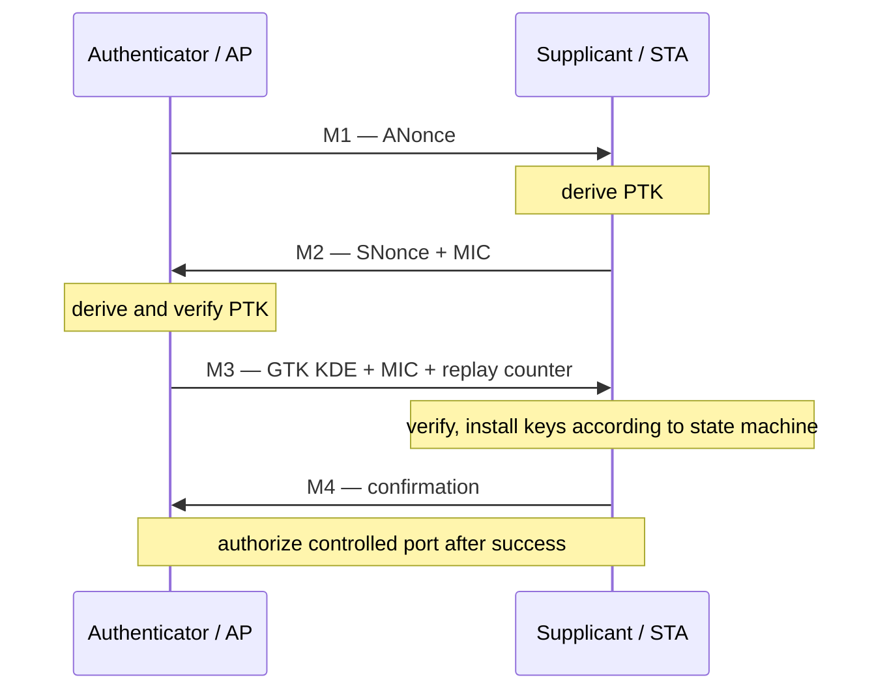

# Key、PN 与 Replay Protection

安全路径是连接状态机和数据路径的交界。问题通常不是“有没有 Key”，而是 Key 类型、索引、Peer/VIF 绑定、生效时机、PN 所有者和重装语义是否一致。

## 四次握手中的本地状态

PTK 不是由 AP 直接“安装到 STA”；双方基于共享材料本地派生。GTK 通过 M3 的受保护 Key Data 传递。M3/M4 重传、roam 和 rekey 必须避免错误重装或 PN 回退。

## Key context

至少区分 pairwise/group、data/integrity management、TX/RX、key index、cipher、Peer/VIF、generation。Hardware table 更新建议采用：冻结相关队列→写入完整表项→memory/order guarantee→原子切换 valid/generation→恢复队列。

## PN 不是一个全局“最后值”

“RX PN 必须大于上一个 PN”过于简单。Replay 状态与 cipher、key、traffic context 和重排边界相关；A-MSDU 子帧还可能合法共享同一 MPDU 的 PN。若 Hardware/Firmware 完成校验，RX descriptor 应显式上报 `decrypted`、`PN validated`、`MIC checked` 等语义，Host 不应猜测。

Linux mac80211 的 `RX_FLAG_PN_VALIDATED`、`RX_FLAG_ALLOW_SAME_PN` 和 `RX_FLAG_IV_STRIPPED` 正是为了表达这些 offload 边界。移除 IV 后若 Host 已无法 replay check，Driver/Hardware 就必须真正承担该责任。

## Reset、Suspend 与 Rekey

- Reset 后不能从零恢复仍在使用的 TX PN；无法安全恢复时必须重新建链。
- WoWLAN/GTK rekey offload 要把新 replay counter 同步回 Host。
- roam/reconnect 必须用 session generation 隔离迟到的 Key event。
- 删除 Key 前应阻断新 TX，并确认硬件不再引用该 slot。

## 调试证据

不要打印密钥材料。记录 cipher、key type/index、Peer/VIF、generation、安装/删除时间、PN validation reason 和错误计数即可。对 replay/MIC 问题，同时对齐 EAPOL replay counter、Key 生命周期、RX Sequence/PN 与 reorder 状态。

## 参考

- [Linux mac80211 RX flags](https://www.kernel.org/doc/html/latest/driver-api/80211/mac80211.html)
- [IEEE 802.11i 四次握手讨论](https://ieee802.org/16/liaison/docs/80211-05_0123r1.pdf)

## PTK 内部用途与 Counter 的两个层次

PTK 派生材料包含共享 PMK、双方地址和 Nonce 等；其内部用于握手完整性、Key Data 保护以及数据加密的子密钥用途不同。数据 PN 与 EAPOL-Key replay counter 也不同：前者保护数据帧，后者参与 EAPOL-Key 消息的重放处理。两者都叫 counter，不代表可以共用一个字段。

PMF 还涉及管理帧保护及相应 Key/完整性状态。Key slot 应明确 cipher、pairwise/group、数据/管理、方向和有效会话；不能仅以 key index 查询全局表。

## 重排与 PN 的教学例子

同一 Key/TID 上，空口可能因选择性重传让较大 Sequence 的 MPDU 先到，较小者随后补齐。若接收路径在错误层次维护一个“所有帧共享的最大 PN”，后到的合法帧可能被错误丢弃。

这并不意味着可以普遍接受较小 PN；应按 cipher 的规定、traffic context 和实际 reorder/offload 契约维护状态。对于已拆分 A-MSDU，共享外层 PN 的后续子帧只能在明确的同 MPDU 语义下处理，不能把 ALLOW_SAME_PN 当作关闭 replay protection 的开关。

审计需逐项检查：RX descriptor 是否宣称验证完成、IV 是否仍在、Host 是否还能验证、各子帧标志与重排完成状态是否一致。

## M3 重传与幂等安装

教学事件序列为：STA 接受 M3 并安装 Key → M4 丢失 → AP 重发 M3。状态机应允许合法的握手重传流程，但不能将相同 Key 的 TX PN、RX replay 窗口重新初始化为零。

“遇到任何重复 M3 都丢弃”也可能导致合法恢复失败。应在握手层判断 counter、MIC、当前状态和已安装 Key 的身份，再决定响应与是否需要安装动作。

## 删除 Key 时的引用

先禁止新 TX 引用，再等待在途描述符与 crypto engine 使用完成，随后撤销 slot 并擦除材料。若硬件支持版本化双 bank，可通过原子切换减少暂停，但仍需回收旧 bank 的引用。

Reset 若丢失 PN 而保留同一 Key，不能盲目重开队列。恢复方案必须证明安全状态连续，或者通过新的安全协商获得可用上下文。

## 复习追问与答案

**EAPOL replay counter 与数据 PN 相等吗？** 无此要求，属于不同协议消息与校验域。

**为什么 key index 对了仍解密失败？** 可能是旧 session、错误 Peer/VIF、cipher、方向或 slot 已被复用。

**如何记录安全问题而不泄露密钥？** 记录状态转换、身份/代际、cipher、counter 元数据与失败 reason；禁止 Key 材料进入普通日志和公开 dump。

参考：[mac80211 RX offload flags](https://docs.kernel.org/6.12/driver-api/80211/mac80211.html)、[wpa_supplicant 项目说明](https://w1.fi/wpa_supplicant/)。
