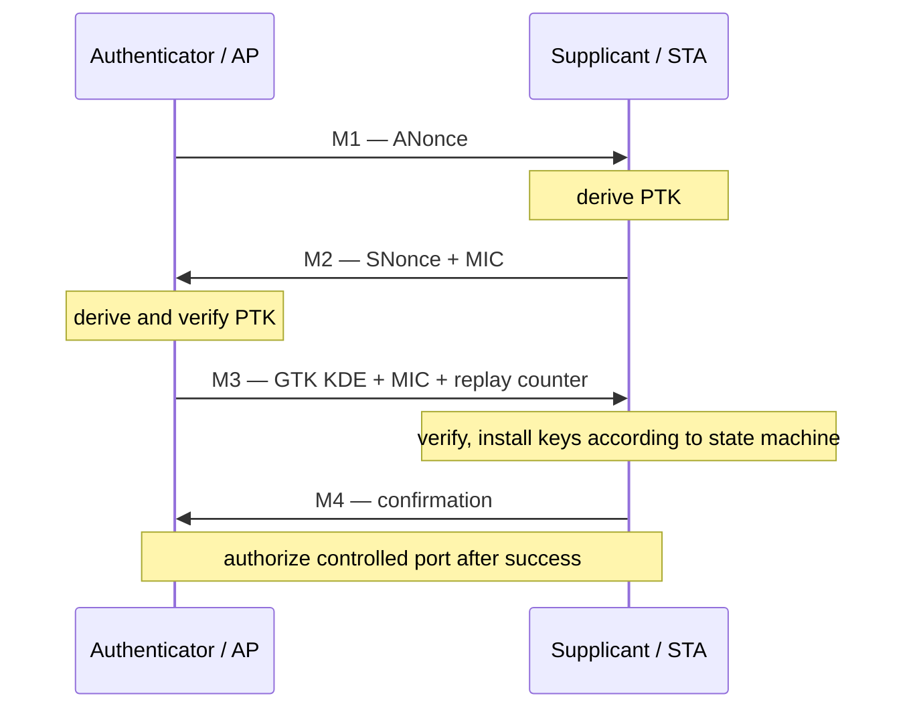

# Key、PN 与 Replay Protection

安全路径是连接状态机和数据路径的交界。问题通常不是“有没有 Key”，而是 Key 类型、索引、Peer/VIF 绑定、生效时机、PN 所有者和重装语义是否一致。

## 四次握手中的本地状态

PTK 不是由 AP 直接“安装到 STA”；双方基于共享材料本地派生。GTK 通过 M3 的受保护 Key Data 传递。M3/M4 重传、roam 和 rekey 必须避免错误重装或 PN 回退。

## Key context

至少区分 pairwise/group、data/integrity management、TX/RX、key index、cipher、Peer/VIF、generation。Hardware table 更新建议采用：冻结相关队列→写入完整表项→memory/order guarantee→原子切换 valid/generation→恢复队列。

## PN 不是一个全局“最后值”

“RX PN 必须大于上一个 PN”过于简单。Replay 状态与 cipher、key、traffic context 和重排边界相关；A-MSDU 子帧还可能合法共享同一 MPDU 的 PN。若 Hardware/Firmware 完成校验，RX descriptor 应显式上报 `decrypted`、`PN validated`、`MIC checked` 等语义，Host 不应猜测。

Linux mac80211 的 `RX_FLAG_PN_VALIDATED`、`RX_FLAG_ALLOW_SAME_PN` 和 `RX_FLAG_IV_STRIPPED` 正是为了表达这些 offload 边界。移除 IV 后若 Host 已无法 replay check，Driver/Hardware 就必须真正承担该责任。

## Reset、Suspend 与 Rekey

- Reset 后不能从零恢复仍在使用的 TX PN；无法安全恢复时必须重新建链。
- WoWLAN/GTK rekey offload 要把新 replay counter 同步回 Host。
- roam/reconnect 必须用 session generation 隔离迟到的 Key event。
- 删除 Key 前应阻断新 TX，并确认硬件不再引用该 slot。

## 调试证据

不要打印密钥材料。记录 cipher、key type/index、Peer/VIF、generation、安装/删除时间、PN validation reason 和错误计数即可。对 replay/MIC 问题，同时对齐 EAPOL replay counter、Key 生命周期、RX Sequence/PN 与 reorder 状态。

## 参考

- [Linux mac80211 RX flags](https://www.kernel.org/doc/html/latest/driver-api/80211/mac80211.html)
- [IEEE 802.11i 四次握手讨论](https://ieee802.org/16/liaison/docs/80211-05_0123r1.pdf)
