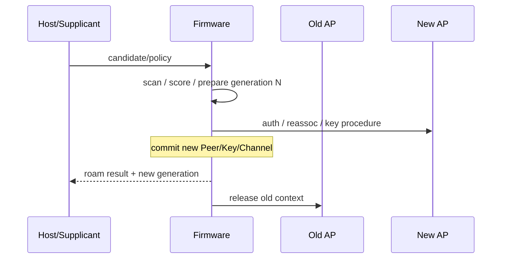

# WPA2/WPA3、漫游与受控端口状态

连接问题必须把 802.11 关联、AKM 认证、密钥安装、受控端口和 IP 配置分开。UI 显示“已连接”并不代表数据面已经可用。

## 分层状态

```text
DISCOVERED
→ AUTHENTICATED (802.11 open/SAE 等语境需区分)
→ ASSOCIATED
→ PTK/GTK READY
→ CONTROLLED PORT AUTHORIZED
→ L3 CONFIGURED
→ SERVICE REACHABLE
```

每层有独立的成功证据和超时。DHCP 失败不能自动归因于四次握手；关联成功也不能证明 Key/Port/queue 已放行。

## RSN 协商

STA 在 Scan 结果中读取 RSN/RSNXE 等能力，选择协议、pairwise/group cipher、AKM 与 PMF policy，并在 Association Request 中提交选择。AP 的响应和后续 EAPOL 必须与选择一致。

实现应保存“原始能力”“Host 选择”“Firmware/Hardware 实际配置”三份视图，并在差异时给出 reason。只保存最终 cipher 字符串无法解释能力协商失败。

## 四次握手的状态提交

M1 提供 ANonce，Supplicant 生成 SNonce 并派生 PTK；M2 让 Authenticator 验证；M3 携带受保护的 GTK Key Data 与 replay counter；M4 确认。双方本地安装 Key，不是 AP 把 PTK 传给 STA。

实现需要处理：

- EAPOL replay counter 单调性和重传；
- M3 重传不得导致 Key 重装或 TX PN 回退；
- Key 写 Hardware table 的原子发布；
- Key ready、Port authorized 与数据 queue release 的顺序；
- 握手失败时清理旧 Key/BA/Peer state；
- 日志绝不输出 PMK/PTK/GTK 或可恢复密钥的材料。

## WPA3-SAE 边界

SAE 在关联前建立抗离线字典攻击的共享密钥材料，随后仍进入 RSN 和四次握手。排查要区分 SAE commit/confirm、anti-clogging、group/capability、Association 和 EAPOL 阶段。

PMF 使用管理帧完整性保护健壮管理帧。`capable`、`required` 与实际协商结果要分开；未受保护的 Deauth/Disassoc 在 PMF 会话中不能按普通断链处理。

## Roam 不是一次简单 reconnect

漫游可包含扫描/邻居信息、候选评分、预认证或 FT、reassociation、Key 切换和 datapath 切换。关键目标是在旧链路失效前准备尽可能多的新状态，同时防止两个 AP Context 混用。



提交点之前，数据仍属于旧 Peer；提交点之后，旧 completion/Event 不得修改新状态。若硬件只有一套 Key/Peer slot，要定义切换期间暂停队列的窗口。

## 11k/11v/11r 的作用边界

- 11k 提供邻居和测量信息，帮助发现候选，不保证漫游；
- 11v 可提供 BSS Transition 建议，STA 仍有策略选择；
- 11r 缩短认证/密钥派生路径，但不会消除信道切换、关联和数据面恢复时间。

不要看到协议 IE 就断言功能生效；需要对齐请求、响应、选择、提交与业务中断时间。

## Controlled Port 与例外流量

Port 未授权时通常只允许必要认证流量，例如 EAPOL。Driver/Firmware 需要明确过滤位置和例外规则。若 Host 认为 Port open、Firmware 仍 block，表现为关联和握手成功但 DHCP 不出去。

## 诊断矩阵

| 现象 | 先验证 |
|---|---|
| 找不到 AP | Regulatory/channel、Scan dwell、RF detect |
| Auth/Assoc 被拒 | status code、能力/安全选择 |
| M1 后无 M2 | Supplicant、PMK/AKM、Event delivery |
| M3 循环 | MIC/replay、Key install、M4 TX |
| Port open 但无 DHCP | key generation、TX queue、decrypt/replay、VLAN/AP |
| Roam 后单向通 | Peer/Key/BA/PN 的新旧绑定 |

## 最小证据包

保存 BSS capability、Auth/Assoc status、EAPOL message/replay counter（不含密钥）、Key metadata、Port state、Peer generation、TX/RX reason、roam commit 时间和空口抓包。所有来源使用统一时间轴。

## 面试追问

- Association success、4-way complete、Port authorized 有什么区别？
- M3 重传为什么可能成为安全问题？
- 11r 能缩短哪些阶段，不能缩短哪些阶段？
- 漫游后旧 BA completion 为什么可能破坏新连接？

## 答题要点与适用边界

Association成功仅确认加入BSS；4-way完成确认相应安全握手状态；Port authorization控制普通数据是否允许。M3重传若重复初始化同一Key的PN，会破坏安全状态。11r优化部分认证/密钥过程，不能消除信道调谐、调度和业务路径恢复。旧BA/TX事件若引用被复用的Peer/TID，会推进新窗口或错误归还资源。
