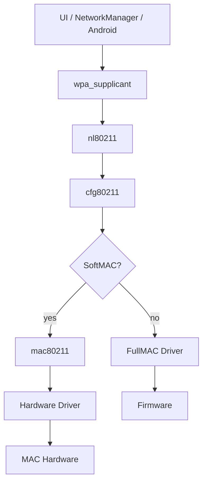

# cfg80211、mac80211 与用户态组件

## 控制路径

一次连接请求通常从 NetworkManager、Android Framework 或命令行进入 wpa_supplicant，再通过 nl80211 发送到 cfg80211。cfg80211 校验能力和状态后调用 Driver 操作；FullMAC Driver 往往把请求编码成 Firmware Command，完成后再用 cfg80211 API 上报结果。

异步事件与请求不是严格一问一答。扫描可能被取消，连接可能在等待期间收到断链，接口也可能在 suspend/remove 时消失。因此 Driver 必须定义请求生命周期、并发规则与过期事件处理。

## 数据路径

TX 从 qdisc/netdev 进入 `ndo_start_xmit` 或 mac80211 TX path。队列缺 credit 时应停止相应 netdev queue，并在资源恢复后唤醒；无边界缓存只会把总线背压变成内存增长和高延迟。RX 则通过 NAPI 或等价路径批量处理，减少每包中断开销。

## 调试工具分层

- `iw dev`、`iw phy`：接口、连接与能力视图。
- `iw event -t`：带时间戳的 cfg80211/nl80211 事件。
- `wpa_cli status`：supplicant 选择与握手状态。
- `ip -s link`、`ethtool -S`：netdev 与驱动统计。
- tracepoint、dynamic debug、ftrace：内核时序与回调。

## 常见边界错误

1. 将关联成功误当成受控端口已授权，或为等待 Key ready 而错误推迟 Host 握手所需的关联通知。
2. Firmware 断链事件重复或迟到，污染下一次连接。
3. scan abort、interface delete 与异步回调竞态。
4. queue stop 后遗漏 wake，表现为连接正常但 TX 永久停止。
5. regulatory/capability 上报与硬件实际支持不一致。

调试时先记录接口 generation/session ID，使迟到事件能够被识别，而不是只按接口指针或全局状态处理。

## 三个内核对象与两套回调

`wiphy` 描述无线硬件能力与约束，`wireless_dev` 表示无线接口上下文，`net_device` 承载网络数据接口。不要假定三者一一对应；同一 wiphy 可以承载多个无线接口，也有不作为普通数据口使用的无线对象。

FullMAC 常实现 `cfg80211_ops` 中的扫描、连接、Key、接口操作；SoftMAC 驱动实现 `ieee80211_ops`，由 mac80211 衔接 cfg80211 并管理相应 MLME/数据功能。两者都可能使用 Firmware，不能以“有固件”判断 FullMAC。

| 操作 | 向下请求 | 向上结果 | 生命周期问题 |
|---|---|---|---|
| Scan | scan/request | BSS reports、scan done | abort 与 done 重复 |
| Connect | connect 或 auth/assoc 路径 | association/connect result | 关联与 Keying 分层 |
| Key | add/del key | 调用结果或卸载通知 | 旧 Key slot 引用 |
| Data | netdev 或 mac80211 TX | completion/TX status | buffer 与 air 状态不同 |
| Remove | interface/device teardown | 请求终止、对象注销 | work/event/inflight |

这些是角色映射，具体函数签名和通知应以目标内核版本为准。[Linux 6.12 cfg80211](https://docs.kernel.org/6.12/driver-api/80211/cfg80211.html) 与 [mac80211](https://docs.kernel.org/6.12/driver-api/80211/mac80211.html) 是接口检查入口。

## 正确的连接通知边界

在 Host supplicant 处理 RSN 的架构中，Driver 可以先上报成功关联，随后 EAPOL 握手和 Key 安装继续进行。若把 connect-result 延迟到 Key ready，可能阻止 supplicant 进入握手。

应分别定义 Assoc、authorized port、carrier 和 IP 状态，而不是要求所有“connected”同时发生。安全 gate 控制普通业务通行；关联通知不应伪装成互联网已可达。

## mac80211 队列不能当作普通 netdev 队列操作

mac80211 有自己的 TX queue 调度和 driver TXQ 交互。硬件资源不足时应使用匹配该 API 的 stop/wake 或 TXQ 调度接口；直接把 FullMAC 的 netif 流控方案复制进 SoftMAC，可能绕开 mac80211 状态。

同理，SoftMAC RX 要正确填写 RX status 并交给 mac80211；FullMAC 已转为 802.3 的 RX 通常交给网络栈。错报帧视图、重复剥离头部或丢掉 decryption flags 都会破坏边界。

## 能力上报需要组合约束

支持 STA 和 AP 不等于同时支持 STA+AP；支持两个接口也不代表两个信道。能力包含 interface combinations、最大 channel context、带宽/NSS、cipher、scan/roam/offload 限制。让用户态依据真实能力选择路径比操作失败后补救更可靠。

## 复习追问与答案

**cfg80211 会搬运每个数据包吗？** 它主要提供无线配置/管理框架；数据包通过对应 netdev/mac80211 数据路径。

**用户态看到 connected 能否开始 DHCP？** 平台需结合其安全状态和端口授权；不能只看单一关联通知。

**为什么不同驱动 ethtool 计数名不一样？** 许多是 driver-specific；记录定义和统计点，再做跨平台归一化，不能按名字猜含义。

深入：[队列与流控](03-qos-qdisc-driver-flow-control.md)、[连接状态](../03-Connection-Security/01-connection-lifecycle.md)。
