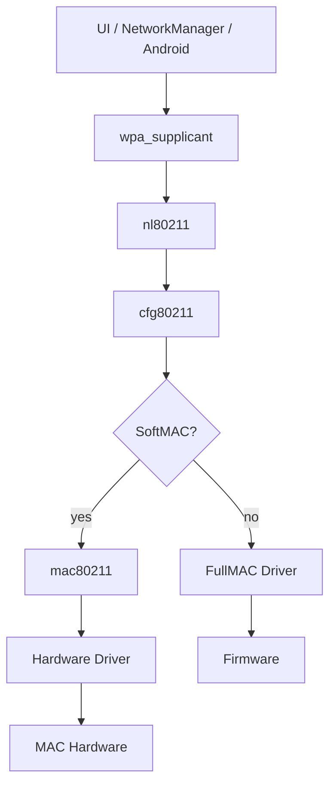

# cfg80211、mac80211 与用户态组件

## 控制路径

一次连接请求通常从 NetworkManager、Android Framework 或命令行进入 wpa_supplicant，再通过 nl80211 发送到 cfg80211。cfg80211 校验能力和状态后调用 Driver 操作；FullMAC Driver 往往把请求编码成 Firmware Command，完成后再用 cfg80211 API 上报结果。

异步事件与请求不是严格一问一答。扫描可能被取消，连接可能在等待期间收到断链，接口也可能在 suspend/remove 时消失。因此 Driver 必须定义请求生命周期、并发规则与过期事件处理。

## 数据路径

TX 从 qdisc/netdev 进入 `ndo_start_xmit` 或 mac80211 TX path。队列缺 credit 时应停止相应 netdev queue，并在资源恢复后唤醒；无边界缓存只会把总线背压变成内存增长和高延迟。RX 则通过 NAPI 或等价路径批量处理，减少每包中断开销。

## 调试工具分层

- `iw dev`、`iw phy`：接口、连接与能力视图。
- `iw event -t`：带时间戳的 cfg80211/nl80211 事件。
- `wpa_cli status`：supplicant 选择与握手状态。
- `ip -s link`、`ethtool -S`：netdev 与驱动统计。
- tracepoint、dynamic debug、ftrace：内核时序与回调。

## 常见边界错误

1. Driver 先上报 connected，再完成密钥或数据路径准备。
2. Firmware 断链事件重复或迟到，污染下一次连接。
3. scan abort、interface delete 与异步回调竞态。
4. queue stop 后遗漏 wake，表现为连接正常但 TX 永久停止。
5. regulatory/capability 上报与硬件实际支持不一致。

调试时先记录接口 generation/session ID，使迟到事件能够被识别，而不是只按接口指针或全局状态处理。
