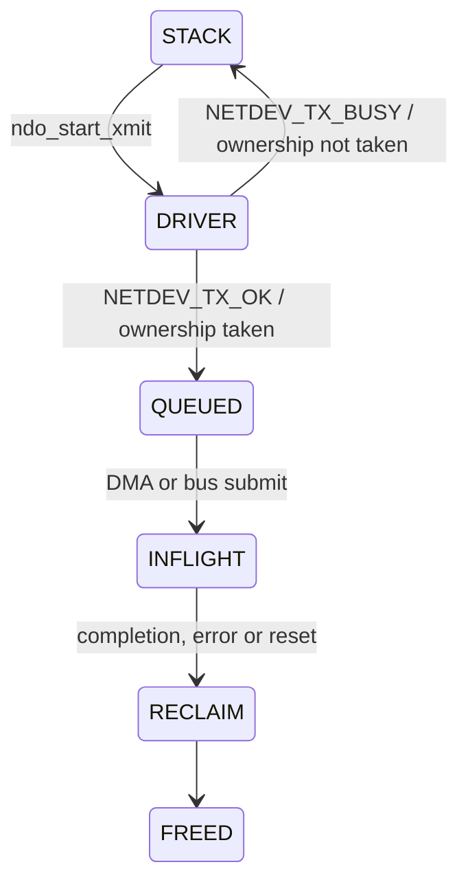

# SKB、Netdev Queue 与 NAPI

Host 数据路径的深度体现在所有权和并发契约，而不是能说出 `ndo_start_xmit` 与 NAPI 两个名字。

## TX SKB 所有权

Driver 从 `ndo_start_xmit()` 返回 `NETDEV_TX_OK` 后，就承担在有限时间内完成并释放 SKB 的责任。若返回 `NETDEV_TX_BUSY`，则不能保留引用或释放该 SKB。正常流控应提前 stop queue，而不是把 `NETDEV_TX_BUSY` 当常规背压机制。

## Stop/Wake 竞态

典型安全顺序是：更新 producer 与可用 descriptor→判断低水位并 stop→再次检查 consumer/credit，避免 completion 恰好发生导致永久 stop。Wake 侧也必须检查真实资源，不应因一次过期 credit event 把满 Ring 唤醒。

需要按 TXQ/AC 记录：stop/wake 次数、stop duration、false wake、ring full while awake、completion age 和 orphan SKB。

## TX completion 的层次

USB URB complete、Device 接收 descriptor、Hardware DMA done、空口 ACK/BA 是不同完成点。若 Host 在总线完成时释放原 buffer，Device 必须已经复制或不再访问；若 completion 含空口结果，则要定义 retry、filtered、no-ack 与 reset-cancel 的编码。

## NAPI RX

IRQ 只负责屏蔽/确认并调度 NAPI。Poll 在 budget 内消费 RX descriptor，补充 buffer，并在 Ring 清空时完成 NAPI 后重新开中断。关键竞态是“判空→开中断”之间 Device 又写入数据；硬件协议或二次检查必须保证不会 lost interrupt。

高吞吐排查应同时观察 budget exhausted、poll duration、packets/poll、refill failure、page allocation、GRO、softirq CPU 与跨核迁移。盲目增大 budget 会提高吞吐，却可能恶化尾延迟和其他网络设备公平性。

## 参考

- [Linux Softnet Driver Issues](https://kernel.org/doc/html/latest/networking/driver.html)
- [Linux 802.11 Driver Developer’s Guide](https://kernel.org/doc/html/latest/driver-api/80211/)
