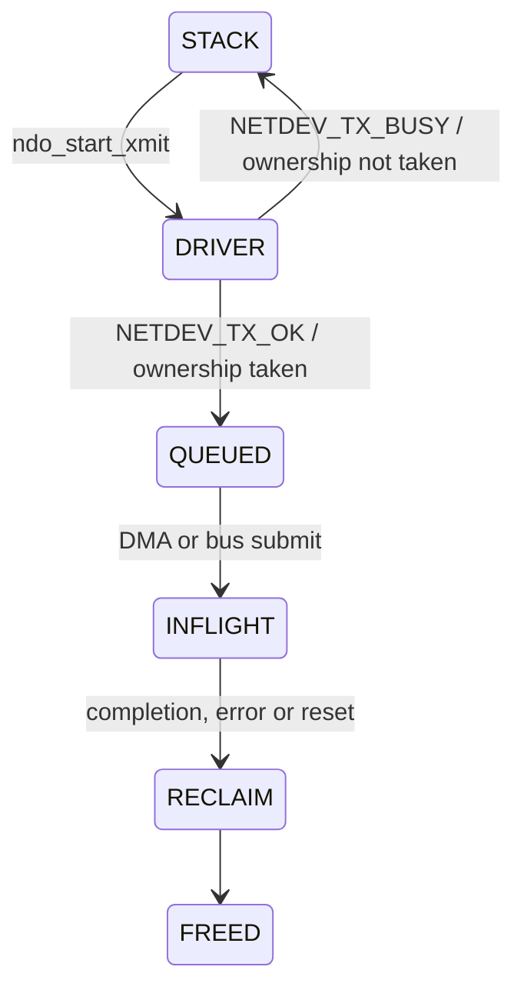

# SKB、Netdev Queue 与 NAPI

Host 数据路径的深度体现在所有权和并发契约，而不是能说出 `ndo_start_xmit` 与 NAPI 两个名字。

## TX SKB 所有权

Driver 从 `ndo_start_xmit()` 返回 `NETDEV_TX_OK` 后，就承担在有限时间内完成并释放 SKB 的责任。若返回 `NETDEV_TX_BUSY`，则不能保留引用或释放该 SKB。正常流控应提前 stop queue，而不是把 `NETDEV_TX_BUSY` 当常规背压机制。

## Stop/Wake 竞态

典型安全顺序是：更新 producer 与可用 descriptor→判断低水位并 stop→再次检查 consumer/credit，避免 completion 恰好发生导致永久 stop。Wake 侧也必须检查真实资源，不应因一次过期 credit event 把满 Ring 唤醒。

需要按 TXQ/AC 记录：stop/wake 次数、stop duration、false wake、ring full while awake、completion age 和 orphan SKB。

## TX completion 的层次

USB URB complete、Device 接收 descriptor、Hardware DMA done、空口 ACK/BA 是不同完成点。若 Host 在总线完成时释放原 buffer，Device 必须已经复制或不再访问；若 completion 含空口结果，则要定义 retry、filtered、no-ack 与 reset-cancel 的编码。

## NAPI RX

IRQ 只负责屏蔽/确认并调度 NAPI。Poll 在 budget 内消费 RX descriptor，补充 buffer，并在 Ring 清空时完成 NAPI 后重新开中断。关键竞态是“判空→开中断”之间 Device 又写入数据；硬件协议或二次检查必须保证不会 lost interrupt。

高吞吐排查应同时观察 budget exhausted、poll duration、packets/poll、refill failure、page allocation、GRO、softirq CPU 与跨核迁移。盲目增大 budget 会提高吞吐，却可能恶化尾延迟和其他网络设备公平性。

## 参考

- [Linux Softnet Driver Issues](https://kernel.org/doc/html/latest/networking/driver.html)
- [Linux 802.11 Driver Developer’s Guide](https://kernel.org/doc/html/latest/driver-api/80211/)

## SKB 容器与数据区不是同一所有权

Driver 接管 SKB 不等于其 payload 一定可写：clone 可能共享 data，非线性 SKB 还包含 frags。要追加/修改 header，先满足 headroom 与可写性条件；不能把 `skb->data` 到 `skb->len` 当成必然连续内存。

Checksum/GSO/GRO 表示的状态也必须与驱动宣称的 offload 能力一致。出现 Host 抓包“checksum bad”时先确认抓包点是否在 checksum offload 之前，不能立即认定空口内容损坏。

## Stop/Wake 的具体交错

教学资源计数为 0，发送线程准备 stop；恰在此时 completion 归还资源并 wake，随后发送线程才执行 stop。若以后没有 completion，就会永久停队。

正确方案用锁串行化，或使用符合前提的 stop→barrier→recheck 协议。Linux 6.12 提供队列 stop/wake helper，但其并发前提需满足，不能把单 producer/consumer 方案扩展成任意多线程而不增加同步。

实测至少记录 stop reason、进入时资源量、wake reason、停队持续时间和重复 wake。单独计算 stop 次数不能定位 lost wakeup。

## NAPI 的三个边界条件

1. `budget=0` 可能是只处理 SKB TX completion 的调用，不处理 RX，也不能调用要求 RX 预算的 XDP/page-pool 操作或 `napi_complete_done()`。
2. 恰好处理 `budget` 个 RX 且队列变空时，可以保留调度等下一轮确认，或按 API 约定完成并返回小于 budget 的值，不能含糊地既返回满预算又表示已完成。
3. `napi_complete_done()` 释放 NAPI 所有权；teardown 的同步不能被误解为 poll 函数所有后续语句都执行完了。完成后的任何私有状态访问要有额外生命周期保证。

常见 IRQ 路径先成功取得 scheduling 条件，再 mask IRQ，最后 schedule；poll 完成并满足 API 返回条件后再 unmask。硬件的 level/edge/cause 语义决定如何处理完成与 unmask 之间的新包，不能靠固定延迟。

参见 [Linux 6.12 NAPI](https://docs.kernel.org/6.12/networking/napi.html)，尤其 budget 与 lifetime 约束。

## RX Buffer refill 的独立状态

一个 RX slot 从 posted→device-owned→completed→Host-consumed→reposted；零拷贝将页面交给网络栈后，该页面未必立刻回到 Device。必须考虑引用释放、page pool、分配失败和批量 refill。

教学算例：posted=64，每个 poll 消费 32 个但只成功补回 24 个，持续 8 轮即可累计少 64 个 Buffer。CPU 看起来工作正常，Device 却因可用 RX Buffer 归零停收。需要 refill low watermark、失败退避和再次补充机制。

## 复习追问与答案

**NETDEV_TX_OK 是成功发射吗？** 不是，它主要表示驱动已处理/接管该 SKB，必须在有限时间内结束其生命周期。

**poll 越快越好吗？** 还应看 refill、协议栈交付和其他队列公平；忙轮询消耗 CPU 也可能掩盖 IRQ 问题。

**GRO 与 A-MPDU 是同一层聚合吗？** 不是，GRO 在 Host 网络接收路径合并上层报文，A-MPDU 是空口 MAC 聚合。

深入：[DMA 所有权](../06-Bus-Data-Path/02-ring-dma-memory-ordering.md)。
