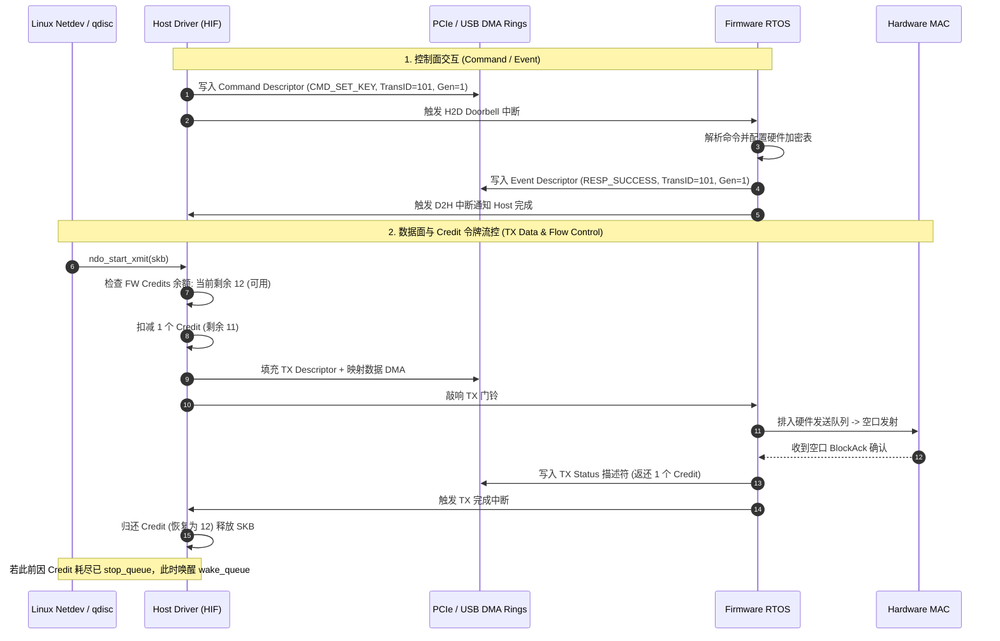
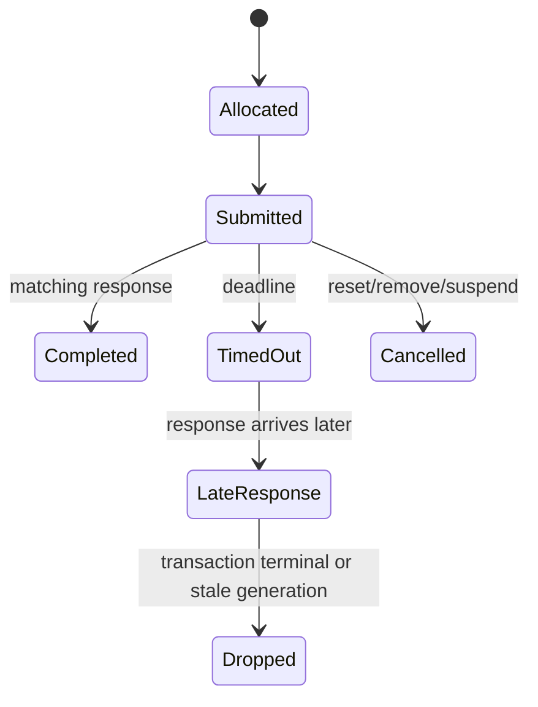

# Host–Device ABI：Descriptor、Command 与 Event

Host Driver 与 Firmware 可以独立编译、独立升级，二者之间不是普通函数调用，而是一套跨处理器 ABI。只要长度、字节序、版本或生命周期有一处理解不同，故障就可能表现为随机丢包、错误 Key、Ring 卡死甚至越界访问。

## Header 最小集合

```c
struct message_header {
    uint16_t type;
    uint16_t version;
    uint16_t header_len;
    uint16_t total_len;
    uint32_t transaction_id;
    uint32_t generation;
    uint32_t flags;
};
```

这是概念结构，不对应具体产品。协议还必须定义 alignment、endianness、最大长度、可选 TLV、未知字段处理和错误返回。接收方的验证顺序应是：可读取固定头→版本/header length→total length→type-specific minimum→TLV 边界→上下文/generation。

## Descriptor 不是结构体裸拷贝

C bit-field、编译器 padding、指针宽度和 enum 大小都不适合作为稳定 ABI。Descriptor 应使用固定宽度字段和显式 mask/shift，并为 Host/Firmware 各写静态断言与互操作测试向量。

TX Descriptor 通常包含 buffer/segment、length、VIF/Peer/TID、Key、offload、cookie 和 completion policy；RX Descriptor 包含 length、offset、VIF/Peer/TID、RXVECTOR 摘要、FCS/decrypt/replay 和聚合边界。每个字段还要说明：由谁写、何时有效、何时可复用。

## Command 与 Event 异步交互及 Credit 令牌流控

Host 与固件之间通常分为**控制通路 (H2D Command / D2H Event)** 与**数据通路 (H2D TX / D2H RX)**。数据通路依赖固件的 Buffer Credit 进行背压流控：



## Command 生命周期



Transaction ID 解决匹配，generation 解决 reset 后的迟到事件污染新会话。Timeout 只表示 Host 没在 deadline 内收到有效响应，不等于命令未执行；因此可重试命令必须具有幂等语义或查询/回滚路径。

## 兼容策略

- 启动时交换 ABI major/minor、feature bitmap 和 ring limits；
- major 不兼容直接失败，minor 能力按交集启用；
- 新增字段用长度/TLV 扩展，不能复用旧保留位而不协商；
- dump 中保存双方 build ID、ABI 与 feature negotiation 结果；
- fuzz malformed descriptor/event，验证 Device 和 Host 都能拒绝而不越界。

## 不变量

每个成功提交的对象最终必须落入 completion、explicit drop、cancel 或 reset reclaim 之一；任何路径都不能既归还 credit 又重复 completion，也不能丢失 buffer ownership。

## TLV 解析：用剩余长度避免整数溢出

以下为教学逻辑，假设总报文长度已由 transport 验证，所有整数已按线格式读取：

```text
remaining = total_len - header_len
while remaining != 0:
    require remaining >= TLV_HEADER_SIZE
    length = read_tlv_length()
    require length <= remaining - TLV_HEADER_SIZE
    require padding(length) fits remaining as well
    if unknown mandatory type: reject
    if known type: validate semantic bounds before use
    advance by checked header + length + padding
require no forbidden duplicates or missing required fields
```

不能先计算 `offset+length` 再比较末尾，因为加法本身可能溢出；也不能在长度校验前解引用 C 结构体。TLV 对齐后的填充也属于边界验证。

## 具体 descriptor 契约

| 字段组 | 线格式应定义 | 失败示例 |
|---|---|---|
| 地址/segment | DMA 地址宽度、段数、每段长度 | 64-bit 地址截断 |
| 长度/offset | 含不含 Ethernet、crypto、FCS | 多读 header 或尾部 |
| Context | VIF/Peer/TID/key 与 generation | 复用旧 slot |
| offload | 输入帧视图、checksum、crypto 责任 | 两层重复封装 |
| 完成策略 | Buffer consumed 与 air status | 过早释放/错误成功率 |

Host 指针不能进入 Device 可解释字段。PCIe 的 DMA address、USB 的 transfer offset、Device SRAM handle 是三种不同地址空间；不要共用一个未经标记的整数语义。

## Boot 协商与兼容测试

启动先确认 BootROM/loader 可用、下载范围及完整性，再等待 Firmware ready，交换 ABI/capabilities/ring limits，加载有效 board/calibration 数据并启动事件通道。普通数据 queue 只能在依赖就绪后开放。

版本兼容应覆盖 old Host/new FW 与 new Host/old FW。新增可选 TLV 能否跳过取决于协议定义；影响语义的 mandatory 功能不应静默降级。主版本不兼容、长度超限、feature bitmap 与实际返回冲突要给出具体失败原因。

## 复习追问与答案

**为什么 packed struct 仍不足？** 只解决部分布局，不解决字节序、字段语义、位域顺序、对齐访问、版本与生命周期。

**重复响应怎么办？** 依据 transaction terminal state 检测；不是所有迟到响应都会 generation mismatch。

**最有价值的测试向量是什么？** 双端一致的序列化字节、最小/最大/截断长度、未知 optional/mandatory TLV、重复字段、Reset 后旧响应。不要只测试两端同编译器的正常路径。
