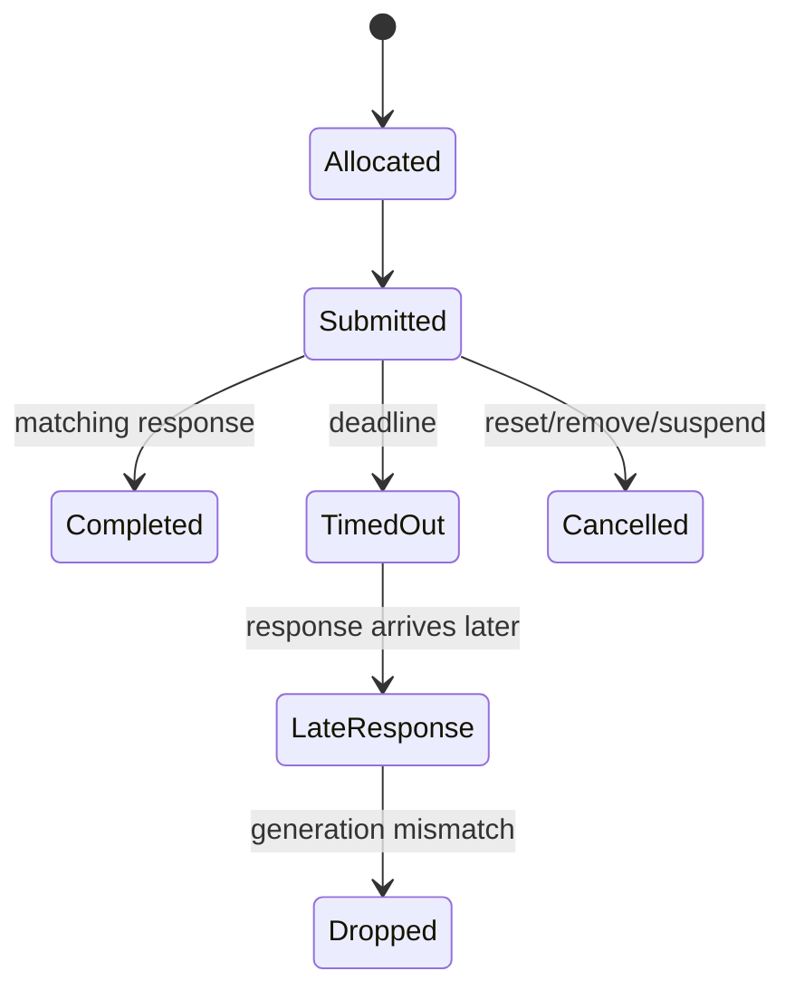

# Host–Device ABI：Descriptor、Command 与 Event

Host Driver 与 Firmware 可以独立编译、独立升级，二者之间不是普通函数调用，而是一套跨处理器 ABI。只要长度、字节序、版本或生命周期有一处理解不同，故障就可能表现为随机丢包、错误 Key、Ring 卡死甚至越界访问。

## Header 最小集合

```c
struct message_header {
    uint16_t type;
    uint16_t version;
    uint16_t header_len;
    uint16_t total_len;
    uint32_t transaction_id;
    uint32_t generation;
    uint32_t flags;
};
```

这是概念结构，不对应具体产品。协议还必须定义 alignment、endianness、最大长度、可选 TLV、未知字段处理和错误返回。接收方的验证顺序应是：可读取固定头→版本/header length→total length→type-specific minimum→TLV 边界→上下文/generation。

## Descriptor 不是结构体裸拷贝

C bit-field、编译器 padding、指针宽度和 enum 大小都不适合作为稳定 ABI。Descriptor 应使用固定宽度字段和显式 mask/shift，并为 Host/Firmware 各写静态断言与互操作测试向量。

TX Descriptor 通常包含 buffer/segment、length、VIF/Peer/TID、Key、offload、cookie 和 completion policy；RX Descriptor 包含 length、offset、VIF/Peer/TID、RXVECTOR 摘要、FCS/decrypt/replay 和聚合边界。每个字段还要说明：由谁写、何时有效、何时可复用。

## Command 生命周期



Transaction ID 解决匹配，generation 解决 reset 后的迟到事件污染新会话。Timeout 只表示 Host 没在 deadline 内收到有效响应，不等于命令未执行；因此可重试命令必须具有幂等语义或查询/回滚路径。

## 兼容策略

- 启动时交换 ABI major/minor、feature bitmap 和 ring limits；
- major 不兼容直接失败，minor 能力按交集启用；
- 新增字段用长度/TLV 扩展，不能复用旧保留位而不协商；
- dump 中保存双方 build ID、ABI 与 feature negotiation 结果；
- fuzz malformed descriptor/event，验证 Device 和 Host 都能拒绝而不越界。

## 不变量

每个成功提交的对象最终必须落入 completion、explicit drop、cancel 或 reset reclaim 之一；任何路径都不能既归还 credit 又重复 completion，也不能丢失 buffer ownership。
