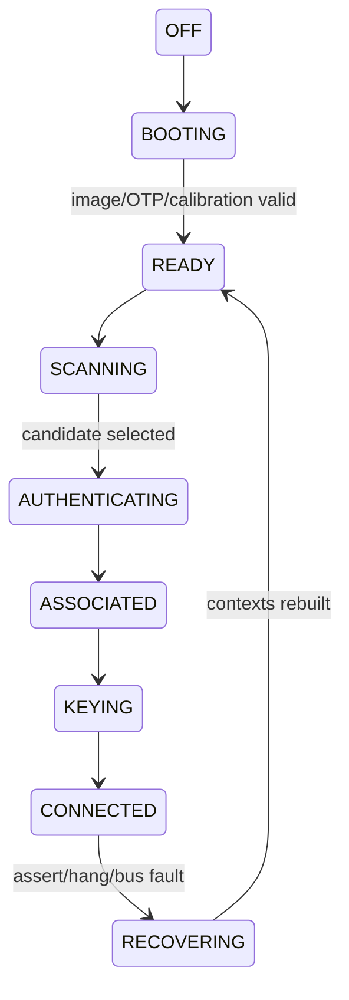

# Firmware RTOS、状态机与实时调度

Firmware 的复杂度不在 task 数量，而在异步事件同时改变连接、信道、功耗和硬件上下文。把所有逻辑塞进 command handler 会产生不可证明的竞态。

## 事件来源与执行域

| 来源 | 示例 | 建议处理域 |
|---|---|---|
| Host | scan/connect/add key | Command dispatcher → 对应状态机 |
| MAC/PHY IRQ | RX/TX done、radar、trigger | 最小 ISR → real-time queue |
| Timer | scan dwell、auth timeout、reorder | timer event → owner state machine |
| Power | sleep request、wake | power coordinator |
| Watchdog | heartbeat/queue stall | fault manager |

优先级不是简单的“RX/TX 都最高”。SIFS response 由硬件 fast path 保证；Firmware 高优先级任务负责补充 buffer、消费 completion 和维护下一次实时动作所需上下文。日志格式化、统计汇总和 Host 大命令不能占用实时队列。

## 状态所有权

每个状态只能有一个 owner。Connect state machine 可以请求 Channel Manager 切信道，却不能直接改 RF state；Power Manager 可以等待 TX quiesce，却不能偷偷清空连接队列。跨模块通过事件和带 deadline 的 request 交互。



每次进入状态记录 reason、deadline、session generation；每个 event 声明允许的源状态。收到旧 session 的 Auth/Key/TX completion 时丢弃并计数，而不是“尽量处理”。

## Watchdog 设计

单一 heartbeat 只能证明 MCU 还在调度，不能证明数据面工作。建议分别监控：command progress、TX/RX ring progress、MAC completion、Beacon/TBTT deadline、heap/stack watermark 和 real-time queue latency。

Watchdog 触发后先冻结关键 trace，保存 task/ISR 状态、pending command、Ring 指针、VIF/STA/Key/BA、MAC/PHY reason，再执行分级恢复。若先 reset 再 dump，得到的只是恢复后的正常现场。

## 可验证性

- 对每个状态转换建立 event table 和非法事件测试；
- 注入 command timeout、completion loss、重复事件和 reset；
- 用逻辑时钟测试 timer race，不依赖真实等待；
- 为 task queue 设置 latency histogram，而不只统计平均值；
- 用 generation 验证 teardown 后的异步事件不会访问旧对象。

## 给状态机写 Event Table

状态图只画允许路径，Event Table 还定义非法与迟到事件。以下为连接状态的教学片段：

| 当前状态 | 事件 | 动作 | 新状态/拒绝原因 |
|---|---|---|---|
| SCANNING | scan done（匹配请求） | 选候选/失败完成 | AUTHENTICATING/READY |
| AUTHENTICATING | disconnect | 取消 timer，终止连接请求 | READY |
| READY | 旧 auth response | 计 stale，不创建 Peer | READY |
| CONNECTED | reset | 停入口，冻结证据 | RECOVERING |
| RECOVERING | 旧 TX done | 按旧事务回收/拒绝 | 不更新新 Credit |

每行还要写 deadline、可重入性和资源变化。没有状态变化的事件也可能改变 Buffer 所有权，不能简单忽略。

## 实时调度的预算模型

对固定优先级抢占模型，可用响应时间分析检查任务 i：

```text
R_i = C_i + B_i + Σ ceil(R_i / T_j) × C_j
                    j 为更高优先级任务
```

C 是最坏执行时间，B 是阻塞，T 是高优先级任务的最小到达间隔。该模型假设应明确；突发 IRQ、非抢占区、DMA/总线争用不能被平均 CPU 利用率掩盖。

教学例：控制任务执行 100 μs，可能被锁阻塞 40 μs；周期 100 μs、执行 20 μs 的高优先级任务干扰。迭代得到 `140→180→180 μs`。若 deadline=150 μs，即便平均负载看起来不高仍违约。

## 优先级反转与队列耗尽

高优先级 TX refill 等待低优先级日志任务持有的锁，而中优先级任务持续运行，会形成优先级反转。可用缩短临界区、拆分共享数据或平台提供的优先级继承，但不能假定所有 RTOS mutex 自动继承。

Event queue 也要设计满时行为：关键控制事件不应静默丢弃；telemetry 可丢但要计数。不可在 ISR 中无限等待空槽，否则 consumer 无法获得执行时间。

## Watchdog 的进展判据

空闲时 Ring 不移动不表示卡死；应在“有待处理工作”且超过 deadline 时判定 stall。心跳、任务执行、queue consumer、IRQ 和 MAC completion 分开监控，避免一个健康任务替整个系统喂狗。

Dump 要保存触发前历史。1 MiB ring、每条 32 byte、10,000 条/秒仅覆盖约 3.28 秒；日志速率升高会缩短现场窗口，应做采样、触发和关键事件保留。

## 复习追问与答案

**CPU 没满为什么还错过 deadline？** 阻塞、不可抢占区域、优先级反转、共享 SRAM/总线都能增加最坏响应时间。

**非法事件都能直接丢弃吗？** 还需处理其附带资源和 pending waiter，否则状态没坏但内存泄漏。

**怎样复现 timer race？** 使用受控事件顺序或逻辑时钟注入，验证每一种 terminal path 恰好完成一次。
