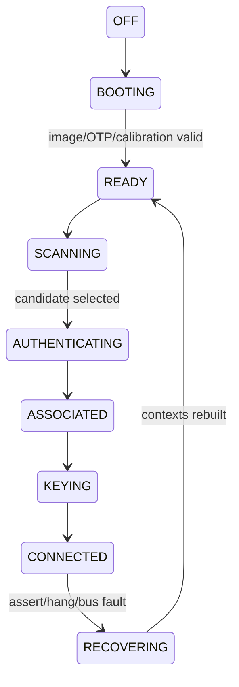

# Firmware RTOS、状态机与实时调度

Firmware 的复杂度不在 task 数量，而在异步事件同时改变连接、信道、功耗和硬件上下文。把所有逻辑塞进 command handler 会产生不可证明的竞态。

## 事件来源与执行域

| 来源 | 示例 | 建议处理域 |
|---|---|---|
| Host | scan/connect/add key | Command dispatcher → 对应状态机 |
| MAC/PHY IRQ | RX/TX done、radar、trigger | 最小 ISR → real-time queue |
| Timer | scan dwell、auth timeout、reorder | timer event → owner state machine |
| Power | sleep request、wake | power coordinator |
| Watchdog | heartbeat/queue stall | fault manager |

优先级不是简单的“RX/TX 都最高”。SIFS response 由硬件 fast path 保证；Firmware 高优先级任务负责补充 buffer、消费 completion 和维护下一次实时动作所需上下文。日志格式化、统计汇总和 Host 大命令不能占用实时队列。

## 状态所有权

每个状态只能有一个 owner。Connect state machine 可以请求 Channel Manager 切信道，却不能直接改 RF state；Power Manager 可以等待 TX quiesce，却不能偷偷清空连接队列。跨模块通过事件和带 deadline 的 request 交互。

每次进入状态记录 reason、deadline、session generation；每个 event 声明允许的源状态。收到旧 session 的 Auth/Key/TX completion 时丢弃并计数，而不是“尽量处理”。

## Watchdog 设计

单一 heartbeat 只能证明 MCU 还在调度，不能证明数据面工作。建议分别监控：command progress、TX/RX ring progress、MAC completion、Beacon/TBTT deadline、heap/stack watermark 和 real-time queue latency。

Watchdog 触发后先冻结关键 trace，保存 task/ISR 状态、pending command、Ring 指针、VIF/STA/Key/BA、MAC/PHY reason，再执行分级恢复。若先 reset 再 dump，得到的只是恢复后的正常现场。

## 可验证性

- 对每个状态转换建立 event table 和非法事件测试；
- 注入 command timeout、completion loss、重复事件和 reset；
- 用逻辑时钟测试 timer race，不依赖真实等待；
- 为 task queue 设置 latency histogram，而不只统计平均值；
- 用 generation 验证 teardown 后的异步事件不会访问旧对象。
