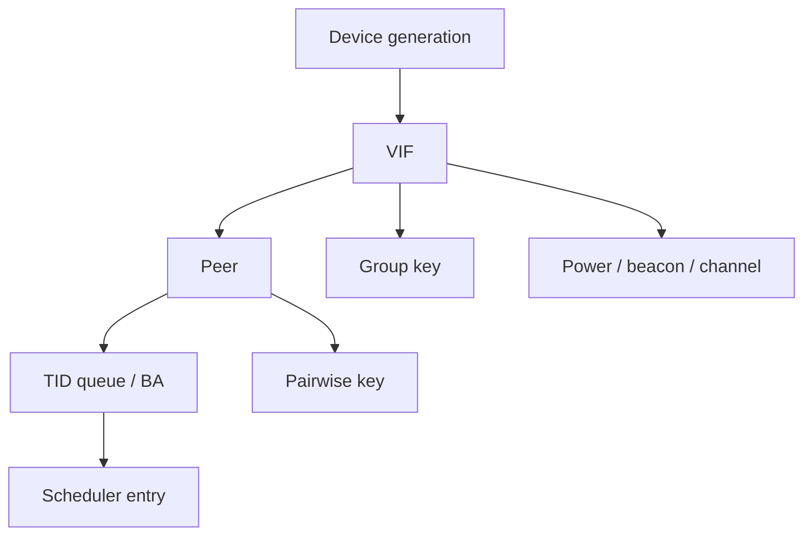

# VIF、Peer、Key、BA Context 与 Reset 一致性

Firmware 中最重要的数据结构通常不是某个算法，而是把 VIF、Peer、Key、TID、BA、Power 和 Scheduler 状态正确绑定起来的 Context 图。

## Context 关系



每条边既是查询关系，也是销毁依赖。Peer 删除前必须让 Scheduler、BA、Key 和 pending packet 停止引用；VIF 删除前必须清空其 Peer、Group Key、Channel Context 和异步命令。

## 最小字段

| Context | 关键字段 |
|---|---|
| Device | boot generation、capability、fatal state |
| VIF | id/gen、role、MAC/BSSID、channel、connection state |
| Peer | id/gen、VIF、AID、capability、state、last activity |
| Key | index/gen、cipher、direction、Peer/VIF、PN owner、valid |
| TID/BA | TID、SSN/head、window、bitmap、timer、generation |
| Packet | cookie、Peer/TID gen、queue、lifetime、completion state |

ID 可复用，generation 不可在可见生命周期内复用。Hardware table 若只有有限 bit 的 generation，要证明回绕前旧事务已经全部消失。

## 两阶段发布

硬件可见 Context 不应边写边生效：

1. 分配无效 slot；
2. 填充完整字段并做范围/能力校验；
3. 完成 DMA/cache ordering；
4. 最后原子发布 valid + generation；
5. 再允许 queue/scheduler 引用。

删除顺序相反：先阻止新引用并撤销 valid，再等待硬件 in-flight，最后清零和复用。Key table 还要避免材料通过 dump 或 reuse 泄漏。

## Command/Event 一致性

Host 发起 `ADD_PEER(vif_id, vif_gen, transaction)`，Firmware 成功后返回新 `peer_id/peer_gen`。后续 `SET_KEY`、`ADDBA` 和 Packet descriptor 必须携带或能解析到同一代 Peer。

Event 至少分三类：

- transaction completion：精确完成一个 pending request；
- state notification：连接、roam、radar、power 等异步变化；
- telemetry：统计和 trace，可丢但不能阻塞控制面。

不要用 telemetry channel 承载必须可靠到达的状态切换，也不要让重复 notification 重复创建对象。

## Reset 边界

Reset 不是“重新下载 Firmware”一个动作，而是跨层事务：

```text
freeze new entry
→ snapshot evidence
→ advance device generation
→ cancel Host pending
→ stop IRQ/NAPI and bus submit
→ quiesce or fence DMA
→ reboot Firmware
→ negotiate ABI/capability
→ rebuild VIF/Peer/Key/BA or reconnect
→ reopen queues
```

一旦 device generation 前进，所有旧 Event/Completion 即使格式正确也必须丢弃。若不能证明旧 DMA 已停止，就不能释放和复用其目标内存。

## 恢复策略

是否透明恢复取决于可重建状态：

- 静态 capability、regulatory、board data 可以重新加载；
- VIF/channel 可能重建；
- Peer/BA 可以重新协商；
- Key 与 TX PN 若无法安全恢复，应重新建链；
- TCP 连接是否存活由恢复时延和网络状态决定，Driver 不应伪造成功。

恢复完成的判据不是 Firmware heartbeat，而是 control path、TX/RX path、queue/credit 和关键状态全部重新建立。

## 典型竞态

- Disconnect 与 roam-complete 交错，旧 AP 重新成为当前 Peer；
- DELBA 后 reorder timer 访问已复用 TID；
- Key delete 与 TX scheduler 交错，Hardware 使用新写入的同 index Key；
- Reset 后旧 completion 归还新 Ring 的 Credit；
- Suspend 时 Firmware 自主 GTK rekey，Resume 未同步新 replay counter；
- VIF delete 完成先于 pending scan event，Host 收到幽灵 BSS/connection event。

## 断言与统计

开发版本应断言：父 Context active、generation 匹配、引用计数非零、状态转换合法、completion 未重复。量产版本把断言转为 reason counter + 有界 snapshot，并在破坏内存安全时升级恢复。

建议维护 `stale_event`、`generation_mismatch`、`double_completion`、`orphan_packet`、`context_busy_on_delete`、`reset_drain_timeout` 六类计数。

## 面试追问

- ID 已经唯一，为什么还要 generation？
- Firmware Reset 后哪些状态可以恢复，哪些必须重新协商？
- 如何避免旧 completion 给新 Session 归还 Credit？
- Key slot 的 valid bit 为什么必须最后发布、最先撤销？

## 答题要点与适用边界

ID被复用后仍可能收到旧事件，因此必须有代际或等价隔离。Reset可重载静态配置，但Peer/BA需要恢复或重新协商；Key/PN不能在无法证明连续性时直接沿用。旧completion先按其所属generation和terminal状态处理，禁止更新新Credit。valid-last只是原子发布的一种设计，还必须保证字段可见并在删除时等旧引用退出。
