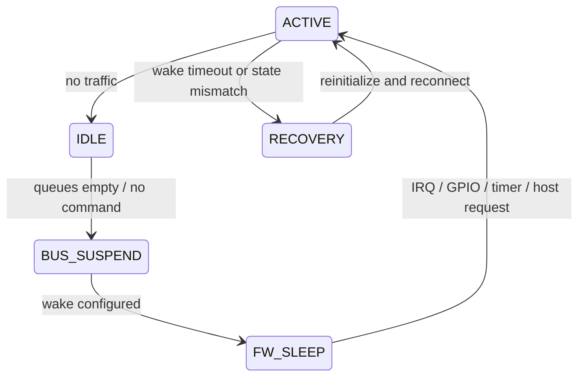

# 空口与系统电源状态机

## 空口省电

Legacy Power Save 中，STA 通知 AP 自己进入省电，AP 缓存下行单播，并通过 Beacon TIM 指示。STA 在 DTIM 关注组播/广播。U-APSD 使用指定 AC 的 Trigger/Delivery 机制；TWT 则由双方协商服务周期，更适合规律唤醒。

详细协议演进可参考 [Wi-Fi 低功耗机制概览](/2024/05/26/wifi-low-power-mechanisms/)。

## 系统状态机

真实顺序由硬件决定，但必须满足：停止新流量、排空或冻结队列、确认 Firmware 状态、配置 wake source、再关闭总线或时钟。唤醒时反向恢复，并在上报 ready 前验证命令与数据通路。

## 常见竞态

1. TX 入队与 autosuspend 同时发生，queue 有数据但总线已睡。
2. Firmware 产生事件后进入睡眠，Host 未及时取走事件。
3. suspend 期间旧命令超时触发 reset，与 resume 并发。
4. Wake IRQ 被清除过早，设备有数据但 Host 不再调度 RX。
5. AP 认为 STA 仍在省电，STA 却已恢复 Active，造成缓存释放异常。

## 观测与指标

至少统计各状态驻留时间、进入/退出次数、拒绝休眠原因、wake source、唤醒延迟、超时次数和恢复等级。功耗结果要同时记录 Beacon interval、DTIM、Listen Interval、U-APSD/TWT 配置和背景流量。

一个省电方案只有在功耗、唤醒时延、丢包、重连率和吞吐均满足目标时才算成立。
