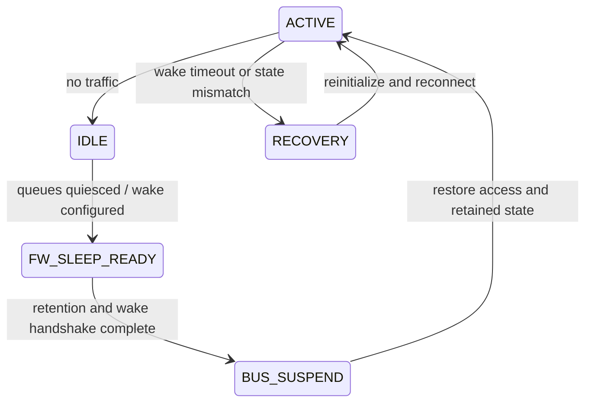

# 空口与系统电源状态机

## 空口省电

Legacy Power Save 中，STA 通知 AP 自己进入省电，AP 缓存下行单播，并通过 Beacon TIM 指示。STA 在 DTIM 关注组播/广播。U-APSD 使用指定 AC 的 Trigger/Delivery 机制；TWT 则由双方协商服务周期，更适合规律唤醒。

详细协议演进可参考 [Wi-Fi 低功耗机制概览](/2024/05/26/wifi-low-power-mechanisms/)。

## 系统状态机



真实顺序由硬件决定，但必须满足：停止新流量、排空或冻结队列、确认 Firmware 状态、配置 wake source、再关闭总线或时钟。唤醒时反向恢复，并在上报 ready 前验证命令与数据通路。

## 常见竞态

1. TX 入队与 autosuspend 同时发生，queue 有数据但总线已睡。
2. Firmware 产生事件后进入睡眠，Host 未及时取走事件。
3. suspend 期间旧命令超时触发 reset，与 resume 并发。
4. Wake IRQ 被清除过早，设备有数据但 Host 不再调度 RX。
5. AP 认为 STA 仍在省电，STA 却已恢复 Active，造成缓存释放异常。

## 观测与指标

至少统计各状态驻留时间、进入/退出次数、拒绝休眠原因、wake source、唤醒延迟、超时次数和恢复等级。功耗结果要同时记录 Beacon interval、DTIM、Listen Interval、U-APSD/TWT 配置和背景流量。

一个省电方案只有在功耗、唤醒时延、丢包、重连率和吞吐均满足目标时才算成立。

## Legacy PS：TIM、DTIM、Listen Interval

STA通过PM状态通知AP缓存下行。Beacon中的TIM可指示该STA的缓存单播；STA按协定唤醒、读取指示并取回数据。DTIM涉及组播/广播缓存释放时机，Listen Interval描述STA监听相关的能力/约定，三者不是同一个周期参数。

进入睡眠不能只本地关RF而不保证AP已获知；退出Active也需要确保AP停止按旧状态缓存。证据包含空口PM bit、相关确认、AP缓存与实际下行，不是仅有Driver一条sleep日志。

## U-APSD服务周期

Trigger-enabled AC和delivery-enabled AC在关联时协商。STA的合适QoS帧触发服务周期，AP在规则允许范围交付缓存数据，EOSP用于标示服务周期结束。More Data与EOSP表达不同含义：仍有缓存不等于本次服务周期必须继续。

一旦EOSP丢失、AP/STA对服务周期状态不一致，STA可能保持唤醒或过早睡眠。需要trigger、delivery count、EOSP、timeout和PM状态对齐；不能将任何普通上行包都视为合法触发。

## TWT协议与设备睡眠分层

协商的TWT包含目标唤醒时刻、间隔、持续时间及相应模式。implicit/explicit、announced/unannounced、trigger-enabled等选项影响行为。TWT安排通信机会，并不自动保证Host已睡或所有业务只能在窗口内发送。

调度需要把TWT时间转换到本地保留时钟，提前完成RF/PLL/校准等唤醒准备。TSF drift、MCC切信道、BT占用和buffer突发都可能使窗口不足。错过窗口需要规定重试/重协商/退出策略。

机制背景可参考研究论文 [Target Wake Time](https://arxiv.org/abs/1804.07717)；具体功能与约束按目标802.11版本及协商字段核对。

## 节能的盈亏平衡

教学模型：Active=200 mW，Sleep=10 mW，一次进入/退出额外能量100 μJ，若可睡间隙为t：

```text
energy_saved = (200-10) mW × t - 100 μJ
break_even t = 100 μJ / 190 mW ≈ 0.526 ms
```

短于该间隙频繁睡醒可能更耗电；还要扣除唤醒提前量和业务延迟。参数应取目标硬件测量，不能用一个固定autosuspend阈值覆盖所有板卡。

## 实际平均功耗

`Pavg=ΣPstate×duty + Etransition×transition_rate`。只降低Sleep电流但增加false wake次数，平均功耗可能变差。统计协议唤醒、主机唤醒、系统业务唤醒分别的占比。

## 复习追问与答案

**TWT开启就一定省电吗？** 不，真实驻留、突发业务、窗口错过与唤醒开销决定收益。

**DTIM越大越好吗？** 增加某些缓存等待和组播业务延迟，还受AP配置和系统需求限制。

**怎么看是空口PS还是Host PM的问题？** 分别观察PM/TIM/TWT空口行为与runtime usage、bus state、wake IRQ，避免跨层猜测。

深入：[WoWLAN恢复](02-wowlan-suspend-resume.md)。
