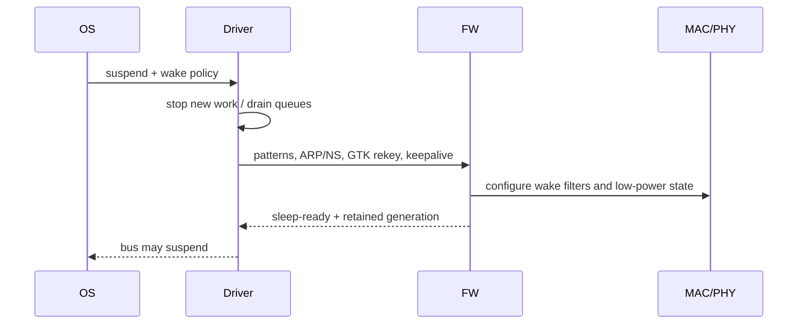

# WoWLAN、Suspend/Resume 与状态恢复

WoWLAN 的目标不是让 Wi-Fi“继续完整运行”，而是在 Host 睡眠期间由 Device 保存最小连接状态、处理必要 offload，并在匹配事件发生时可靠唤醒 Host。

## Suspend 事务

任何一步失败都要回滚到可工作的 Active 状态。不能在 command 尚 pending、TX ownership 未回收或 wake IRQ 未配置时关闭总线。

## Resume 顺序

先恢复供电/时钟和总线，再读取 wake reason、同步 Firmware generation 与 GTK replay state，恢复 RX request/Ring、控制通道和 netdev queue，最后才向上层报告 ready。若 Firmware 在睡眠期间 reset，必须走完整重建和重新建链，不能沿用旧 VIF/Key/BA。

## Offload 边界

- ARP/NS offload：Device 代答，但必须使用当前地址和安全上下文；
- GTK rekey：Device 更新 GTK 后要将 replay counter/状态同步回 Host；
- Pattern match：明确 mask、offset、加密前后视图和 false wake；
- Disconnect wake：AP Deauth、Beacon loss 和链路阈值属于不同 reason；
- Keepalive：失败是唤醒、重连还是仅计数，必须定义策略。

## 竞态与注入

重点测试 suspend 与 TX enqueue、scan、connect、rekey、disconnect、Firmware assert 同时发生。注入 sleep-ready 丢失、wake IRQ 提前到达、resume command timeout 和 retained-state 校验失败。

## 指标

记录各低功耗状态驻留、拒绝睡眠原因、wake reason、false wake、resume latency、第一条 command/第一包 RX/TX、连接/IP 保留率和 fallback reset 次数。平均电流下降但 resume p99 或断流率上升，不算成功。

## Runtime PM与system suspend的区别

Runtime PM可在系统运行时让空闲设备挂起；system suspend是系统级状态转换。Driver必须管理访问设备前的电源引用和并发入口，不能凭“接口还UP”认为总线必然可访问。

一种设计是提交工作先获取有效runtime引用，完成时归还；autosuspend只在无引用且满足Device条件时进入。调用可睡眠的resume helper要选择正确上下文，不能直接放在所有TX fast path中。

参考 [Linux 6.12 Runtime PM](https://docs.kernel.org/6.12/power/runtime_pm.html)。具体API返回值和失败时引用处理应按目标版本验证。

## Suspend是一笔可回滚事务

| 提交阶段 | 已改变的状态 | 后续失败时的处理 |
|---|---|---|
| freeze入口 | 新数据暂缓 | 解除freeze、按资源恢复队列 |
| 配置offload | FW可能持有新过滤规则 | 撤销/恢复策略或重建 |
| sleep-ready | Device已准备保留状态 | 协商回Active |
| bus suspend | Host不可普通访问 | 先resume总线，再读取状态 |

回滚不能只把Host标志改回ACTIVE。如果FW仍在睡而队列已wake，就制造新的提交超时。事件可能在sleep-ready与Host真正挂起之间到达，应使用wake pending/系统唤醒协议避免丢失。

## 恢复不能笼统“反向执行”

先恢复访问控制通道需要的电源/总线/RX event资源，再查询generation和wake reason。若wake reason本身通过RX Event上送，就不能先等待Event再补充所有RX资源。

随后核对连接、Key/PN/GTK rekey、BA及业务地址。静态地址保留并不证明网络仍相同；必要时由上层重新确认IP状态。只有完成数据路径准备后才开放普通TX。

## Pattern matching的字节视图

Pattern的offset究竟以802.11、Ethernet还是IP开头，匹配在解密前还是解密后，哪些mask位有效，都要写入ABI。相同业务因VLAN、IPv4 options或IPv6 extension header改变offset，固定模式可能失配或误唤醒。

ARP/NS offload还要随IP变更更新；GTK rekey需要安全地同步新状态。不同Firmware的能力不同，不应假定所有offload都必然支持或同时可用。

## 复习追问与答案

**第一条命令能通、数据不通看哪里？** 查数据RX posting、queue/Credit、Key/BA与AP的PS缓存状态，控制通道可用不能证明它们正常。

**如何测resume时延？** 分别记录wake assertion、Host callback、bus ready、FW同步、首命令和首个业务包，报告每段及p99。

**反复100次不掉线够吗？** 还应覆盖有/无流量、rekey/scan/reset交错、不同wake源和状态丢失，按失败机制设计测试。
