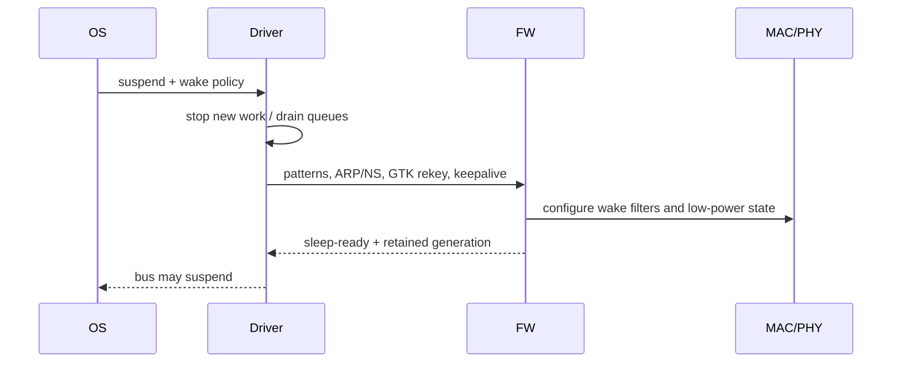

# WoWLAN、Suspend/Resume 与状态恢复

WoWLAN 的目标不是让 Wi-Fi“继续完整运行”，而是在 Host 睡眠期间由 Device 保存最小连接状态、处理必要 offload，并在匹配事件发生时可靠唤醒 Host。

## Suspend 事务

任何一步失败都要回滚到可工作的 Active 状态。不能在 command 尚 pending、TX ownership 未回收或 wake IRQ 未配置时关闭总线。

## Resume 顺序

先恢复供电/时钟和总线，再读取 wake reason、同步 Firmware generation 与 GTK replay state，恢复 RX request/Ring、控制通道和 netdev queue，最后才向上层报告 ready。若 Firmware 在睡眠期间 reset，必须走完整重建和重新建链，不能沿用旧 VIF/Key/BA。

## Offload 边界

- ARP/NS offload：Device 代答，但必须使用当前地址和安全上下文；
- GTK rekey：Device 更新 GTK 后要将 replay counter/状态同步回 Host；
- Pattern match：明确 mask、offset、加密前后视图和 false wake；
- Disconnect wake：AP Deauth、Beacon loss 和链路阈值属于不同 reason；
- Keepalive：失败是唤醒、重连还是仅计数，必须定义策略。

## 竞态与注入

重点测试 suspend 与 TX enqueue、scan、connect、rekey、disconnect、Firmware assert 同时发生。注入 sleep-ready 丢失、wake IRQ 提前到达、resume command timeout 和 retained-state 校验失败。

## 指标

记录各低功耗状态驻留、拒绝睡眠原因、wake reason、false wake、resume latency、第一条 command/第一包 RX/TX、连接/IP 保留率和 fallback reset 次数。平均电流下降但 resume p99 或断流率上升，不算成功。
