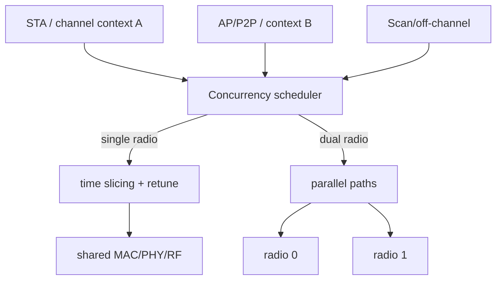

# SCC/MCC/双频并发与 BT Coexistence

SCC、MCC、DBAC、DBDC、DBS 多为产品或厂商术语，不能只凭名字判断硬件能力。必须还原成资源图：有几套 MAC/PHY/RF、能否同时 TX/RX、共享哪些天线/FEM/时钟/Host Interface。

## 资源模型

SCC 共用信道但仍争用 airtime；单 Radio MCC/跨频并发通过分时和 retune 实现；真正 simultaneous 需要足够独立的 RF/PHY 资源，但仍可能共享天线、总线、功耗和热预算。

## 调度约束

Scheduler 不只按吞吐切片，还必须满足 STA Beacon receive deadline、AP/GO TBTT、NoA/CTWindow、TWT service period、DFS、scan dwell 和 Channel Switch。TX completion latency 应分解为 role wait、retune、queue、air contention，而不是只给总延迟。

建议记录每个 role/channel context 的 dwell、airtime、queue residence、beacon miss/jitter、retune latency 和 missed deadline。

## BT/Wi-Fi 共存

2.4 GHz 共存通常由 PTA/grant、RF switch 和 Firmware policy 协同。SCO、A2DP、BLE connection event 与 Wi-Fi Scan、AMPDU、Beacon 有不同 deadline。只按“Wi-Fi 高优先级/BT 高优先级”二分会造成吞吐抖动或音频破音。

统计至少包括 request/grant/deny、deny duration、业务类型、Wi-Fi retry/CCA、BT miss 和天线状态。调试时用统一时间线把 PTA 决策、Wi-Fi TX attempt、BT event 与空口结果对齐。

## 典型不变量

- 单 Radio 同一时刻只能属于一个 channel context；
- 切走前没有继续提交到旧信道的 Hardware queue；
- GO/AP 的 Beacon deadline 不因 bulk traffic 被饿死；
- Scan budget 有上限且能被实时角色抢占；
- Role teardown 会取消其 timer、queue、NoA 和 channel request。

## 资源矩阵比厂商缩写更可靠

| 资源 | 两个VIF是否可能共享 | 共享时的实际影响 |
|---|---|---|
| RF/PLL | 是 | 同时只能在一个channel或需要retune |
| PHY/baseband | 是 | spatial stream与解码吞吐竞争 |
| antenna/FEM | 是 | grant与收发切换限制 |
| HIF/SRAM | 是 | 双Radio也可能被总线/Buffer限制 |
| 电源/热 | 是 | 同时发射会限功率或降性能 |

DBAC、DBDC、DBS并无可跨厂商直接等同的一套资源保证，应在目标产品规范中核对是否simultaneous、是否同频/跨频、是否支持并发TX/RX。

## MCC时间预算教学例

假设一个调度轮次100 ms，角色A占60 ms，B占36 ms，两次retune各2 ms，恰好用完。A业务到达B窗口开始时，可能额外等待B驻留与往返切换；即便平均吞吐可接受，尾延迟也可能超过40 ms。

若期间加入10 ms扫描，就必须压缩角色驻留、跨轮调度或拒绝请求，不能凭空增加10 ms而仍声称各deadline满足。AP TBTT、STA监听、TWT与NoA是硬约束输入，bulk throughput是优化目标之一。

真实Beacon间隔可能用TU表达，应先转换单位；不能把100 TU误写为100 ms。

## 切信道的事务边界

停止向旧channel提交 → 等待/终止受影响TX → 保存必要Context → RF retune/calibration → 确认新channel ready → 选择对应Peer/queue → 恢复调度。晚到旧TX completion仍要回收资源，但不能改变新channel统计或Credit归属。

Scan也是一个临时channel消费者，应有预算、可取消性和抢占策略。只给VIF配置channel而没有统一Channel Manager，容易让scan与AP Beacon互相覆盖。

## PTA共存的具体观察

BT音频、BLE周期事件与Wi-Fi A-MPDU的时间尺度不同。PTA deny时长增大会增加Wi-Fi queue residence，长Wi-Fi burst又可能跨越BT deadline。优化要同时观察两侧业务失败与延迟，不只追Wi-Fi吞吐。

射频自干扰未必被软件grant解决：双Radio同时工作还可能因隔离度、谐波、FEM和天线耦合造成desense。区分“没有获得机会”和“已获机会但接收性能下降”。

## 复习追问与答案

**SCC没有retune就没有并发成本吗？** 仍共享airtime、queue、功耗和角色时序。

**DBDC吞吐未翻倍正常吗？** 总线/CPU/天线/热预算或流量供给可能成为上限。

**怎样证明BT引起Wi-Fi波动？** 对齐grant/deny、BT事件、Wi-Fiattempt及业务窗口，并用受控开关/负载实验确认因果。
