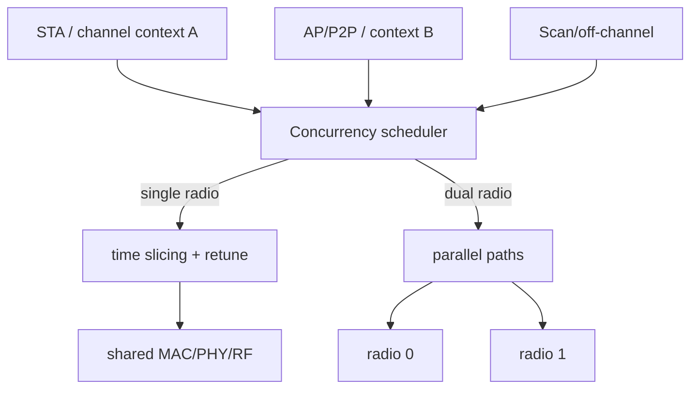

# SCC/MCC/双频并发与 BT Coexistence

SCC、MCC、DBAC、DBDC、DBS 多为产品或厂商术语，不能只凭名字判断硬件能力。必须还原成资源图：有几套 MAC/PHY/RF、能否同时 TX/RX、共享哪些天线/FEM/时钟/Host Interface。

## 资源模型

SCC 共用信道但仍争用 airtime；单 Radio MCC/跨频并发通过分时和 retune 实现；真正 simultaneous 需要足够独立的 RF/PHY 资源，但仍可能共享天线、总线、功耗和热预算。

## 调度约束

Scheduler 不只按吞吐切片，还必须满足 STA Beacon receive deadline、AP/GO TBTT、NoA/CTWindow、TWT service period、DFS、scan dwell 和 Channel Switch。TX completion latency 应分解为 role wait、retune、queue、air contention，而不是只给总延迟。

建议记录每个 role/channel context 的 dwell、airtime、queue residence、beacon miss/jitter、retune latency 和 missed deadline。

## BT/Wi-Fi 共存

2.4 GHz 共存通常由 PTA/grant、RF switch 和 Firmware policy 协同。SCO、A2DP、BLE connection event 与 Wi-Fi Scan、AMPDU、Beacon 有不同 deadline。只按“Wi-Fi 高优先级/BT 高优先级”二分会造成吞吐抖动或音频破音。

统计至少包括 request/grant/deny、deny duration、业务类型、Wi-Fi retry/CCA、BT miss 和天线状态。调试时用统一时间线把 PTA 决策、Wi-Fi TX attempt、BT event 与空口结果对齐。

## 典型不变量

- 单 Radio 同一时刻只能属于一个 channel context；
- 切走前没有继续提交到旧信道的 Hardware queue；
- GO/AP 的 Beacon deadline 不因 bulk traffic 被饿死；
- Scan budget 有上限且能被实时角色抢占；
- Role teardown 会取消其 timer、queue、NoA 和 channel request。
