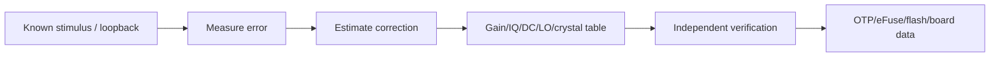

# RF 指标、校准与失效模式

RF/Analog 把数字 I/Q 转为受法规约束的射频信号，也把微弱且受干扰的信号送入 ADC。芯片“能收发”只是 Bring-up 起点，量产一致性取决于校准、温度补偿和 Board Data。

## 关键模块

- TX：DAC、mixer、PLL/VCO、driver、PA、filter/FEM。
- RX：filter/switch、LNA、mixer、VGA、ADC 与 AGC loop。
- 公共：reference crystal、供电、天线、band switch 和 coexistence path。

## 指标的因果关系

| 指标 | 说明 | 常见根因方向 |
|---|---|---|
| TX power | 输出功率与精度 | PA/gain table、供电、温补 |
| EVM | 星座误差 | IQ、phase noise、PA 非线性、CFO |
| Frequency error | 载波频偏 | crystal/PLL/温度 |
| Spectral mask/spur | 带外能量 | PA、PLL、时钟耦合、滤波 |
| Sensitivity/PER | 指定条件下接收能力 | NF、AGC、同步、PHY decode |
| RSSI accuracy | 报告功率误差 | RX gain calibration、温补 |

RSSI、SNR 与 EVM 不能盲目跨芯片比较，先确认参考点、单位、per-chain/combined 方式和是否经过校准。

## 校准闭环

常见项目包括 TX power、RX gain、DC offset、IQ imbalance、LO leakage、crystal trim 和 temperature compensation。必须定义校准条件、算法版本、数据格式、CRC、fallback 和失效策略。

## OTP/eFuse 安全性

OTP 是不可逆资源。写入流程应校验 device identity、board/SKU、目标地址、未烧写状态、电压温度条件与结果 readback；重要字段使用冗余/CRC 和版本。生产工具不得允许任意地址裸写。

## 分层定位

- Conducted 测试正常、OTA 差：优先检查 FEM、天线、Layout 与整机干扰。
- 低 MCS 正常、高 MCS EVM/PER 差：检查 phase noise、IQ、PA linearity 与电源噪声。
- 高低温频偏或功率漂移：检查 crystal/gain 温补表及传感器路径。
- 近距离反而丢包：检查 AGC saturation、LNA bypass 和动态范围。
- 仅特定信道出现 spur/EVM：检查 PLL、时钟谐波、band-edge power 与校准插值。

每个结论都应保存 instrument 配置、cable loss/reference plane、Vector、温度、电压、board revision 和 calibration version，才能复现。
