# 同步、信道估计、编码与 MIMO 接收链

PHY RX 的核心不是“FFT 后解调”，而是在低 SNR、多径、频偏、采样误差和干扰下逐步建立对 PPDU 的可信解释。每一级都应输出质量指标和失败原因。

## 接收处理链

```mermaid
flowchart LR
    ADC --> DC[DC/IQ correction]
    DC --> DET[Packet detection / AGC]
    DET --> SYNC[Timing / CFO / SFO]
    SYNC --> FFT[GI removal / FFT]
    FFT --> CE[Channel estimation / tracking]
    CE --> EQ[Equalization / MIMO detect]
    EQ --> DEMAP[Soft demap / LLR]
    DEMAP --> FEC[BCC/LDPC decode]
    FEC --> CRC[SIG/PSDU checks]
    CRC --> RXV[RXVECTOR + metrics]
```

## Packet Detection 与 AGC

检测器利用前导码相关性、能量或组合指标区分噪声与有效包。门限过高降低灵敏度，过低增加 false alarm；强干扰还可能触发 AGC 却无法解码。

AGC 要在有限训练字段内选择 LNA/VGA/ADC range。增益不足损失量化精度，过高导致 clipping。应记录 initial/final gain、saturation、gain step、RSSI per chain 和 detect metric，而不是只返回一个 RSSI。

## Timing、CFO 与 SFO

- Symbol timing 决定 FFT window；偏移会引入 ISI/ICI。
- CFO 来自收发本振差和多普勒，通常分 coarse/fine 估计并在时域/频域补偿。
- SFO 是采样时钟差，误差随 OFDM symbol 累积，需要 pilot tracking。
- Common Phase Error 与 phase noise 会旋转星座，高阶 QAM 更敏感。

“同步失败”应细分为 no detect、coarse timing、fine timing、CFO out of range、SIG CRC fail 和 tracking divergence。

## Channel Estimation 与 Equalization

LTF 提供已知训练序列，接收端估计每个 subcarrier、每条空间链路的复数响应。频率选择性衰落意味着单一 RSSI 无法代表可解码性。

SISO 可使用 ZF/MMSE 等均衡；MIMO 要根据 channel matrix 分离 spatial streams。矩阵条件数差时，即使总功率很高，stream separation 仍可能失败。MMSE 利用噪声估计在噪声增强和残余干扰间折中。

实现需说明：channel estimate 存储精度、插值、pilot tracking、noise variance、per-RU/per-user 边界和 saturation behavior。

## Soft Demap 与 FEC

Demapper 不只输出 bit，而是输出 LLR。LLR 的尺度依赖星座点距离、channel gain 和噪声估计；量化范围太小会饱和，太大则浪费精度。

BCC 经过 Viterbi 等译码；LDPC 使用迭代译码，性能与 iteration、early termination、codeword 参数和 LLR 质量相关。高吞吐设计要在 decoder 并行度、存储、功耗和 worst-case latency 间权衡。

建议记录 LDPC iteration histogram、decoder failure、post-FEC CRC、LLR saturation 和 codeword 参数。只记录“FCS error”会把 RF、同步、估计和译码问题全部混在一起。

## TX/RXVECTOR 契约

Vector 至少描述 PPDU format、bandwidth、MCS、NSS、GI/LTF、coding、STBC/DCM、RU/user、length 和 power/control 信息。Hardware/Firmware 之间要版本化，保留 raw status 与归一化 status，避免新增 HE/EHT 字段后旧 Host 错读结构。

RXVECTOR 还包含 RSSI/EVM per chain/stream、frequency error、AGC、decoder/FCS 状态、BSS color/user/RU、timestamp 等。字段的 reference point、单位和有效条件必须文档化。

## HE MU/TB 的额外约束

HE MU 需要从 HE-SIG-B 等信令解析 user/RU，再对目标 RU 解调。HE TB 接收端面对多个 STA 的残余 timing/CFO/power 差异，AP Trigger 中的同步与 target RSSI 只能减少误差，不能消除。

调试 HE TB 应按 user/RU 保存 detect、power、CFO、EVM、FEC 和 FCS，而不是只给整个 PPDU 一个 pass/fail。

## Beamforming 与 CSI

Beamforming 依赖 sounding、channel measurement、feedback/compression 和 steering。问题可能出在 NDPA/NDP 时序、feedback dimension、calibration、矩阵应用或 channel aging。

看到 Beamforming capability 不等于已生效。需要证明 sounding 发生、CSI 有效、steering matrix 被使用，并比较启用前后的 per-stream EVM/PER/throughput。

## 定位矩阵

| 指标 | 可能异常层次 |
|---|---|
| no detect | RF gain、门限、干扰、前导码 |
| SIG fail | timing/CFO/channel estimate、format parsing |
| 高 RSSI 高 EVM | clipping、IQ、phase noise、CFO、矩阵条件 |
| LDPC iteration 飙升 | SNR/EVM、LLR scale、channel estimate |
| 仅高 MCS 失败 | EVM/phase noise、LLR/FEC margin |
| 仅 MU/TB 失败 | RU/user parsing、多用户同步/功率 |

## 面试追问

- 为什么 RSSI 很高仍可能 PER 很差？
- CFO、SFO、phase noise 分别怎样影响 OFDM？
- ZF 与 MMSE 的权衡是什么？
- 为什么 RXVECTOR 必须描述字段有效条件和 reference point？

## 答题要点与适用边界

高RSSI仍可能有clipping、IQ失衡或高相噪。CFO破坏载波正交性，SFO造成跨symbol的采样/相位漂移，相噪包含公共相位误差及载波间干扰。ZF可能在弱信道方向增强噪声，MMSE利用噪声估计作折中。Vector字段只有在对应解码阶段成功且参考面/单位明确时才可比较。小timing偏移仍在允许GI范围时可被均衡处理，不能说任何偏移都会导致ISI。
