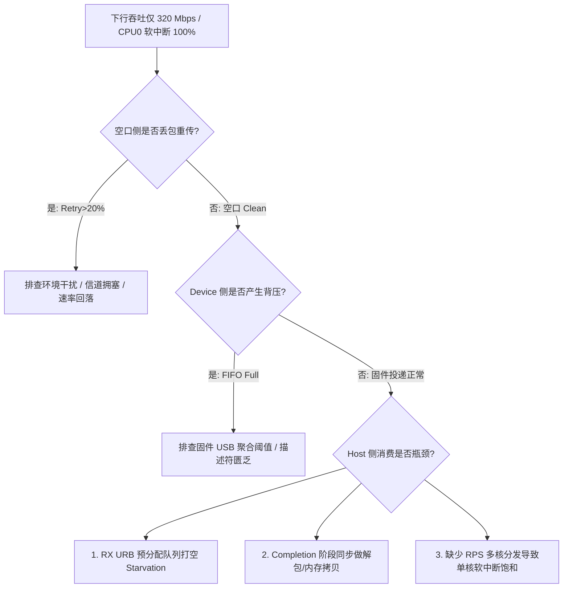

# 案例：USB RX 吞吐瓶颈与软中断打满分析

!!! note "场景性质说明"
    本案例为基于 Wi-Fi 6 (2x2 80MHz, 理论 PHY Rate 1201 Mbps) 教学基准模型的合成场景（Synthetic Educational Model）。文中的日志切片、`perf top` 采样与指标数值均为定量阐释排查机理与调优逻辑所用的推演示意，不对应特定量产网卡的原始实测报告。

## 现象描述

在一款 Wi-Fi 6 (802.11ax 2x2 80MHz) USB 无线网卡教学模型中：
- 空口协商 PHY Rate 稳定在 **1201 Mbps**，RSSI 为 -45 dBm，测试距离 2 米无遮挡。
- **上行 (TX) TCP 吞吐**：`iperf3 -c <server>` 达到 **860 Mbps**，表现正常。
- **下行 (RX) TCP 吞吐**：`iperf3 -c <server> -R` 仅达到 **310~330 Mbps**，无论增加并发流 (`-P 4`) 还是增大 TCP 窗口均无法突破。
- `top` 观测到单核 CPU0 的软中断使用率长期处于 **100%**（`ksoftirqd/0` 满载），而其他 CPU 核心几乎处于空闲状态。

## 排查与假设树



## 关键证据推演与数据示例

### 1. 驱动与总线层关键统计
示意驱动 debugfs 统计视图：
```text
=== USB Data Path Stats ===
RX URB depth:           8
RX URB starved count:   14,820 / sec   <-- 严重饥饿！Host 补 URB 不及时
Avg USB transfer size:  1,514 bytes    <-- 几乎无聚合，每个以太网帧触发一次 URB 完成
URB completions:        26,400 / sec   <-- 产生极其惊人的中断/软中断开销！
Firmware RX overflow:   1,210 / sec    <-- 设备侧 USB 端点 FIFO 溢出丢包
```

### 2. 内核火焰图 / perf top 热点分析
```text
# perf top -C 0
Overhead  Shared Object       Symbol
  32.14%  [kernel]            usb_submit_urb
  28.65%  [kernel]            memcpy
  14.20%  [wifi_usb_drv]      rx_urb_complete_handler
   9.81%  [kernel]            __netif_receive_skb_core
   4.32%  [kernel]            kmalloc
```
**热点归因**：
1. **中断次数过多**：平均每个 URB 仅传输 1.5 KB 数据，每秒触发 2.6 万次 URB 完成回调，内核大量时间耗费在软中断上下文切换中。
2. **URB 深度不足**：仅预提交了 8 个 URB，在 CPU0 忙于 `memcpy` 时，所有 8 个 URB 瞬间耗尽（`inflight = 0`），USB 端点向 Device 返回 NAK，导致 Device 内部硬件 RX FIFO 溢出。

## 根因与优化措施

### 优化 1：启用固件端 USB RX 多包聚合
固件在收到 MAC 层的 A-MPDU 后，不再拆解为一个一个独立的 USB Transfer，而是将多个以太网帧组装在一个大的 USB Bulk IN Transfer（例如 32 KB 或 64 KB）中打包上送。

### 优化 2：增大 Host RX URB 深度与缓冲区所有权置换
将 RX URB 池从 8 扩大到 32~64，并遵循严格的 Buffer 所有权生命周期：不能直接重新提交挂着旧数据的同一个 URB，否则当 NAPI 或消费者异步解析旧数据时，USB 控制器的新 DMA 会直接覆盖破坏缓冲区。必须在回调中将旧 Buffer 解绑交出，并置换入新分配的 Buffer 后再行提交：

```c
/* 深队列与大聚合接收缓冲区 (32KB) */
#define RX_URB_NUM       32
#define RX_BUFFER_SIZE   (32 * 1024)

static void rx_urb_complete(struct urb *urb)
{
    struct my_wifi_rx_slot *slot = urb->context;
    struct sk_buff *completed_skb = slot->skb;
    struct sk_buff *new_skb;
    int ret;

    /* 检查 USB 传输完成状态 */
    if (unlikely(urb->status != 0)) {
        if (urb->status == -ENOENT || urb->status == -ECONNRESET || urb->status == -ESHUTDOWN)
            return; /* 驱动正在卸载或接口关闭 */
        slot->adapter->stats.rx_urb_errors++;
        goto resubmit;
    }

    /* 1. 分配新 Buffer 用于后续接收，准备与已完成数据置换 (使用标准内核接口) */
    new_skb = __netdev_alloc_skb(slot->adapter->netdev, RX_BUFFER_SIZE, GFP_ATOMIC);
    if (unlikely(!new_skb)) {
        /* 内存耗尽降级：只能忍痛复用旧 Buffer 重新提交，防止 USB 流水线断流饥饿 */
        slot->adapter->stats.rx_dropped_nomem++;
        goto resubmit;
    }

    /* 2. 所有权交接：旧 Buffer 记录实际长度并移交 NAPI 消费队列 */
    skb_put(completed_skb, urb->actual_length);
    skb_queue_tail(&slot->adapter->rx_backlog, completed_skb);
    napi_schedule(&slot->adapter->napi);

    /* 3. 将新 Buffer 挂载给当前 URB */
    slot->skb = new_skb;
    urb->transfer_buffer = new_skb->data;

resubmit:
    ret = usb_submit_urb(urb, GFP_ATOMIC);
    if (unlikely(ret)) {
        /* 提交失败需记录错误并加入延时重试链表，避免 URB 永久掉队丢失 */
        slot->adapter->stats.rx_submit_failures++;
        schedule_rx_refill(slot->adapter);
    }
}
```

> **USB DMA 映射模式说明**：本示例假定驱动采用 Linux USB Core 的自动 DMA 映射机制（由 USB 主机控制器驱动在 `usb_submit_urb` 时统一建立和解除流式 DMA 映射）。若驱动自行管理预映射（设置了 `URB_NO_TRANSFER_DMA_MAP`），则不可仅替换 `urb->transfer_buffer`，还必须同步更新 `urb->transfer_dma` 并严格遵循 `dma_sync_single_for_cpu` / `dma_sync_single_for_device` 维护内存一致性。

### 优化 3：开启 RPS (Receive Packet Steering) 实现多核软中断分流
由于单 USB 端口的中断通常绑定在单个 CPU 核心上，通过 RPS 将网络协议栈解析开销分发至其他 CPU 核心：
```bash
# 将网络栈软中断分发至系统所有 CPU 核心 (例如 4 核系统掩码设为 f)
echo "f" | sudo tee /sys/class/net/wlan0/queues/rx-0/rps_cpus
```

## 教学推演与调优前后指标对照

!!! note "教学基准模型说明"
    下表数据源自 Wi-Fi 6 (2x2 80MHz, 理论 PHY Rate 1201 Mbps, 干净信道) 教学基准模型的调优推演对比，用于定量阐释“USB 固件大聚合、消除 URB 饥饿与 RPS 跨核分流”对系统 Goodput 和 CPU 开销的改善量级。此处不代表特定商业芯片在全部软硬件条件下的实测保证，真实调优应以目标平台与仪表数据为准。

| 衡量指标 | 优化前 (单帧 URB + 单核绑定) | 优化后 (32KB 聚合 + 32 URB + RPS) | 改善机理分析 |
|---|---|---|---|
| **TCP RX 吞吐 (Goodput)** | ~320 Mbps | **~860 Mbps** | 消除 URB 饥饿与单核瓶颈，逼近总线与空口上限 |
| **平均单个 URB 传输长度** | 1,514 byte | ~28,000 byte | 固件聚合生效，大块 Bulk 传输大幅提升总线效率 |
| **每秒 URB 完成中断次数**| ~26,000 次/秒 | ~3,800 次/秒 | **降低 ~85%** 中断与软中断上下文切换损耗 |
| **CPU0 软中断使用率** | 100% (打满瓶颈) | ~35% | RPS 多核协同分流，协议栈开销不再单核排队 |
| **URB Starvation 发生频次** | 高频发生 (数千次/秒) | 0 次/秒 | 预充 32 深度 Buffer 确保 DMA 流水线不空转 |

详细深入背景可参考博文：[Wi-Fi USB 驱动架构与多核性能调优](/2025/07/13/wifi-usb-driver-performance-tuning/)。


