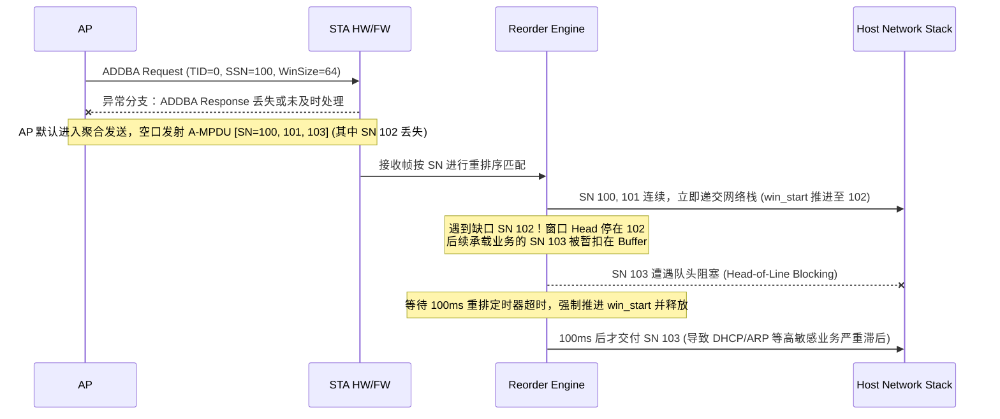

# 案例：ADDBA 协商异常导致重排序阻塞与业务断流

!!! note "场景性质说明"
    本案例为合成教学场景（Synthetic Educational Model）。文中的日志切片、时序交互与重排序演算旨在深入阐释 BlockAck 状态机与 Reorder Engine 的队头阻塞机理，不对应特定量产芯片的原始实测记录。

## 现象描述

STA 成功完成 802.11 关联与 WPA2/WPA3 密钥协商后：
- 偶发性出现获取 IP 地址（DHCP）耗时超过 15 秒，或已获得 IP 后下行 ping 丢包率高达 60%~80%。
- 抓取空口报文发现：AP 多次向 STA 发送 `ADDBA Request` (Category: Block Ack, Action: ADDBA Request, TID=0)，但空口未见 STA 发出 `ADDBA Response`；随后 AP 强行发送 A-MPDU 聚合包，STA 侧数据出现大量“假性失步”。

## 机制背景：BlockAck 与 Reorder Engine



### 正常缺口与异常状态的边界

1. **正常重排序行为**：
   - 收到连续帧（如 100、101）时，Reorder Engine 必须立即向上交付给 Host，并将滑动窗口起始序号 `win_start` 顺序推进至 102；
   - 收到乱序的 103 时，由于存在未达缺口 102，103 必须暂扣在 Reorder Buffer 中等待补齐；
   - 一旦缺失的 102 到达，或者 AP 下发 BAR 帧显式推进，或者本地 Reorder Timer（通常 50~100ms）超时，窗口才跳过 102 并向上刷新 103。
2. **本案例的故障特征**：
   - 掉线重连或快速漫游后，STA 固件内残留了旧 AP 的 BA Session 上下文与过期的 SSN；
   - 当新 AP 发起 ADDBA Request 时，固件因内部状态机错乱未正确响应 ADDBA Response；
   - AP 随后以 A-MPDU 方式发送下行流量。由于 BA 状态半开、缺少 BAR 驱动，空口一旦偶发丢单帧，随后的业务包（如包含 DHCP Offer 的单播帧）就会在 STA 端遭遇漫长的 100ms 定时器超时等待，进而引发上层 DHCP 客户端多次重试退避甚至超时挂死。

## 异常证据推演与日志示例

### 1. 空口 Sniffer 抓包特征
- AP 发送 Action 帧：`Category: Block Ack (3)`, `Action: ADDBA Request (0)`, `Dialog Token: 0x01`, `TID: 0`, `Buffer Size: 64`, `SSN: 2048`。
- STA 未发送 `ADDBA Response`，AP 触发重发（Retry=1），连续 3 次后 AP 放弃重试。
- 紧随其后的下行报文中出现 DHCP Offer（承载在 TID 0 上），但由于此前丢了一个单播帧，DHCP Offer 在 STA 端被扣留在 Reorder 队列中无法上报。

### 2. 固件与驱动日志切片
```text
[  58.120401] wifi_mac: RX Action frame: Category=3 Action=0 len=9
[  58.120412] wifi_mac: ADDBA Req received for TID 0, but session already ACTIVE! (Stale Peer AID 1)
[  58.120419] wifi_mac: Dropping ADDBA Req: duplicate or invalid session state
[  58.225010] wifi_mac: Reorder timer expired for TID 0, win_start moved 2048 -> 2050, flushed 1 frames
```

## 根因推演与排查树

```text
ADDBA 响应缺失 / 数据阻塞
 ├── 1. 固件是否收到 ADDBA Request 帧？
 │    ├── 否 -> 硬件 FCS 校验失败 / 组播或单播地址过滤错误 / 信道对错
 │    └── 是 -> 检查固件 Action 帧处理分发
 ├── 2. 为什么固件未发送 ADDBA Response？
 │    ├── 原因 A：旧连接 Session 未彻底注销（本案例根因）
 │    │    └── 快速漫游或掉线重连时，驱动仅重置了 VIF，未下发命令清除底层的 Peer BA Context。
 │    ├── 原因 B：Action 帧发送队列被数据队列背压阻塞
 │    │    └── 固件管理帧共用数据 TX Buffer，数据队列打满导致 Response 无法入队。
 │    └── 原因 C：内存不足拒绝（Status Code = 37: Decline）
 └── 3. 为什么导致 DHCP 业务失败？
      └── 缺少 SN 导致 Reorder 队头阻塞，业务帧在缓冲区内停留超时，DHCP Client 重试退避。
```

## 关键代码修复与状态机重置

在漫游断链或 BSSID 切换时，必须向固件下发同步重置命令，彻底释放所有 TID 的 BA 状态与 Reorder 队列。针对并发 RX / BAR 路径，必须严格在锁保护下将 `active` 置为 false，防止在销毁过程中被重新装载定时器：

```c
void wifi_teardown_peer_ba(struct wifi_priv *priv, struct wifi_peer *peer)
{
    int tid;
    for (tid = 0; tid < IEEE80211_NUM_TIDS; tid++) {
        struct wifi_ba_session *sess = &peer->rx_ba_session[tid];

        /* 1. 在自旋锁保护下立即标记 session 失效，
         * 阻断并发 RX / BAR 路径向该 Session 入队或调用 mod_timer() 重启定时器 */
        spin_lock_bh(&peer->ba_lock);
        if (!sess->active) {
            spin_unlock_bh(&peer->ba_lock);
            continue;
        }
        sess->active = false;
        spin_unlock_bh(&peer->ba_lock);

        /* 2. 在锁外同步等待并取消在途的 Reorder 定时器回调 (注意：del_timer_sync 不能持有自旋锁调用)。
         * 此时由于 active 已为 false，正在执行的回调或新到达的帧均不会再次 arm 定时器 */
        del_timer_sync(&sess->reorder_timer);

        /* 3. 再次获取锁，安全排空已无定时器保护的 Reorder 队列，将暂存帧上交或丢弃 */
        spin_lock_bh(&peer->ba_lock);
        reorder_queue_flush(&sess->reorder_queue);
        spin_unlock_bh(&peer->ba_lock);

        /* 4. 下发固件命令注销硬件侧 BA Session 描述符与 Context */
        fw_cmd_delete_ba_session(priv, peer->mac_addr, tid, BA_INITIATOR_RECIPIENT);
    }
}
```

> **并发防竞态准则**：仅调用 `del_timer_sync()` 只能保证返回时刻无回调执行，无法阻止并发路径在锁外调用 `mod_timer()`。必须遵循“**锁内标记失效 $\to$ 锁外同步取消定时器 $\to$ 锁内排空残留队列 $\to$ 固件注销**”的确定性时序。

## Wireshark 关键过滤语法

- 过滤所有 BlockAck 相关 Action 帧：`wlan.fc.type == 0 && wlan.action.category == 3`
- 过滤特定 TID 的 ADDBA 交互：`wlan.ba.action == 0 || wlan.ba.action == 1`
- 检查下行重排序延迟：通过设置 Wireshark 的 `Time Since Previous Displayed Frame` 观察 DHCP Offer/ACK 到达时间间隔。

## 回归验证

1. **快速漫游/重连注入**：在 AP 发起 ADDBA 握手的瞬间，强制触发 STA 断开连接并重连同一 AP，验证固件不应存在残留 BA 状态。
2. **丢帧容忍度测试**：在受控射频衰减室模拟 5%~15% 的随机空口丢包，验证 Reorder Engine 的缺少帧补全机制与超时刷新是否平稳，不发生业务单播长时间停滞。

