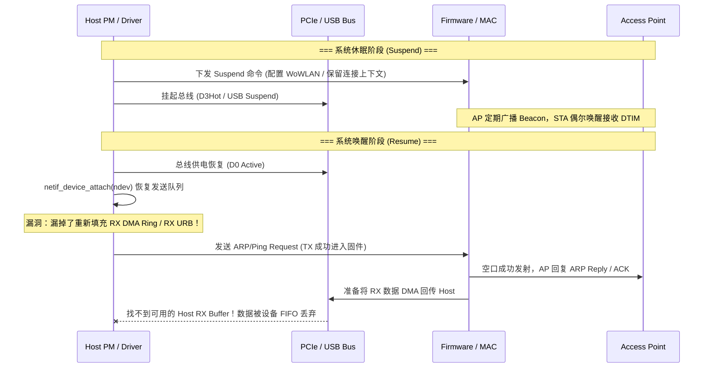

# 案例：系统休眠唤醒后“假连断流”排查与状态对齐

!!! note "场景性质说明"
    本案例为合成教学场景（Synthetic Educational Model）。文中的内核日志、驱动 dump 与寄存器状态用于演示系统休眠唤醒中的状态不对齐与恢复依赖，不对应特定量产芯片的原始实测记录。

## 现象描述

设备从系统休眠（Linux Suspend-to-RAM / Android Deep Sleep）唤醒后：
- 桌面任务栏或系统设置仍显示 Wi-Fi 处于“已连接”状态，信号格满格。
- 实际所有网络业务完全断绝：网关 Ping 不通，ARP 请求无响应，TCP 连接全部超时挂起。
- 在系统设置中关闭 Wi-Fi 重新打开，或者重启接口（`ifconfig wlan0 down && ifconfig wlan0 up`）后立刻恢复正常。

## 机制背景：休眠唤醒中的“半失步”陷阱

休眠与唤醒绝不仅仅是简单的总线上下电，而是涉及 **Host 驱动、总线控制器、固件上下文与 AP 空口状态** 四方时钟与状态的重新同步：



## 关键证据推演与数据示例

### 1. 内核 dmesg 日志与事件切片
```text
[  128.410120] PM: suspend entry (deep)
[  128.450201] wifi_pci: entering suspend, wowlan=enabled, vif=0
[  128.451002] wifi_pci: pci_set_power_state D3hot
[  140.102310] PM: resume of devices complete after 12.501 msecs
[  140.103001] wifi_pci: pci_set_power_state D0
[  140.103210] wifi_pci: calling netif_device_attach
[  140.103250] wifi_pci: resume finished, device marked ACTIVE
[  142.150110] net_ratelimit: 45 callbacks suppressed
[  142.150115] wlan0: TX completed: 12 packets, RX completed: 0 packets
```

### 2. 硬件与驱动统计比对
通过驱动 debugfs 检查总线 Ring 状态：
```text
=== Host PCIe Ring ===
TX Ring: Head=42, Tail=54, Free=244   (正常推进)
RX Ring: Head=0,  Tail=0,  Free=0     <-- 致命错误：RX Ring 完全未初始化/未提交 Buffer！

=== Firmware State Dump ===
Link State:       CONNECTED (AID=2, BSSID=00:11:22:33:44:55)
Air RX Frames:    38 (包括对端 AP 的回复)
Drop Reason:      HOST_BUFFER_UNAVAILABLE (38 次)  <-- 固件侧明确提示 Host 无可用接收槽位
```

### 3. 空口抓包对账
- 使用独立抓包网卡捕获空中报文：
  - STA 唤醒后，向网关发出了 ARP Request（`Who has 192.168.1.1? Tell 192.168.1.100`）；
  - 网关 AP 在 1.2ms 后立即发回了单播 ARP Response（`192.168.1.1 is at 00:11:22:33:44:55`）；
  - 芯片 MAC 硬件在 16μs 后准确回复了空口 ACK。
- **排查推论**：结合空口确认与设备侧 `HOST_BUFFER_UNAVAILABLE` 计数，排除了射频损坏与固件断链故障，证据链高度指向 **Host 驱动在 Resume 恢复流程中未向设备及时补充 RX 接收槽位**。

## 典型根因归类

| 故障类别 | 根本诱因 | 典型特征与判据 |
|---|---|---|
| **A. RX Buffer 遗漏 (本案例)** | 驱动在 resume 时唤醒了 TX 队列，却未重新分配提交 RX 描述符/URB | 只有 TX 流量、RX 计数恒为 0、固件日志报 Buffer Unavailable |
| **B. 假活僵尸连接 (Zombie)** | 休眠期间 AP 发生信标超时已踢掉 STA (Deauth)，但固件未感知或未向 Host 上报 | 任何 TX 均无空口 ACK、不断触发空口最大重传、驱动报 TX Timeout |
| **C. 总线 MSI 中断未重使能** | PCIe D3Hot 到 D0 切换后，MSI/MSI-X 配置寄存器丢失，驱动未调用 `pci_enable_msi` | 数据已 DMA 到 Host 内存，但 CPU 从未进入中断与 NAPI 处理 |
| **D. 固件休眠命令超时** | Host 发送 Wakeup Mailbox 固件无响应，驱动强制跳过导致状态不同步 | dmesg 出现 mailbox timeout，寄存器读出全为 `0xFFFFFFFF` |

## 恢复时序的核心原则：通信通路依赖分析

许多工程师容易把 PCIe 恢复代码当成跨总线通用规则。实际上，**恢复步骤的先后顺序严格受制于“唤醒握手响应走哪条通路”**：

- **模式 1：带外 MMIO / 寄存器轮询通路**：
  若芯片支持通过 PCIe MMIO 寄存器或 USB Endpoint 0 控制传输轮询固件唤醒状态，可先在总线层确认固件存活，再铺设数据 Buffer。
- **模式 2：带内事件环 (Event Ring) / 中断依赖通路**：
  若固件唤醒成功的确认（ACK Event）必须作为描述符经由 DMA Ring 回传并通过中断通知 Host，则**必须先将 RX/Event Ring 铺满可用 Buffer 并开启中断，才能发起唤醒握手**；否则 Host 驱动在等待固件响应时，会因中断未开或无可用接收槽位而发生自死锁或超时！

### PCIe 模式示例（以带外 MMIO 唤醒为例）

```c
static int my_wifi_pci_resume(struct device *dev)
{
    struct my_wifi_priv *priv = dev_get_drvdata(dev);
    int ret;

    /* 1. 恢复 PCIe 配置空间与电源状态 (D3hot -> D0) */
    pci_set_power_state(priv->pdev, PCI_D0);
    pci_restore_state(priv->pdev);

    /* 2. 预备接收通路：铺满 RX DMA Ring 并刷新描述符 */
    my_wifi_refill_rx_ring(priv);

    /* 3. 恢复总线中断 (确保后续固件事件与数据能够触发 CPU 处理) */
    enable_irq(priv->pdev->irq);

    /* 4. 握手固件唤醒 (通过 MMIO 门铃触发并等待就绪) */
    ret = fw_handshake_wakeup_mmio(priv);
    if (ret) {
        dev_err(dev, "Firmware dead after resume, queueing reset recovery\n");
        return queue_recovery_work(priv);
    }

    /* 5. 确保全部通道就绪后，才通知内核网络栈恢复发送 */
    netif_device_attach(priv->ndev);
    netif_tx_wake_all_queues(priv->ndev);

    return 0;
}
```

!!! note "教学推演说明"
    本案例基于教学模型还原休眠唤醒中的典型异步失步场景。在真实工程中，PCIe、USB 与 SDIO 的总线挂起机制（如 USB Autosuspend / PCIe L1SS）各有特性，驱动必须结合芯片固件 spec 严格对齐各通道的生命周期。

## 回归验证与自动化压测

1. **休眠唤醒压测脚本**：
   ```bash
   # 循环休眠 200 次，每次唤醒后自动 ping 网关 3 个包，验证无假死
   for i in $(seq 1 200); do
       echo "=== Round $i ==="
       sudo rtcwake -m mem -s 10
       sleep 2
       ping -c 3 192.168.1.1 || { echo "Traffic Dead at round $i"; exit 1; }
   done
   ```
2. **边缘状态覆盖**：
   - **带流休眠**：在持续 `iperf3` 高吞吐流量下强行执行系统 Suspend；
   - **AP 异常断开**：在设备休眠期间关闭 AP 电源，唤醒后验证能否在 3 秒内检测到断开并触发自动重连扫描，而不是永远挂起在已连接假象。

