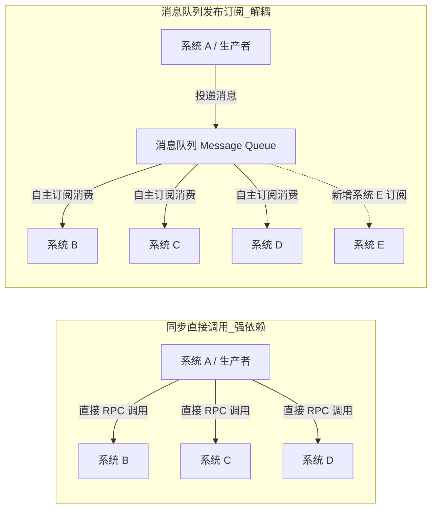

在分布式后端架构（如 Kafka, RocketMQ, RabbitMQ）以及嵌入式 RTOS / Linux 系统中（如 FreeRTOS Queue, POSIX Message Queue），**消息队列（Message Queue, MQ）** 都是常用的并发与异步通信机制。

软件工程中常将消息队列的作用总结为六个字：**解耦、异步、削峰**。

本文结合时延对比、系统边界演进与嵌入式/分布式实际场景，梳理消息队列的设计考量与适用场景。

---

## 1. 场景一：解耦（降低模块间直接依赖）

### 同步直接调用 vs 发布-订阅 (Pub/Sub)



- **故障隔离**：在直接调用模式下，若下游系统 D 超时或异常，可能阻塞系统 A 的调用线程；引入 MQ 后，系统 A 将消息写入队列即可返回，下游系统的临时故障不会直接阻塞上游生产链路；
- **接口与生命周期解耦**：系统 A 无需维护下游每个消费者的地址与调用细节，新增消费系统时只需订阅相关 Topic，生产者代码保持稳定。

---

## 2. 场景二：异步（减少客户端等待时延）

在包含多个非核心下游动作的业务链路中，同步阻塞与异步处理的时延差异显著：

```
方案 A (同步串行阻塞):
[ 用户请求 ] ──> A 写库 (1ms) ──> B 发短信 (100ms) ──> C 积分 (200ms) ──> D 优惠券 (300ms) ──> [ 返回响应: 601ms ]

方案 B (消息队列异步):
[ 用户请求 ] ──> A 写库 (1ms) ──> 投递 MQ (5ms) ──> [ 返回响应: 6ms ]
                                      │
                                      └──> (后台异步消费: B短信 100ms | C积分 200ms | D优惠券 300ms)
```

### 时延对比计算

$$\text{同步总耗时 } T_{\text{sync}} = T_{\text{local}} + \sum_{i=1}^{n} T_{\text{downstream}_i} = 1 + 100 + 200 + 300 = \mathbf{601\text{ ms}}$$

$$\text{异步响应耗时 } T_{\text{async}} = T_{\text{local}} + T_{\text{MQ\_push}} = 1 + 5 = \mathbf{6\text{ ms}}$$

通过将非关键路径（如通知、统计、衍生数据更新）异步化，能够显著降低前台交互的感知延迟。

---

## 3. 场景三：削峰填谷（平滑流量波动）

下层存储系统（如数据库、Flash 写入模块）通常具有明确的吞吐上限。

```
瞬时峰值流量
  5000 QPS  ──> ┌────────────────────────────────────────┐
                │       消息队列 MQ (缓冲排队)           │
                └───────────────────┬────────────────────┘
                                    │
                                    ▼ 匀速消费 (1000 QPS)
                        ┌───────────────────────┐
                        │   下游存储 / 数据库   │
                        └───────────────────────┘
```

- **削峰（Peak Shaving）**：当瞬时流量超过下游处理上限时，消息队列暂存突发请求，防止下游过载崩溃；
- **填谷（Valley Filling）**：高峰过后，消费者继续以稳定速率消化队列中积压的消息，直至恢复平稳状态。

---

## 4. 架构映射：嵌入式 RTOS vs 分布式 MQ

消息队列的设计思想在不同层次系统中均有体现：

| 对比维度 | 嵌入式 RTOS 队列 (`FreeRTOS Queue`) | 分布式消息中间件 (`Kafka / RocketMQ`) |
| :--- | :--- | :--- |
| **底层存储** | 内部 SRAM / 环形 FIFO 内存区 | 磁盘顺序存储 + 操作系统 Page Cache |
| **传输方式** | 内存值拷贝或结构体指针传递 | 网络 Socket / Zero-Copy (sendfile) |
| **持久化** | 掉电丢失 | 磁盘持久化存储 + 多副本机制 |
| **典型用途** | 中断与任务间传递数据、传感器采样同步 | 跨服务解耦、日志收集、异步事件通知 |

---

## 5. 引入消息队列的常见设计考量

1. **消息可靠性**：生产端确认机制、队列持久化以及消费端处理成功后的显式确认（ACK）；
2. **幂等性处理**：网络抖动重试可能导致同一条消息重复投递，消费端通常需基于全局唯一业务 ID 做防重校验；
3. **顺序性要求**：若业务对顺序严格敏感，需确保单分区或单队列的串行消费。
