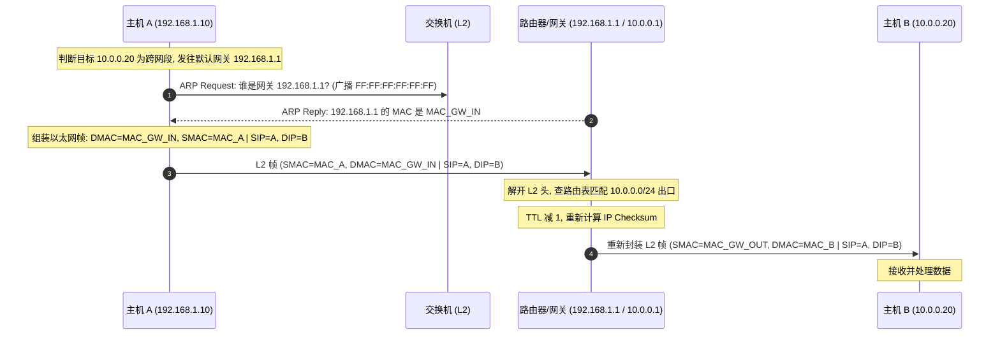

在排查网络通信故障（如“ping 不通网关”、“Wi-Fi 已关联但无法获取 IP”、“跨网段通信丢包”）时，关键的第一步是界定问题属于 L2（数据链路层）还是 L3（网络层）。

- **L2（数据链路层）**：负责**局域网内单跳物理链路的寻址与帧交付**（以 MAC 地址为核心）；
- **L3（网络层）**：负责**跨越不同物理网络的端到端全局路径寻址与路由转发**（以 IP 地址为核心）。

本文梳理以太网帧格式（Ethernet II 与 IEEE 802.3 区别）、802.1Q VLAN、ARP 动态解析与跨网段路由转发机制。

---

## 1. L2 数据链路层核心机制 (以太网与 802.1Q)

### 1.1 Ethernet II 帧结构 (DIX Ethernet)

在当今 TCP/IP 网络中，最通用的以太网帧格式为 **Ethernet II（DIX 格式）**：

```
 6 字节           6 字节          2 字节          46 ~ 1500 字节        4 字节
+---------------+---------------+---------------+----------------------+---------------+
| 目的 MAC (DMAC)| 源 MAC (SMAC) | EtherType     | Payload (上层 IP 数据)| FCS / CRC-32  |
+---------------+---------------+---------------+----------------------+---------------+
```

- **EtherType 协议标识**：
  Ethernet II 使用 2 字节的 EtherType（取值 $\ge \text{0x0600}$）标识上层载荷协议：
  - `0x0800`：IPv4 报文
  - `0x0806`：ARP 地址解析报文
  - `0x86DD`：IPv6 报文
  - `0x8100`：携带 IEEE 802.1Q VLAN 标签
- **Ethernet II 与 IEEE 802.3 的区别**：
  原始 IEEE 802.3 标准将该 2 字节定义为 **Length（长度）** 字段（取值 $\le 1500$），并通过后续的 802.2 LLC / SNAP 头部封装上层协议；现代 TCP/IP 网络几乎普遍使用 Ethernet II 格式。
- **MTU（最大传输单元）**：标准以太网 Payload 上限为 1500 字节。

### 1.2 802.1Q VLAN 标签

为了在同一物理交换机上划分不同的广播域并实现逻辑隔离，IEEE 802.1Q 在源 MAC 与 EtherType 之间插入 4 字节的 VLAN Tag：

```
 2 字节 TPID (0x8100)      3 bit PCP (优先级) 1 bit DEI   12 bit VLAN ID (0 ~ 4095)
+────────────────────────+─────────────────+───────────+─────────────────────────+
```

---

## 2. L3 网络层核心架构 (IPv4 报文与路由)

```
 0                   1                   2                   3
 0 1 2 3 4 5 6 7 8 9 0 1 2 3 4 5 6 7 8 9 0 1 2 3 4 5 6 7 8 9 0 1
+-+-+-+-+-+-+-+-+-+-+-+-+-+-+-+-+-+-+-+-+-+-+-+-+-+-+-+-+-+-+-+-+
|Version|  IHL  |Type of Service|          Total Length         |
+-+-+-+-+-+-+-+-+-+-+-+-+-+-+-+-+-+-+-+-+-+-+-+-+-+-+-+-+-+-+-+-+
|         Identification        |Flags|      Fragment Offset    |
+-+-+-+-+-+-+-+-+-+-+-+-+-+-+-+-+-+-+-+-+-+-+-+-+-+-+-+-+-+-+-+-+
|  Time to Live |    Protocol   |         Header Checksum       |
+-+-+-+-+-+-+-+-+-+-+-+-+-+-+-+-+-+-+-+-+-+-+-+-+-+-+-+-+-+-+-+-+
|                       Source IP Address                       |
+-+-+-+-+-+-+-+-+-+-+-+-+-+-+-+-+-+-+-+-+-+-+-+-+-+-+-+-+-+-+-+-+
|                    Destination IP Address                     |
+-+-+-+-+-+-+-+-+-+-+-+-+-+-+-+-+-+-+-+-+-+-+-+-+-+-+-+-+-+-+-+-+
```

- **TTL（Time to Live）**：防止报文在网络环路中无休止循环。每经过一次三层路由器转发，TTL 递减 1；减至 0 时丢弃并向源端返回 ICMP Time Exceeded 报文（`traceroute` 的基本原理）；
- **Protocol 字段**：`1`=ICMP, `6`=TCP, `17`=UDP；
- **最长前缀匹配（Longest Prefix Match）**：路由器检索路由表时，选取与目标 IP 地址匹配掩码位数最长的一条路由项作为下一跳出口。

---

## 3. L2 与 L3 协同：ARP 寻址与跨网段转发流程

当 Host A（`192.168.1.10`）向跨网段的 Host B（`10.0.0.20`）发送数据时，数据包在网络各层的封装演变如下：



> **转发规律**：在端到端多跳转发过程中，**IP 报文中的源 IP 与目的 IP 保持不变（除 NAT 场景），而在每一跳局域网内，以太网帧头部的 SMAC 与 DMAC 会在经过路由器时被重新封装。**

---

## 4. 故障排查参考矩阵

| 故障现象 | 层级归属 | 常见排查方法 |
| :--- | :--- | :--- |
| 同网段内 ping 不通，提示 `Destination Host Unreachable` | **L2 链路 / ARP** | `arp -a` 检查对端或网关 MAC 是否为 incomplete；检查网线接口 Link 状态、VLAN 配置与 Wi-Fi 关联状态。 |
| 跨网段 ping 不通，提示 `Network is unreachable` | **L3 路由** | `ip route` 查看默认网关路由（`default via ...`）是否缺失。 |
| ping 大包超时或丢包，小包正常 | **L3 MTU / 分片** | 检查中间链路是否丢弃了设置 DF（Don't Fragment）标志的大包（PMTU 黑洞问题）。 |
| 局域网广播风暴，网络瘫痪 | **L2 环路** | 检查交换机物理连线是否存在环路，确认交换机是否已启用 STP/RSTP（生成树协议）。 |

---

## 5. 总结

1. **职责划分**：L2 负责局域网单跳传输（交换机依据 MAC 表转发），L3 负责广域网端到端路由（路由器依据 IP 路由表转发）；
2. **ARP 桥接**：ARP 将 L3 的逻辑 IP 地址映射为 L2 的物理 MAC 地址；
3. **排查方法**：自底向上排查物理链路与 Link 状态（L1）、MAC 与 ARP 邻居表（L2），再到 IP 路由表与防火墙策略（L3）。
