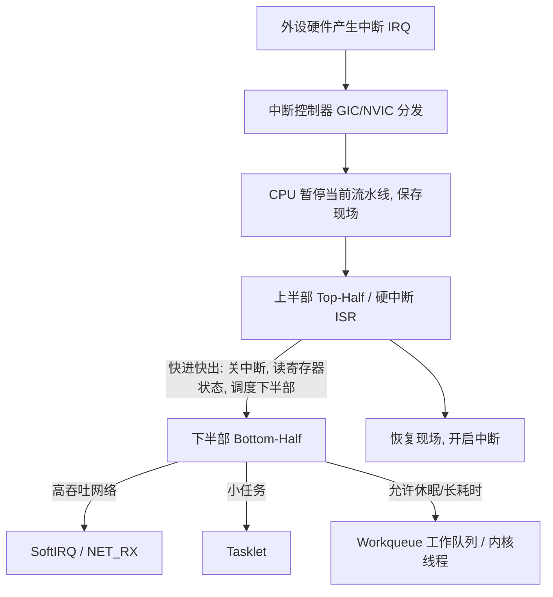

在底层系统开发、驱动编写与并发调试中，常会遇到以下底层现象：
- 在中断处理函数（ISR）中调用 `msleep()` 或获取互斥锁导致系统挂死；
- DMA 传输后的数据，CPU 读取时出现数据陈旧；
- 多核环境下并发修改全局变量出现数值错乱；
- 相同虚拟地址在不同进程中指向独立物理内存。

这些现象涉及操作系统的四大核心机制：**中断（Interrupt）、多核（Multi-Core/SMP）、MMU（内存管理单元）与 Cache（高速缓存）**。本文梳理这四大机制的基本原理与协作关系。

---

## 1. 中断机制：异步响应与上下半部拆分



### 1.1 中断上下文不能睡眠的原因
1. **无进程上下文（No Process Context）**：中断是异步触发的，借用当前被打断进程的内核栈或独立中断栈运行，缺乏独立的 `task_struct` 调度实体；
2. **调度器无法唤醒**：若在 ISR 中调用休眠函数或申请互斥锁导致阻塞，调度器将无法正常挂起并再次唤醒该上下文，容易引发系统死锁（`scheduling while atomic`）。

### 1.2 上下半部机制（Top-Half & Bottom-Half）
- **上半部（Hard ISR）**：快速读取硬件寄存器并清除中断标志，随后触发下半部并退出中断；
- **下半部（SoftIRQ / Tasklet / Workqueue）**：在开中断环境或内核工作线程中处理复杂的数据包解析、内存分配等耗时操作。

---

## 2. Cache 与缓存一致性 (Cache Coherency)

CPU 访问寄存器和 L1 Cache 的时延远低于访问外部主存 DDR 的时延。为此，现代处理器引入了多级高速缓存（以 Cache Line 为单位，常见 64 字节）。

```
[ CPU Core 0 ] ──> [ L1/L2 Cache (私有) ] ──┐
                                             ├──> [ L3 Cache (共享) ] ──> [ DDR 物理内存 ]
[ CPU Core 1 ] ──> [ L1/L2 Cache (私有) ] ──┘          ▲
                                                       │
                                            [ DMA 外设控制器 (直接读写 DDR) ]
```

### 2.1 DMA 与 Cache 一致性处理
外设（如网卡、存储控制器）进行 DMA 传输时直接读写 DDR 物理内存，绕过了 CPU 的私有 Cache：
- **DMA 发送（内存 -> 外设）**：若 CPU 刚写入数据但仍停留在 Cache 中（Dirty），DMA 从 DDR 读出的是旧数据；
  - **处理方法**：启动 DMA 发送前执行 **Cache Clean / Flush**，将 Cache 脏数据刷回 DDR。
- **DMA 接收（外设 -> 内存）**：外设将新数据写入 DDR，但 CPU Cache 中若有该地址的历史缓存，CPU 读取时会发生旧读；
  - **处理方法**：DMA 接收完成后执行 **Cache Invalidate**，使对应 Cache 行失效，强制 CPU 重新从 DDR 读取。

### 2.2 多核 MESI 协议
在多核 SMP 系统中，各核心的私有 Cache 通过 **MESI 协议（Modified, Exclusive, Shared, Invalid）** 监听总线事务，保证同一物理内存地址在多核 Cache 间的数据一致性。

---

## 3. 多核并发与同步原语

在多核架构中，单核的“关中断”无法阻止其他 CPU 核心并发访问共享资源。

```
                  ┌─────────────────────────────────────────┐
                  │           多核并发同步机制              │
                  └────────────────────┬────────────────────┘
            ┌──────────────────────────┼──────────────────────────┐
            ▼                          ▼                          ▼
   ┌─────────────────┐        ┌─────────────────┐        ┌─────────────────┐
   │    原子操作     │        │     自旋锁      │        │     互斥锁      │
   │  (Atomic/CAS)   │        │   (Spinlock)    │        │    (Mutex)      │
   │ * 硬件指令级保护│        │ * 忙等待循环    │        │ * 阻塞并让出CPU │
   │ * 适用于简单计数│        │ * 适用于短临界区│        │ * 适用于耗时操作│
   └─────────────────┘        └─────────────────┘        └─────────────────┘
```

- **内存屏障（Memory Barriers）**：现代 CPU 具备乱序执行与写缓冲优化。在驱动中操作硬件寄存器时，需使用内存屏障指令（如 ARM 的 `dmb`, `dsb`, `isb`）保证读写指令的时序正确性。

---

## 4. MMU (内存管理单元)

MMU 是负责虚拟地址（VA）到物理地址（PA）转换的硬件单元。

1. **权限与保护**：
   页表项（PTE）中包含访问权限控制位：用户态只读、内核特权级读写、以及防止代码注入执行的 **NX 位（No-Execute bit）**；
2. **地址空间隔离**：
   不同进程拥有独立的页表基地址（CR3 / TTBR），相同的虚拟地址会被映射到不同的物理页帧上，实现进程隔离。

---

## 5. 总结

- **中断 (Interrupt)**：实现异步事件的高效响应，通过上下半部拆分平衡实时性与处理吞吐；
- **多核 (Multi-Core)**：通过原子操作、自旋锁与互斥锁保证并发安全；
- **Cache**：利用局部性缓解内存访问延迟，需关注 DMA 传输下的一致性同步；
- **MMU**：提供虚拟地址到物理地址的硬件翻译与多进程内存保护。
