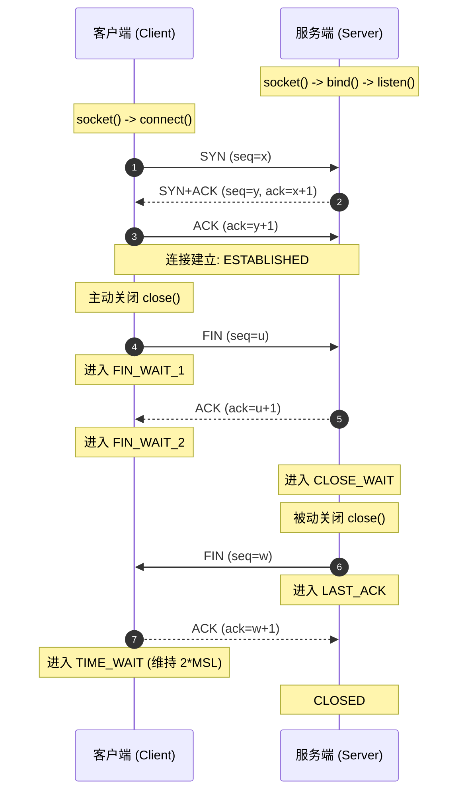

无论是在 Linux 服务端开发，还是在嵌入式系统（Linux / RTOS lwIP）上开发联网组件，除了基础的 `socket()`、`bind()`、`listen()`、`connect()` API 之外，深入理解传输层行为对于排查网络异常至关重要。

在弱网或高并发环境中，开发者常遇到以下问题：
- 小包交互时偶发约 40ms 延迟抖动；
- 服务端重启时提示 `Address already in use` 无法绑定；
- 对端断网后，本端连接长时间处于假死状态；
- 嵌入式协议栈（如 lwIP）中网络驱动与应用层的数据传递开销。

本文梳理 Socket 编程的状态机、I/O 模型、常用 Socket 选项与嵌入式网络优化策略。

---

## 1. TCP 连接生命周期与状态机



### 1.1 `TIME_WAIT` 与 `SO_REUSEADDR` 选项
- **为什么需要维持 2*MSL（通常为 1~2 分钟）？**
  1. 保证最后一个 ACK 能够送达对端（若丢失，对端重发的 FIN 会在 2*MSL 窗口内到达，本端可补发 ACK）；
  2. 允许网络中残留的延迟报文自然消亡，避免新建的同四元组连接接收到旧连接的历史数据。
- **端口复用**：服务端异常退出并重启时，监听端口常因处于 `TIME_WAIT` 导致 `bind: Address already in use`。在 `bind()` 前开启 **`SO_REUSEADDR`** 允许端口快速重用：
  ```c
  int opt = 1;
  setsockopt(listen_fd, SOL_SOCKET, SO_REUSEADDR, &opt, sizeof(opt));
  ```

---

## 2. 常用 Socket 调优选项

### 2.1 降低小包时延：禁用 Nagle 算法 (`TCP_NODELAY`)
- **Nagle 算法与延迟确认（Delayed ACK）的交互**：
  - **Nagle 算法**：本端若存在未确认的在途数据包，会将后续应用层的小包暂存，等待攒满一个 MSS（最大段大小）或收到对端 ACK 后再发出；
  - **接收端 Delayed ACK**：接收端为减少空口报文数，通常延迟几十毫秒等待与回传数据合并发送 ACK；
  - **影响**：两者叠加会导致交互式小包通信（如遥控指令、按键事件、RPC）出现约 40ms 的等待延迟。
- **处理方式**：在交互式通信中开启 `TCP_NODELAY` 禁用 Nagle：
  ```c
  int enable = 1;
  setsockopt(fd, IPPROTO_TCP, TCP_NODELAY, &enable, sizeof(enable));
  ```

### 2.2 异常断连探测：`SO_KEEPALIVE` 与保活定时器
当对端异常断电或物理链路中断，若本端不主动发送数据，TCP 协议栈默认不会主动感知对端状态。可配置系统级 Keepalive 探测：
```c
int keepalive = 1;
int keepidle = 30;   // 空闲 30 秒后开始发送探测包
int keepinterval = 5;// 探测包发送间隔 5 秒
int keepcount = 3;   // 连续 3 次无应答判定连接断开

setsockopt(fd, SOL_SOCKET, SO_KEEPALIVE, &keepalive, sizeof(keepalive));
setsockopt(fd, IPPROTO_TCP, TCP_KEEPIDLE, &keepidle, sizeof(keepidle));
setsockopt(fd, IPPROTO_TCP, TCP_KEEPINTVL, &keepinterval, sizeof(keepinterval));
setsockopt(fd, IPPROTO_TCP, TCP_KEEPCNT, &keepcount, sizeof(keepcount));
```

---

## 3. I/O 多路复用：`epoll` 机制 (ET vs LT)

处理大量并发连接时，通常使用 `epoll` 管理文件描述符：

```
                    ┌─────────────────────────┐
                    │      epoll_create()     │
                    │ (内核红黑树管理监听 fd) │
                    └────────────┬────────────┘
                                 │
           ┌─────────────────────┴─────────────────────┐
           ▼                                           ▼
┌───────────────────────┐                   ┌───────────────────────┐
│ 水平触发 (Level-Trigger)│                   │ 边缘触发 (Edge-Trigger) │
│ * 缓冲区有数据即持续通知│                   │ * 仅状态发生变化时通知│
│ * 编程模型相对直观    │                   │ * 需循环读取至 EAGAIN │
└───────────────────────┘                   └───────────────────────┘
```

> **ET 模式注意点**：在边缘触发（`EPOLLET`）模式下，**socket 需设置为非阻塞模式（`O_NONBLOCK`）**，且事件到达后需循环读取直至 `read()` 返回 `-1` 且 `errno == EAGAIN`，防止残留数据未被及时处理。

---

## 4. 嵌入式协议栈 (lwIP) 内存模型

在资源受限的 MCU/RTOS 环境下，常使用轻量级协议栈 **lwIP**。

### 4.1 `pbuf` 四类内存模型
1. **`PBUF_RAM`**：在动态堆内存中分配，头部与载荷连续存储，常用于发送端数据组装；
2. **`PBUF_POOL`**：在固定大小的预分配内存池中管理，常用于网卡接收中断中的快速分配；
3. **`PBUF_ROM` / `PBUF_REF`**：载荷直接指向外部只读 Flash 或外部全局内存，以指针引用方式减少数据拷贝。

### 4.2 线程安全与驱动接口
- **Mailbox 消息转发**：lwIP 核心线程（`tcpip_thread`）非线程安全，外部应用线程通过消息邮箱向核心线程传递请求；
- **驱动递交**：以太网或 Wi-Fi 驱动在接收到报文后，从 `PBUF_POOL` 分配 `pbuf`，通过 `netif->input(p, netif)` 递交协议栈处理。

---

## 5. 总结

1. **状态机把控**：理解 `TIME_WAIT` 与 `CLOSE_WAIT` 的产生时机，合理配置 `SO_REUSEADDR`；
2. **时延与保活**：对时延敏感的小包交互可开启 `TCP_NODELAY`，对静默长连接可配置 `SO_KEEPALIVE`；
3. **架构选型**：Linux 服务端采用非阻塞与 epoll 模型，嵌入式环境关注 lwIP `pbuf` 内存池与驱动数据流转。
