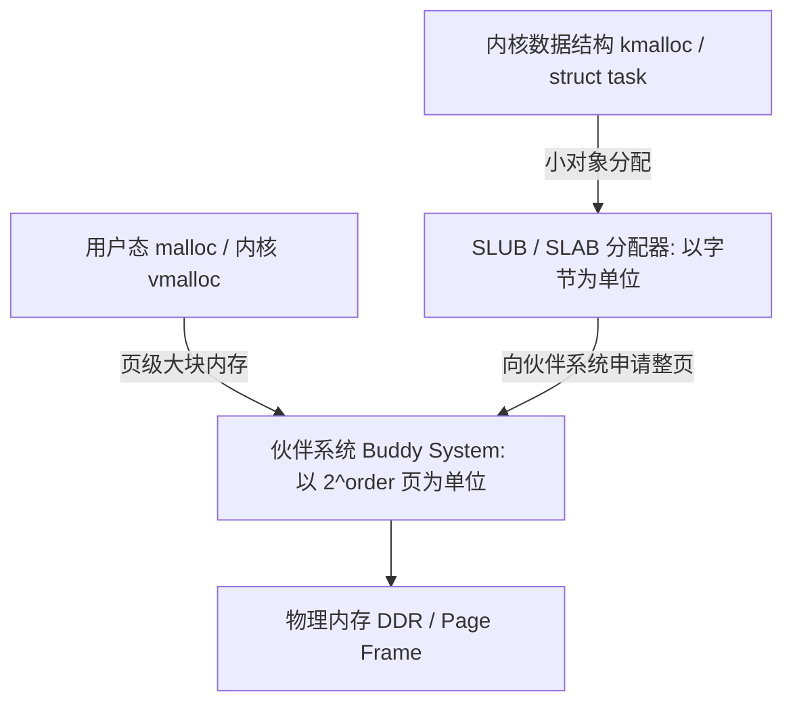

Linux 内存管理是操作系统的核心子系统之一。

通常可以从两条主线来理解其运行机制：
1. **控制与分配主线**：`虚拟地址 (VMA) -> 多级页表与 MMU -> 缺页异常 (Page Fault) -> 伙伴系统 (Buddy) -> SLUB`
2. **压力与回收主线**：`内存水位线 (Watermarks) -> kswapd 异步回收 / 内存规整 (Compaction) -> 直接内存回收 -> OOM Killer`

本文梳理 Linux 内存管理的底层硬件机制、两级分配器与内存回收流程。

---

## 1. 虚拟内存与多级页表映射 (MMU & TLB)

### 1.1 虚拟地址与分页机制
现代操作系统通过分页机制（常见页大小为 4KB）为每个进程提供独立的虚拟地址空间，实现进程间的内存隔离与按需分配。

### 1.2 四级页表映射过程 (64 位架构)

```
虚拟地址 (Virtual Address):
+----------+----------+----------+----------+----------------+
| PGD (9b) | PUD (9b) | PMD (9b) | PTE (9b) | Offset (12b)   |
+----+-----+----+-----+----+-----+----+-----+-------+--------+
     │          │          │          │             │
     ▼          ▼          ▼          ▼             ▼
  [CR3/TTBR] -> PGD表  -> PUD表  -> PMD表  -> PTE项 ──> 物理基地址 + Offset ──> [物理内存]
```

1. **硬件页表遍历（Page Table Walk）**：CPU 执行访存时，MMU 先查询 TLB（Translation Lookaside Buffer）快表；若未命中（TLB Miss），MMU 依据页表基地址寄存器逐级查找 PGD、PUD、PMD 与 PTE，最终定位物理地址并更新 TLB；
2. **权限与有效性检查**：在遍历过程中，若页表项未建立或访问权限不匹配，硬件将触发 CPU 异常进入内核缺页中断。

---

## 2. 进程地址空间描述：`mm_struct` 与 `vm_area_struct`

在内核中，进程的虚拟内存布局由 `task_struct->mm` 描述：

```
[ task_struct ] ──> [ mm_struct (进程内存描述符) ]
                          │
                          ├── pgd: 指向最高级页表物理基地址
                          └── mmap: 红黑树/链表管理所有的 VMA 区域
                                  │
                                  ├── VMA 0: 代码段 (.text, r-x)
                                  ├── VMA 1: 数据段 (.data/.bss, rw-)
                                  ├── VMA 2: 堆空间 (brk/malloc, rw-)
                                  ├── VMA 3: 动态库/mmap 映射区
                                  └── VMA 4: 用户栈空间 (向下生长, rw-)
```

- **按需延迟分配（Lazy Allocation）**：调用 `malloc` 或 `mmap` 时，内核通常仅记录或扩展 `vm_area_struct`（VMA），此时并未真正分配物理内存；
- 当进程首次访问该虚拟地址区间时，才会触发缺页中断完成物理页分配与页表项填充。

---

## 3. 内核两级分配器：伙伴系统与 SLUB

为了平衡大块物理内存分配与小对象内存管理，Linux 采用两级分配器架构：



### 3.1 伙伴系统 (Buddy System) —— 页级分配器
- **基本单位**：以 $2^{\text{order}}$ 个连续物理页（Order 0 ~ 10，即 4KB ~ 4MB）为单位组织；
- **伙伴合并算法**：释放页面时，内核检测相邻的伙伴块（Buddy）是否同样空闲；若是则合并为更大的高阶块，以此减轻物理内存的**外部碎片**。

### 3.2 SLUB 分配器 —— 对象级缓存池
- **解决问题**：内核中大量存在较小的结构体对象（如 `struct inode`、`struct file`、`sk_buff`），直接分配 4KB 页面会带来**内部碎片**；
- **机制**：SLUB 向伙伴系统申请一组页面，在内部划分为固定规格的对象池（`kmem_cache`），并利用 Per-CPU 缓存提高分配效率。

---

## 4. 缺页异常 (Page Fault) 与写时复制 (CoW)

当 MMU 遍历页表发现页表项无效（`!pte_present`）或权限违规时，CPU 产生 `Page Fault` 异常，进入内核 `handle_mm_fault()`：

```
                    ┌─────────────────────────┐
                    │    Page Fault 缺页异常   │
                    └────────────┬────────────┘
            ┌────────────────────┼────────────────────┐
            ▼                    ▼                    ▼
   ┌─────────────────┐  ┌─────────────────┐  ┌─────────────────┐
   │ 匿名页延迟分配  │  │ 文件页 PageCache│  │ 写时复制 (CoW)  │
   │ * 申请物理页    │  │ * 从存储介质    │  │ * fork 后共享只读│
   │ * 清零建立映射  │  │   读取并放入页缓存│ │ * 写入时复制新物理页│
   └─────────────────┘  └─────────────────┘  └─────────────────┘
```

- **写时复制（Copy-on-Write, CoW）**：`fork()` 创建子进程时，父子进程共享物理页并将其标记为只读。当任一方尝试写入时触发缺页异常，内核独立分配并拷贝新页给写入方，避免不必要的全量内存复制。

---

## 5. 内存水位线、回收与 OOM

当系统可用物理内存减少时，Linux 通过三级**内存水位线（Watermarks）**驱动分级回收：

```
物理内存容量
  ^
  |  [ 可用充足 ]
  | ---------------------------------- WMARK_HIGH (回收停止线: kswapd 停止休眠)
  |  [ 正常波动 ]
  | ---------------------------------- WMARK_LOW  (异步回收线: 唤醒后台 kswapd 线程回收)
  |  [ 内存紧张 ]
  | ---------------------------------- WMARK_MIN  (直接回收线: 阻塞当前申请进程同步回收)
  |  [ 彻底耗尽 ] ──> 触发 OOM Killer (按 badness 评分选择进程终止)
  +------------------------------------->
```

1. **Page Cache 与匿名页回收**：
   - **文件页（File-backed Pages）**：干净页（Clean）可直接丢弃释放，脏页（Dirty）由后台刷盘后再回收；
   - **匿名页（Anonymous Pages）**：堆和栈等无文件支撑的数据，若系统开启了 Swap 分区，则换出至存储介质。
2. **内存规整 (Memory Compaction)**：
   - 移动已用页面，将碎片化的空闲页整合为连续的高阶页面，提升高阶内存分配成功率；
3. **OOM Killer**：
   - 当直接回收仍无法满足最小内存需求时，内核遍历进程列表，依据内存占用与 `oom_score_adj` 计算得分，终止相应进程以保护系统免于死锁。

---

## 6. 总结

- **地址转换**：`VMA` 维护进程虚拟逻辑区间，`MMU + 页表` 负责物理地址翻译；
- **分层分配**：页级连续内存由 **Buddy 伙伴系统** 管理，细粒度对象由 **SLUB 缓存池** 承接；
- **弹性机制**：通过 **Page Fault** 支撑延迟分配与 CoW，通过 **Watermarks + kswapd** 与 **OOM Killer** 应对内存压力。
