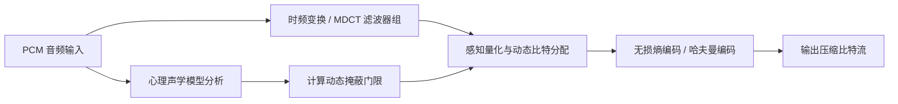

在接触音视频开发时，很多人容易把采样率、位深、PCM、WAV、AAC、MP3 混在同一层去理解。

实际上，它们分别属于不同层级：
- **物理与数学参数**：采样率（Sample Rate）、量化位深（Bit Depth）、声道数（Channels）、码率（Bitrate）；
- **原始数据表示**：脉冲编码调制（PCM, Pulse Code Modulation）；
- **无损音频压缩**：利用预测与熵编码消除统计冗余，完全无损还原波形（如 FLAC, ALAC）；
- **有损感知编码**：基于**心理声学模型（掩蔽效应）**舍弃人耳不易察觉的信息（如 AAC, MP3, Opus）；
- **封装容器**：负责时钟同步、多轨道管理与元数据封装的格式（如 WAV, MP4, M4A, OGG, TS）。

本文梳理数字音频的采样量化原理、三大冗余机制与典型的感知音频编码处理管线。

---

## 1. 数字音频的核心参数

自然界的声音是连续的模拟波（横轴代表时间，纵轴代表声压/振幅，频率由单位时间内的周期震荡次数表示）。将模拟声音转化为数字信号（A/D 转换）需要经历**采样（Sampling）**、**量化（Quantization）**与**编码（Coding）**。

```
模拟波形:   /\    /\
         /  \  /  \    ──(采样+量化)──>   [ 0x7FFF, 0x3E21, 0x0000, 0xC1DF ... ] (PCM)
        /    \/    \
```

### 1.1 采样频率 (Sample Rate, $f_s$)

指 ADC 每秒钟抽取声音样本的次数，单位为 Hz。

- **奈奎斯特-香农采样定理 (Nyquist Theorem)**：
  要使离散采样后的数字信号能够无混叠地恢复出原始模拟信号，**采样频率必须大于等于原始信号最高频率分量（$f_{\text{max}}$）的 2 倍**：
  $$f_s \ge 2 f_{\text{max}}$$
- **常见音频采样率**：
  人耳的理论听觉频率上限约为 $20\text{ kHz}$，根据定理采样率需达到 $40\text{ kHz}$ 以上。为了给抗混叠模拟滤波器预留过渡带，工业界选定了 $44.1\text{ kHz}$ 与 $48\text{ kHz}$ 作为音乐 CD 与数字视音频的标准采样率。

| 采样率 | 常见应用场景 |
| :--- | :--- |
| **8,000 Hz** | 传统电话网络（窄带语音） |
| **16,000 Hz** | 语音识别（ASR）、VoIP 宽带语音 |
| **44,100 Hz** | 音乐 CD、MP3 消费级音频 |
| **48,000 Hz** | 影视视频、数字广播、专业声卡 |
| **96 / 192 kHz** | 高解析音频（Hi-Res Audio） |

---

### 1.2 量化位深 (Bit Depth)

量化位深决定了振幅方向的离散精度与理论动态范围：

- **理论动态范围公式**：
  $$\text{Dynamic Range (dB)} \approx 6.02 \times N + 1.76 \text{ dB}$$
  （其中 $N$ 为量化比特数，每增加 1 bit，动态范围扩大约 6 dB）。
- **16-bit（CD 标准）**：提供 $2^{16} = 65,536$ 个离散量化阶梯，理论动态范围约 **96 dB**；
- **24-bit（专业录音）**：提供约 **144 dB** 动态范围，底噪低于大多数模拟电路热噪声，为混音保留充足动态裕量；
- **32-bit Float（浮点运算）**：现代 DAW / DSP 音频引擎内部的标准处理格式，可避免中间阶段因增益过大导致的截断溢出。

---

### 1.3 声道数 (Channels) 与 PCM 码率计算

- **单声道 (Mono)**：单路音频信号；
- **双声道立体声 (Stereo)**：包含左、右两路声道，利用双耳时间差（ITD）与声级差（ILD）构建声场定位；
- **多声道环绕声**：如 5.1 / 7.1 声道。

#### PCM 无损码率与文件体积计算

$$\text{PCM 码率 (bps)} = \text{采样率 (Hz)} \times \text{位深 (bit)} \times \text{声道数}$$

$$\text{文件大小 (Bytes)} = \frac{\text{PCM 码率} \times \text{时长 (s)}}{8}$$

> **示例：标准 44.1kHz 16-bit 双声道 CD 音频**：
> - 码率 = $44100 \times 16 \times 2 = 1,411,200\text{ bps} \approx 1411.2\text{ kbps}$
> - 1 分钟未压缩 PCM 体积 = $\frac{1411.2 \times 10^3 \times 60}{8 \times 1024 \times 1024} \approx 10.09\text{ MB}$

---

## 2. 音频编码压缩的核心：三大冗余

为了降低传输带宽与存储需求，音频编码主要针对三类冗余进行压缩：

```
                       ┌─────────────────────────┐
                       │   音频数据冗余分析      │
                       └────────────┬────────────┘
            ┌───────────────────────┼───────────────────────┐
            ▼                       ▼                       ▼
   ┌─────────────────┐     ┌─────────────────┐     ┌─────────────────┐
   │    时域冗余     │     │    频域冗余     │     │   心理声学冗余  │
   │ * 振幅概率分布   │     │ * 功率谱不均匀  │     │ * 等响度听觉阈值│
   │ * 相邻样点相关性 │     │ * 共振峰与谐波  │     │ * 频域同时掩蔽  │
   │ * 语音停顿间隙   │     │                 │     │ * 时域前后掩蔽  │
   └─────────────────┘     └─────────────────┘     └─────────────────┘
```

### 2.1 时域冗余 (Temporal Redundancy)
- **相邻样点相关性**：语音/音乐信号相邻样点之间通常存在高度相关性，可通过预测编码（DPCM / LPC）仅编码预测残差；
- **语音间隙**：对话中存在较多静音间隙，可通过 VAD（语音活动检测）与舒适噪音生成（CNG）减少传输。

### 2.2 频域冗余 (Spectral Redundancy)
- 实际语音和乐器的能量常集中在特定基频与谐波共振峰上，功率谱分布不均匀，存在统计压缩空间。

### 2.3 听觉心理声学冗余 (Psychoacoustics)

感知音频编码（如 MP3, AAC, Opus）利用人类听觉系统的生理与心理特性进行有损压缩：

```
声压级 (dB)
  ^
  |          /▔▔▔\   [强信号 A (例如 1kHz 纯音)]
  |         /     \
  |        / 掩蔽门限\ ─────────┐
  |       /           \        │ 落在该曲线下的弱信号 B
  | _____/             \______ │ 被人耳感知概率极低，可粗略量化或忽略
  |     绝对听阈曲线           ▼
  +-------------------------------------> 频率 (Hz)
```

1. **绝对听阈（Absolute Threshold of Hearing）**：
   人耳对 2kHz ~ 5kHz 频段最为敏感，在极低频（<50Hz）与超高频（>15kHz）敏感度大幅下降；
2. **频域同时掩蔽（Simultaneous Masking）**：
   强音（掩蔽声）出现时，其邻近频段的弱音（被掩蔽声）会被掩盖，位于掩蔽门限以下的分量可减少比特分配或直接舍弃；
3. **时域掩蔽（Temporal Masking）**：
   - **滞后掩蔽 / 后向掩蔽 (Post-masking / Forward masking)**：强音结束后 50~200 ms 内，听觉系统处于恢复期，紧随其后的弱音不易察觉；
   - **超前掩蔽 / 前向掩蔽 (Pre-masking / Backward masking)**：强音出现前 5~20 ms 内出现的弱音也会被掩盖（大脑对高强度信号的神经感知整合速度更快）。

---

## 3. 感知音频编码基本流水线



1. **时频变换**：利用 MDCT（改进离散余弦变换）等子带分析滤波器将时域样点转换为频域系数；
2. **心理声学分析**：计算各频段的信掩比（SMR），生成动态掩蔽阈值；
3. **动态比特分配与量化**：对掩蔽门限高的频段采用较粗量化，对敏感频段精细量化，控制量化噪声分布在掩蔽曲线之下；
4. **熵编码**：使用 Huffman 或算术编码对量化系数进一步无损压缩。

---

## 4. 总结

1. **底层三要素**：采样率决定可表达的最高频率（$f_s \ge 2 f_{\text{max}}$），位深决定理论动态范围（$6.02N+1.76\text{dB}$），声道数决定空间方位；
2. **无损 vs 有损**：无损编码依靠时域/频域统计预测消除冗余；有损编码基于心理声学掩蔽效应舍弃人耳不易察觉的细节；
3. **分层清晰**：区分参数指标、原始采样（PCM）、编码算法（AAC/FLAC）与封装容器（MP4/WAV）。
