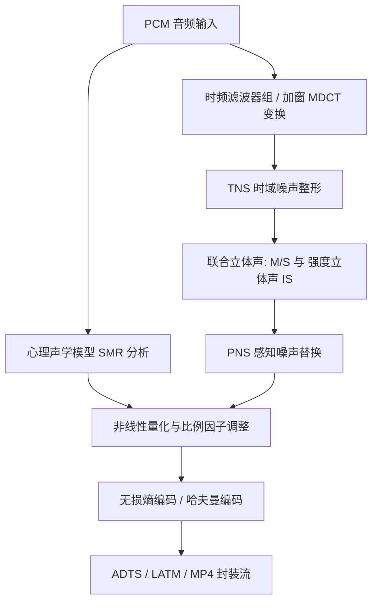

AAC（Advanced Audio Coding，标准由 ISO/IEC 13818-7 及 ISO/IEC 14496-3 定义）作为 MP3 的后续演进标准，采用纯粹的 **1024 点 MDCT 变换**、模块化的工具箱（TNS、PNS、SBR、PS），广泛应用于流媒体（HLS/DASH/RTMP）、广播与移动设备。

在相同主观听感下，AAC 通常能够在更低码率下提供与 MP3 相当的音质。本文梳理 AAC 的核心工具箱、Profile 演进（LC/HE-v1/HE-v2）、ADTS 传输流格式及向下兼容机制。

---

## 1. AAC 编码工具箱 (Toolbox)

AAC 是一套模块化的感知音频编码工具集合，编码器根据目标码率与计算复杂度进行工具选择：



### 1.1 TNS (Temporal Noise Shaping, 时域噪声整形)
- **解决问题**：瞬态信号（如打击乐、辅音齿音）在频域粗量化后，时域量化噪声会扩散到整个变换块，引发**预回声（Pre-echo）**失真；
- **机制**：TNS 在频域谱线上应用线性预测（LPC），将量化噪声在时域上塑形，压制在强信号出现的时间区间内，利用人耳的时域掩蔽效应降低可闻失真。

### 1.2 PNS (Perceptual Noise Substitution, 感知噪声替换)
- **机制**：对于高频类噪声成分（如风声、摩擦声），人耳对具体波形细节不敏感，主要感知其总能量。PNS 不传输具体的频谱谱线，仅传输该频段的**总能量系数**，解码端通过噪声发生器重构，降低高频编码比特消耗。

### 1.3 SBR (Spectral Band Replication, 频带复制) —— HE-AAC v1 核心
- **基本思想**：高频泛音与低频基音存在较强的谐波相关性；
- **编码处理**：核心编码器仅对低频部分（如 0 ~ 12 kHz）执行常规 AAC-LC 编码，高频部分（12 ~ 24 kHz）仅提取微量的高频能量包络边信息（Side Information）；
- **解码还原**：解码端通过 QMF 滤波器组将低频频谱搬移至高频区，并根据包络参数调整能量，重构完整的高频信号。

### 1.4 PS (Parametric Stereo, 参数立体声) —— HE-AAC v2 核心
- **低码率优化（<32 kbps）**：将立体声左右声道混合为单声道进行 AAC 编码，同时提取声道间时间差（IPD/OPD）、声级差（IID）和相干度（ICC）等空间参数；
- **解码还原**：解码端在单声道基础上，依据空间参数矩阵重构双声道立体声。

---

## 2. 常见 Profile 对比

| Profile 规格 | 核心组合技术 | 推荐码率区间 | 典型应用场景 |
| :--- | :--- | :--- | :--- |
| **AAC-LC** (Low Complexity) | 纯 MDCT + TNS + PNS | 64 ~ 192 kbps | 音乐流媒体、视频伴音、广播 |
| **HE-AAC v1** (AAC+) | AAC-LC + **SBR** | 32 ~ 64 kbps | 移动网络广播、弱网低码率音频 |
| **HE-AAC v2** (eAAC+) | AAC-LC + **SBR + PS** | 16 ~ 32 kbps | 极低带宽语音广播、窄带通信 |

---

## 3. ADTS 与 ADIF 流格式对比

AAC 比特流在传输或存储时，主要有两种组织格式：

### 3.1 ADIF (Audio Data Interchange Format)
- 仅在整个文件开头包含一个全局头，后续全部为音频帧载荷；
- **特点**：头部丢失即无法解码，且不支持从流中间任意位置开始播放，仅适用于本地确定性存储。

### 3.2 ADTS (Audio Data Transport Stream) —— 流媒体标准
- 每个音频帧前都携带独立的 **7 字节（无 CRC）或 9 字节（有 CRC）ADTS 头部**：

```
 0                   1                   2                   3
 0 1 2 3 4 5 6 7 8 9 0 1 2 3 4 5 6 7 8 9 0 1 2 3 4 5 6 7 8 9 0 1
+-+-+-+-+-+-+-+-+-+-+-+-+-+-+-+-+-+-+-+-+-+-+-+-+-+-+-+-+-+-+-+-+
|       Syncword (12b: 0xFFF)   |ID |L|P| Profile |  Freq |P|Ch |
+-+-+-+-+-+-+-+-+-+-+-+-+-+-+-+-+-+-+-+-+-+-+-+-+-+-+-+-+-+-+-+-+
|Ch |O|H|C|C|    Frame Length (13-bit)      |Buffer Fullness|R|C|
+-+-+-+-+-+-+-+-+-+-+-+-+-+-+-+-+-+-+-+-+-+-+-+-+-+-+-+-+-+-+-+-+
```

- **同步字（Syncword）**：12-bit 全 1 (`0xFFF`)，用于在网络流中定位帧起始；
- **Frame Length（13-bit）**：包含 ADTS 头加数据载荷的总字节长度，便于流式切帧。

---

## 4. 向下兼容机制：Fill Element 容器

在 HE-AAC 中，SBR 和 PS 的扩展扩展数据被打包在标准 AAC-LC 的 **`Fill Element`（填充单元）** 中。

```
[ ADTS Frame ] ──> [ AAC-LC 核心低频数据 ] + [ Fill Element (内含 SBR / PS 扩展数据) ]
                          │                               │
                          ├── 传统老旧解码器 ──────────────┴──> 忽略 Fill Element，仅解码播放低频 (不报错)
                          └── 现代 HE-AAC 解码器 ─────────────> 提取 SBR/PS 重构完整高保真立体声
```

这种机制保证了即使在不支持 HE-AAC 的旧播放器上，文件依然能够正常播放（输出基础采样率的低频声音），实现了平滑的向前兼容。

---

## 5. 总结

1. **模块化工具**：TNS 抑制预回声，PNS 节省高频噪声比特，SBR/PS 支持低码率高保真重建；
2. **格式选择**：本地存储倾向封装于 MP4/M4A 容器，流式分发（HLS/RTMP）使用带有 `0xFFF` 同步字的 ADTS 格式；
3. **兼容设计**：通过 `Fill Element` 容器实现新旧解码器的平稳兼容。
