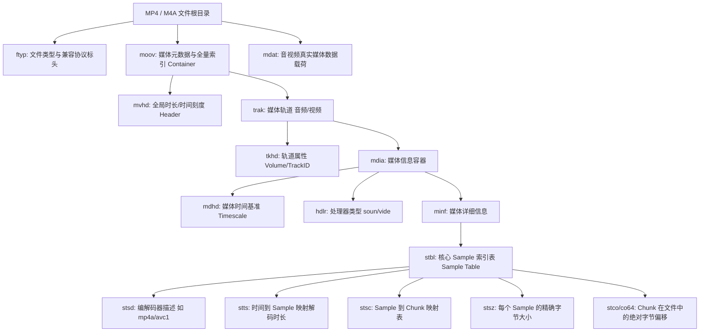

在多媒体开发中，**MP4（MPEG-4 Part 14）** 与 **M4A（纯音频 MP4）** 是应用广泛的封装容器。它们均派生自 ISO 基础媒体文件格式（**ISOBMFF**, ISO/IEC 14496-12）。

与 TS 或 Ogg 等基于连续切片的数据流不同，MP4 采用**基于对象（Box / Atom）的树状索引结构**。所有音频、视频、字幕的时间戳与物理存储位置均记录在独立的元数据 Box 中。

本文梳理 MP4 核心概念、Box 层级结构、`stbl` 样本索引表映射机制以及 Web 流媒体 `faststart` 优化原理。

---

## 1. MP4 核心概念辨析

```
[ MP4 文件 ]
  ├── moov (元数据管理中心: 记录 Sample 索引表与时间轴)
  └── mdat (物理载荷数据: 存储编码后的音频/视频裸流)
        │
  └── Track 0 (音频轨) ──> [ Chunk 0: Sample 0, 1, 2 ] ──> [ Chunk 1: Sample 3, 4 ... ]
  └── Track 1 (视频轨) ──> [ Chunk 0: Sample 0 ] ───────> [ Chunk 1: Sample 1 ... ]
```

1. **Box (Atom)**：
   - MP4 的基本组织单元。标准 Box 由 **8 字节基础头部（4 字节 `size` + 4 字节 `type`）** 与 **Body 数据** 构成。当 `size == 1` 时启用 8 字节扩展大小（`largesize`），头部扩展为 16 字节；数据均按大端网络字节序排列；
2. **Sample（样本）**：
   - 媒体数据的最小时间单元。在视频中一个 Sample 通常代表一帧画面；在音频中一个 Sample 代表一个编码帧（如一个包含 1024 个 PCM 样点的 AAC 帧）；
3. **Chunk（数据块）**：
   - 同一个 Track 内连续多个 Sample 在物理文件中的聚合连续存储区间；
4. **Track（媒体轨道）**：
   - 一个独立的媒体时序流（如音频轨、视频轨、字幕轨）。

---

## 2. 顶级 Box 树状层级结构

一个典型的 MP4/M4A 文件顶层通常包含以下结构：



---

## 3. `stbl` 样本索引表映射机制

播放器要定位第 $K$ 个音视频帧在文件中的物理位置，依靠 `stbl`（Sample Table Box）下的四个核心子表协同计算：

$$\text{Sample } K \xrightarrow{\mathbf{stts}} \text{呈现时间 (PTS)} \xrightarrow{\mathbf{stsc}} \text{所属 Chunk ID} \xrightarrow{\mathbf{stco}} \text{Chunk 起始偏移} \xrightarrow{\mathbf{stsz}} \text{文件绝对物理地址}$$

1. **`stts` (Time-to-Sample)**：记录每个 Sample 持续的时长（Delta），用于计算播放时间与 Seek 定位；
2. **`stsc` (Sample-to-Chunk)**：记录 Sample 如何打包进 Chunk（例如：Chunk 1~5 每个包含 3 个 Sample）；
3. **`stsz` (Sample Size)**：记录每个 Sample 的实际字节大小；
4. **`stco` / `co64` (Chunk Offset)**：记录每个 Chunk 在整个文件中的绝对字节偏移。

---

## 4. Web 流媒体优化：`moov faststart`

在普通录制生成的 MP4 文件中，由于录制结束前无法预知最终总时长和全量索引，编码器通常将 `moov` 写入在文件尾部（`mdat` 之后）。

```
默认未优化 MP4 结构:
+-------------------+------------------------------------------+-------------------+
|  ftyp (几十字节)  |    mdat (媒体数据载荷, 几百 MB ~ 几 GB)   |   moov (元数据)   |
+-------------------+------------------------------------------+-------------------+
  (浏览器必须下载完整个文件或发起多次 Range 请求读取末尾 moov 才能起播)

优化后的 faststart MP4 结构:
+-------------------+-------------------+------------------------------------------+
|  ftyp (几十字节)  |   moov (元数据)   |    mdat (媒体数据载荷, 几百 MB ~ 几 GB)   |
+-------------------+-------------------+------------------------------------------+
  (浏览器收到几十 KB 头部元数据后即可立即开始流式播放)
```

### FFmpeg 优化命令

```bash
# 重构 Box 顺序，将 moov 移动至 mdat 之前 (零重编码)
ffmpeg -i input.mp4 -c copy -movflags faststart output_faststart.mp4
```

---

## 5. 总结

1. **结构模型**：MP4 通过 `moov`（元数据索引）与 `mdat`（物理载荷）解耦媒体数据；
2. **定位原理**：依靠 `stts`、`stsc`、`stsz` 与 `stco` 四大表格完成时间戳到文件物理字节偏移的映射；
3. **流式分发**：网络播放前需执行 `faststart` 优化，将 `moov` 移至文件头部以便即时起播。
