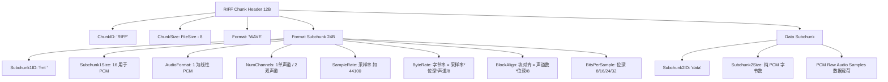

在嵌入式音频开发、驱动采集测试以及 DSP 算法验证中，**WAV（Waveform Audio File Format）** 是常见的基础音频格式。与包含复杂索引表（MP4）或频域压缩（MP3/AAC）的格式不同，标准 PCM WAV 文件由 **44 字节头部描述信息 + 未压缩的原始 PCM 裸数据** 构成。

WAV 遵循微软与 IBM 制定的 **RIFF（Resource Interchange File Format）** 规范，采用**小端字节序（Little-Endian）**存储。本文梳理 WAV 的 Chunk 树状结构、44 字节标准头部的 C 语言结构体定义以及 PCM 数据的双声道交错排列规则。

---

## 1. RIFF 规范与 Chunk 模型

RIFF 是多种多媒体文件（如 `.WAV`、`.AVI`）通用的容器规范。RIFF 文件的基本组成单元是 **Chunk（数据块）**：

```
+──────────────────────────+──────────────────────────+──────────────────────────+
|  4 字节 Chunk ID (FourCC)|   4 字节 Chunk Size      |   Chunk Data (数据载荷)  |
|    (如 'RIFF', 'fmt ')   |  (不含 ID 和 Size 自身)  | (若长度为奇数则补1字节0) |
+──────────────────────────+──────────────────────────+──────────────────────────+
```

1. **FourCC（四字符码）**：4 字节 ASCII 标识符，不足 4 字符时在末尾补空格（例如 Format 块标志是 `'f' 'm' 't' ' '`）；
2. **小端字节序**：整型数值（如采样率、文件大小、位深）均为 Little-Endian（低位字节在前）；
3. **Container Chunk**：当 ID 为 `'RIFF'` 或 `'LIST'` 时，该 Chunk 可以嵌套包含其他子 Chunk（Subchunk）。

---

## 2. 标准 44 字节 WAV 文件结构

典型的 PCM WAV 文件由 **RIFF Header Chunk**、**Format Subchunk (`fmt `)** 与 **Data Subchunk (`data`)** 顺序拼接而成：

```
+─────────────────────────+──────────────────────────+─────────────────────────+
|   RIFF Chunk Header     |   Format Subchunk (fmt ) |   Data Subchunk (data)  |
|  [ 'RIFF' | Size |'WAVE']|  [ 'fmt ' | 16 | 参数... ]|  [ 'data' | Size | PCM..]|
|       (12 字节)         |        (24 字节)         |   (8 字节头 + PCM 载荷) |
+─────────────────────────+──────────────────────────+─────────────────────────+
```



---

## 3. C 语言结构体定义与文件读写

针对标准 44 字节 PCM WAV 头，在 C 语言中必须使用 **`#pragma pack(1)`（1 字节对齐）**，防止编译器默认的 4 字节或 8 字节内存对齐填充破坏协议字段偏移：

```c
#include <stdint.h>
#include <stdio.h>

#pragma pack(push, 1)
typedef struct {
    // 1. RIFF Chunk Header (12 字节)
    uint8_t  chunk_id[4];        // 固定为 "RIFF" (0x52, 0x49, 0x46, 0x46)
    uint32_t chunk_size;         // 整个文件大小 - 8 字节
    uint8_t  format[4];          // 固定为 "WAVE" (0x57, 0x41, 0x56, 0x45)

    // 2. "fmt " Format Subchunk (24 字节)
    uint8_t  subchunk1_id[4];    // 固定为 "fmt " (0x66, 0x6D, 0x74, 0x20)
    uint32_t subchunk1_size;     // 对于线性 PCM，固定为 16 (0x10)
    uint16_t audio_format;       // 1 代表未压缩 PCM，3 代表 IEEE 浮点
    uint16_t num_channels;       // 声道数: 1=Mono, 2=Stereo
    uint32_t sample_rate;        // 采样率: 8000, 16000, 44100, 48000 等
    uint32_t byte_rate;          // 每秒字节数 = sample_rate * num_channels * (bits_per_sample / 8)
    uint16_t block_align;        // 块对齐 = num_channels * (bits_per_sample / 8)
    uint16_t bits_per_sample;    // 每个样点的量化位数: 8, 16, 24, 32

    // 3. "data" Data Subchunk (8 字节头)
    uint8_t  subchunk2_id[4];    // 固定为 "data" (0x64, 0x61, 0x74, 0x61)
    uint32_t subchunk2_size;     // 纯 PCM 数据载荷的总字节数
} wav_header_t;
#pragma pack(pop)
```

---

## 4. PCM 裸数据的双声道交错排列 (Interleaved)

在 Data 载荷中，PCM 样点按时间轴顺序紧密排列。

### 4.1 16-bit 双声道立体声排列
每个样点占用 2 字节（`int16_t`，小端：低位字节在前），左右声道交替出现：

```
[ Sample 0: 左声道 L0 (2B) ][ Sample 0: 右声道 R0 (2B) ] ──> 组成 1 个 BlockAlign (4 字节)
[ Sample 1: 左声道 L1 (2B) ][ Sample 1: 右声道 R1 (2B) ]
...
```

- **分离左/右声道**：
  若需单独分析左声道，只需步长为 4 字节提取 `offset = 0, 4, 8 ...` 的 2 字节整数；右声道提取 `offset = 2, 6, 10 ...`。

---

## 5. 总结

1. **结构清晰**：WAV 由 `RIFF` 头、`fmt ` 描述块与 `data` 载荷块顺序拼装；
2. **结构体对齐**：C 语言解析必须强制 1 字节对齐（`#pragma pack(1)`）；
3. **数据交错**：双声道 PCM 采用 L-R-L-R 时域交错存储，便于 DAC 芯片顺序 DMA 输出。
