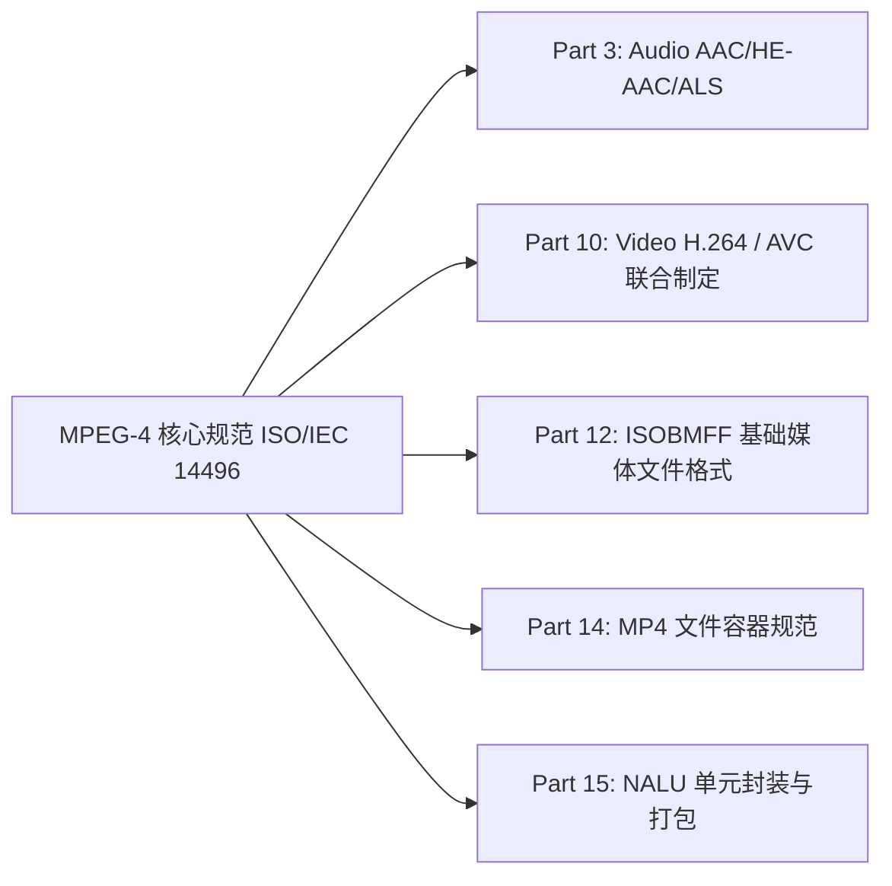

在数字音视频领域，**MPEG（Moving Picture Experts Group，动态图像专家组）** 制定了一系列流媒体与数字视听标准。

从 **MPEG-1 Layer 3、MPEG-2 AAC、MPEG-4 Part 10 (AVC/H.264)、MPEG-4 Part 14 (MP4)** 到 **MPEG-H (HEVC/H.265)**，MPEG 包含多个代际与众多的 Part 子规范。

MPEG 是由 **ISO（国际标准化组织）** 与 **IEC（国际电工委员会）** 于 1988 年联合成立的专家组（ISO/IEC JTC 1/SC 29/WG 11）。本文梳理 MPEG 系列标准的演进脉络、各代代表技术及核心 Part 划分。

---

## 1. MPEG 标准演进概览

```
MPEG-1 (1993, ISO/IEC 11172) ──> VCD / 1.5 Mbps / MP3 音频
   │
MPEG-2 (1995, ISO/IEC 13818) ──> DVD / 数字电视 DVB / TS/PS 流 / AAC 诞生
   │
MPEG-4 (1998, ISO/IEC 14496) ──> 现代网络媒体 (H.264/AVC + AAC + MP4/ISOBMFF)
   │
MPEG-7 / 21 ───────────────────> 多媒体内容元数据描述 (MPEG-7) 与数字版权框架 (MPEG-21)
   │
MPEG-H (2013, ISO/IEC 23008) ──> 4K/8K 时代 (H.265/HEVC + 3D 音频 + MMT 传输)
```

---

## 2. MPEG-1 (ISO/IEC 11172)：光盘多媒体标准

为 **CD-ROM / VCD** 介质定制，优化 1.5 Mbps 码率下的音视频存储：
- **Part 1 (Systems)**：系统时钟同步与音视频复用流；
- **Part 2 (Video)**：基于 DCT（离散余弦变换）与运动补偿（I/P/B 帧）的视频压缩；
- **Part 3 (Audio)**：划分为三层，层数越高压缩率越高且向下兼容：
  - **Layer I (MP1)**：约 4:1 压缩比；
  - **Layer II (MP2)**：约 6:1~8:1 压缩比（VCD 音轨、DAB 广播）；
  - **Layer III (MP3)**：约 10:1~12:1 压缩比，引入心理声学模型与哈夫曼熵编码。

---

## 3. MPEG-2 (ISO/IEC 13818)：数字广播与 DVD

针对广播级画质、多声道环绕声及不可靠传输信道设计：
- **Part 1 (Systems)**：
  - **TS (Transport Stream, 188 字节固定包长)**：专为有线电视、卫星广播和网络流媒体（如 HLS）等易丢包环境设计，具备自同步与纠错能力；
  - **PS (Program Stream)**：专为 DVD 等存储介质设计。
- **Part 2 (Video)**：支持隔行扫描（Interlaced），DVD 与 1080i 高清广播常用；
- **Part 7 (AAC)**：高级音频编码作为独立子标准制定。

---

## 4. MPEG-4 (ISO/IEC 14496)：网络流媒体规范

MPEG-4 面向对象化编码与网络流媒体构建了多项子规范体系：



### 关键子规范 (Parts)

| 子规范编号 | 标准名称 | 实际应用 |
| :--- | :--- | :--- |
| **Part 2** | Visual (ASP) | 早期 DivX / Xvid 编码格式 |
| **Part 3** | Audio | 定义 AAC-LC, HE-AAC, CELP 语音, ALS 无损音频 |
| **Part 10** | **AVC (Advanced Video Coding)** | 即与 ITU-T 联合制定的 **H.264** |
| **Part 12** | **ISO Base Media File Format (ISOBMFF)** | MP4, MOV, 3GP, HEIF, CMAF 的通用对象基类 |
| **Part 14** | **MP4 File Format** | 多媒体封装文件格式（`.mp4`, `.m4a`） |

---

## 5. MPEG-7 与 MPEG-21：元数据与版权框架

- **MPEG-7 (ISO/IEC 15938)**：**多媒体内容描述接口**。通过 XML 对音频特征（音高、音色、静音段）和图像特征（颜色直方图、纹理、边缘形状）进行结构化标注，用于多媒体检索；
- **MPEG-21 (ISO/IEC 21000)**：多媒体框架，定义数字版权管理（DRM）、电子知识产权保护与跨平台分发协议。

---

## 6. 总结

| 时代/标准 | 代表视频标准 | 代表音频标准 | 代表容器/封装 |
| :--- | :--- | :--- | :--- |
| **MPEG-1** | MPEG-1 Video | MP3 (Layer III), MP2 | System Stream (VCD) |
| **MPEG-2** | MPEG-2 Video | MPEG-2 AAC, AC-3 | MPEG-2 TS / PS (DVD) |
| **MPEG-4** | **H.264 / AVC** | **AAC (LC/HE), ALS** | **MP4, ISOBMFF, M4A** |
| **MPEG-H** | **H.265 / HEVC** | MPEG-H 3D Audio | MMT, MP4, CMAF |
