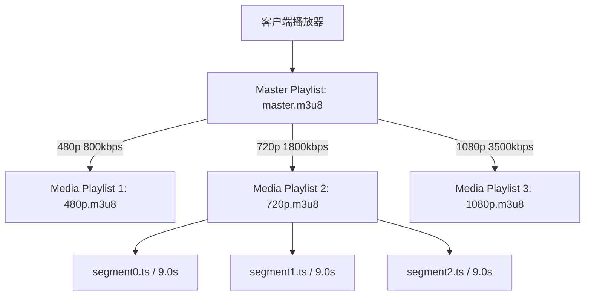

**HLS（HTTP Live Streaming）** 是由苹果公司提出并已成为 RFC 8216 标准的流媒体网络传输协议。与基于长连接的传统流媒体协议（如基于 TCP 的 RTMP）或专用传输通道不同，HLS 将音视频连续流切片为一系列独立的 HTTP 文件（通常为 `.ts` 或 `.m4s/fmp4` 分片），并通过 **M3U8 文本索引播放列表（Playlist）** 驱动客户端拉流播放。

由于完全基于标准 HTTP(S) 协议，HLS 具备良好的 CDN 缓存兼容性与穿透能力，并原生支持**自适应码率切换（ABR）**。本文剖析 M3U8 文件规范、Master/Media Playlist 分层、直播滑动窗口与 AES-128 加密机制。

---

## 1. HLS 核心架构：Master 与 Media Playlist

一个完整的 HLS 流通常采用**主播放列表（Master Playlist）嵌套多级媒体播放列表（Media Playlist）**的两层架构：



### 1.1 主播放列表 (Master Playlist)
Master Playlist 聚合了同一内容的不同码率、分辨率及音频变体，供客户端根据实时网络带宽动态切换：

```ini
#EXTM3U
#EXT-X-VERSION:4

# 480p 流定义
#EXT-X-STREAM-INF:BANDWIDTH=800000,RESOLUTION=854x480,CODECS="avc1.4d401f,mp4a.40.2"
480p/index.m3u8

# 720p 流定义
#EXT-X-STREAM-INF:BANDWIDTH=1800000,RESOLUTION=1280x720,CODECS="avc1.4d401f,mp4a.40.2"
720p/index.m3u8

# 1080p 流定义
#EXT-X-STREAM-INF:BANDWIDTH=3500000,RESOLUTION=1920x1080,CODECS="avc1.640028,mp4a.40.2"
1080p/index.m3u8
```

---

## 2. 媒体播放列表 (Media Playlist) 规范示例

Media Playlist 记录了具体媒体分片的 URI 路径与时长信息。按照 RFC 8216 规范，注释必须独占一行以 `#` 开头，不可在标签值后附加同行尾注释。

### 2.1 点播 (VOD) 播放列表

```ini
#EXTM3U
#EXT-X-VERSION:3
# 允许的最大分片时长 (秒)
#EXT-X-TARGETDURATION:10
# 起始分片序列号
#EXT-X-MEDIA-SEQUENCE:0
# 声明为点播播放列表
#EXT-X-PLAYLIST-TYPE:VOD

# 第一个分片时长 9.009 秒
#EXTINF:9.009,
http://cdn.example.com/seg0.ts
# 第二个分片时长 8.976 秒
#EXTINF:8.976,
http://cdn.example.com/seg1.ts
# 第三个分片时长 9.009 秒
#EXTINF:9.009,
http://cdn.example.com/seg2.ts

# 结束标记，标识点播流全部结束
#EXT-X-ENDLIST
```

### 2.2 直播 (Live) 滑动窗口机制

在直播场景中，**不包含 `#EXT-X-ENDLIST` 标记**。服务端持续生成新切片并移出过期切片，维护一个滑动窗口：

```
时间推进 ───>
[已淘汰 seg0] [在播 seg1] [seg2] [seg3 (最新生成)]
  └── 客户端每隔 TARGETDURATION 周期重新请求 m3u8，比对 MEDIA-SEQUENCE 获取新增分片
```

- `#EXT-X-MEDIA-SEQUENCE`：每次移出最老切片时，该序号递增 1，帮助播放器识别分片连续性。

---

## 3. HLS AES-128 内容加密

HLS 支持基于 AES-128 CBC 模式的分片级别对称加密：

```ini
#EXTM3U
#EXT-X-VERSION:3
#EXT-X-TARGETDURATION:10

# 声明解密密钥 URI 与 IV 向量
#EXT-X-KEY:METHOD=AES-128,URI="https://auth.example.com/get_key?id=9527",IV=0x1234567890abcdef1234567890abcdef

#EXTINF:10.0,
encrypted_segment0.ts
#EXTINF:10.0,
encrypted_segment1.ts
```

1. **获取密钥**：客户端解析到 `#EXT-X-KEY` 后，向鉴权服务器请求 16 字节的原始解密密钥（Key）；
2. **本地解密**：使用获取的 Key 与标签声明的 IV，在本地对下载的 TS 分片解密后再送入播放器管线。

---

## 4. FFmpeg 生成 HLS 切片示例

```bash
# 将输入视频转码为 6 秒切片的 HLS 点播流
ffmpeg -i input.mp4 \
    -c:v libx264 -preset veryfast -crf 22 \
    -c:a aac -b:a 128k \
    -hls_time 6 \
    -hls_playlist_type vod \
    -hls_segment_filename "output_%03d.ts" \
    output.m3u8
```

---

## 5. 总结

1. **层级结构**：Master Playlist 负责 ABR 多码率描述，Media Playlist 负责分片时钟与分片定位；
2. **规范语法**：严格遵守 RFC 8216 规范，注释独立成行，点播包含 `#EXT-X-ENDLIST`，直播依靠 `#EXT-X-MEDIA-SEQUENCE` 维护滑动窗口；
3. **分发优势**：全基于 HTTP 协议，天然利于 CDN 缓存与大规模并发分发。
