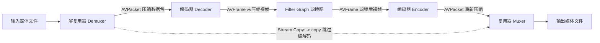

换容器是否需要重新编码，提取音频会不会改变采样参数，是使用 FFmpeg 时常见的疑问。

下面先区分流拷贝与转码，再按换容器、截取、缩放和音频转换列出命令。

---

## 1. FFmpeg 内部处理全流程模型



### 1.1 全流程转码 (Transcoding)
数据经历 `解封装 -> 解码 -> 滤镜加工 -> 重新编码 -> 重新封装`。计算开销主要取决于编解码器和滤镜；再次使用有损编码也可能带来质量损失。

### 1.2 媒体流拷贝 (Stream Copy `-c copy`)
直接将 Demuxer 解出的压缩数据包（`AVPacket`）交给 Muxer 打包进新容器，跳过编解码，处理速度快且保持原始数据无损。

---

## 2. 命令行参数结构语法

```
ffmpeg [全局参数] [输入文件参数] -i input.mp4 [输出文件参数] output.mp4
```

- **位置决定作用域**：`-i` 之前的参数作用于输入文件，`-i` 之后的参数作用于紧随其后的输出文件；
- **Stream 指定语法 (`-map` / `-c:v` / `-c:a`)**：
  - `-c:v copy`：视频流执行 Stream Copy；
  - `-c:a aac -b:a 128k`：音频流用 aac 重新编码为 128 kbps；
  - `-map 0:v:0 -map 0:a:0`：显式选取第 1 个输入文件的指定轨道输出。

---

## 3. 日常高频处理命令参考

### 3.1 封装转换与轨道提取 (Stream Copy)

```bash
# 1. 仅转换容器 (MKV -> MP4 / TS -> MP4)，无重编码
ffmpeg -i input.mkv -c copy -movflags faststart output.mp4

# 2. 纯静音提取 (去除音频流，仅保留视频)
ffmpeg -i input.mp4 -c:v copy -an video_only.mp4

# 3. 纯音频提取 (去除视频流，提取原始音频)
ffmpeg -i input.mp4 -vn -c:a copy audio_only.m4a
```

---

### 3.2 视频裁剪与 Seeking

```bash
# 方案 A: 关键帧快速裁剪 (耗时短，对齐到最近的 I 帧)
ffmpeg -ss 00:01:30 -to 00:03:00 -i input.mp4 -c copy cut_fast.mp4

# 方案 B: 精确裁剪 (重新编码，起始点精确至目标时间戳)
ffmpeg -ss 00:01:30.500 -to 00:03:00.000 -i input.mp4 -c:v libx264 -crf 22 -c:a aac cut_exact.mp4
```

---

### 3.3 视频画质与分辨率调整 (x264)

```bash
# 1. 恒定质量压缩 (CRF 推荐 18~28，23 为默认值)
ffmpeg -i input.mp4 -c:v libx264 -preset medium -crf 22 -c:a copy output_compressed.mp4

# 2. 等比例缩放 (宽度设为 1280，高度保持等比并对齐为偶数)
ffmpeg -i input.mp4 -vf "scale=1280:-2" -c:v libx264 -crf 22 -c:a copy output_720p.mp4

# 3. 画面裁剪 (从坐标 x=100, y=50 处裁剪宽 640、高 480 区域)
ffmpeg -i input.mp4 -vf "crop=640:480:100:50" -c:a copy output_crop.mp4
```

---

### 3.4 音频转码与重采样

```bash
# 1. MP3 转换为 AAC (128 kbps 立体声)
ffmpeg -i input.mp3 -c:a aac -b:a 128k output.m4a

# 2. 提取 16kHz 16-bit 单声道 WAV (ASR 语音识别输入)
ffmpeg -i input.mp4 -vn -ar 16000 -ac 1 -c:a pcm_s16le output_16k.wav

# 3. 提取原始无头裸 PCM
ffmpeg -i input.wav -f s16le -acodec pcm_s16le output.pcm
```

---

### 3.5 GIF 生成 (调色板优化)

下面在同一个滤镜图中先生成调色板，再交给 `paletteuse` 处理画面：

```bash
ffmpeg -ss 00:00:10 -t 5 -i input.mp4 \
    -filter_complex "[0:v]fps=15,scale=480:-1:flags=lanczos,split[s0][s1];[s0]palettegen[p];[s1][p]paletteuse" \
    output_hq.gif
```

---

## 4. 总结

运行命令前，可以先用 `ffprobe input.mp4` 确认输入流和编码。需要保留原始编码数据时检查 `-c copy` 是否适用于目标容器；需要滤镜或精确截取时，再决定重编码参数。处理后也应检查输出流，确认选中的轨道、采样参数和时长符合预期。
