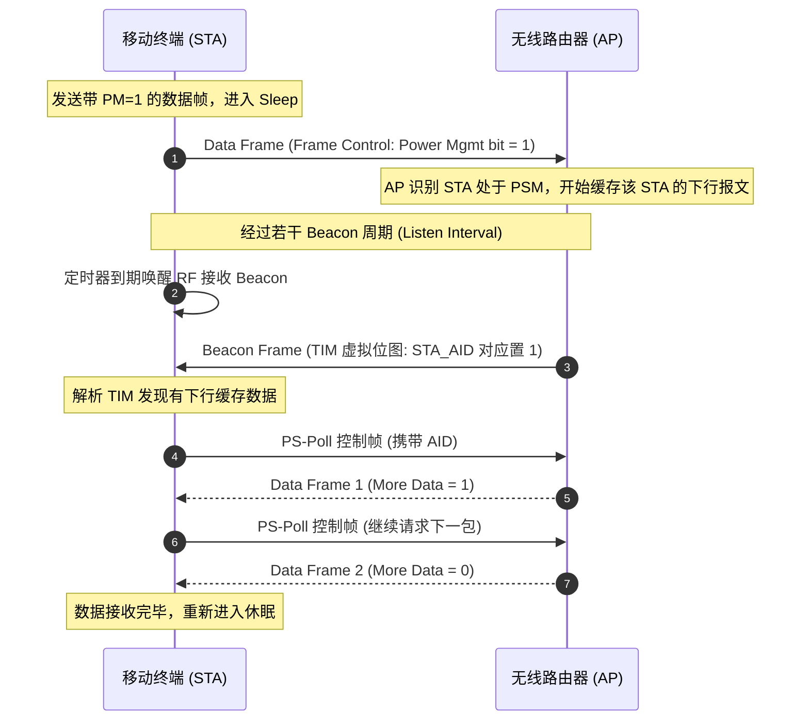

在电池供电的移动终端与 IoT 设备中，Wi-Fi 射频（RF）与基带芯片是整机功耗的主要来源之一。

为了降低能耗并延长续航，IEEE 802.11 协议族历经多代演进，形成了层次化的省电体系。低功耗设计通常围绕两个维度展开：
1. **时域休眠（Sleep Scheduling）**：在无数据收发时关闭射频与基带时钟，进入深度休眠；
2. **频域与空间流降规（Dimension Scaling）**：在低吞吐需求时动态减少天线条数（NSS）或工作带宽（BW）。

本文梳理经典 Legacy PS-Poll、WMM-PS U-APSD、SMPS/OMN 以及 Wi-Fi 6 TWT 的核心机制。

---

## 1. 协议省电机制演进

```
[1997 / 802.11 Legacy] ──> PS-Poll (基于 Beacon 中的 TIM / DTIM 轮询)
                              │
[2005 / 802.11e WMM-PS] ─> U-APSD (非计划自动省电，QoS 触发帧双向突发)
                              │
[2009 / 802.11n Wi-Fi 4] ─> SMPS (空间复用节能：2x2/4x4 动态切 1x1 单天线)
                              │
[2013 / 802.11ac Wi-Fi 5] ─> OMN (工作模式通知：动态收缩 80MHz -> 20MHz 与 NSS)
                              │
[2019 / 802.11ax Wi-Fi 6] ─> TWT (目标唤醒时间：协商唤醒周期，按需与 AP 交互)
```

---

## 2. 基础省电模式 (Legacy PSM / PS-Poll)

这是 802.11 最初定义的节能机制。



### 核心要素
- **TIM 与 DTIM**：
  - **TIM（Traffic Indication Map）**：每个单播 Beacon 携带的位图，指示哪些关联 ID（AID）的 STA 存在下行单播缓存；
  - **DTIM（Delivery TIM）**：周期性出现的特殊 TIM（例如每 3 个 Beacon 一个 DTIM），指示 AP 即将广播/组播数据，所有休眠 STA 必须在此周期唤醒。
- **局限性**：每获取一个下行数据包均需发送一次 `PS-Poll` 控制帧，交互开销较大，且必须等待下一个 Beacon 周期，时延较高。

---

## 3. WMM-PS / U-APSD (非计划自动省电传送)

针对 VoIP 语音等低延迟、双向对称流量，802.11e 引入了 **U-APSD（Unscheduled Automatic Power Save Delivery）**。

```
[ STA 休眠状态 ]
       │
       ▼ (有上行语音包发出)
[ 发送 QoS Trigger 帧 ] ───> AP 接收触发帧后，立即连续下发缓存的所有下行语音帧 (Service Period)
       │
       ▼ (收到最后一包 EOSP=1 标志)
[ 立即重新切入休眠 ]
```

- **触发帧唤醒**：STA 不需要等待 Beacon 中的 TIM 提示，只要本地有上行数据产生，发送一个 QoS Data / QoS Null 触发帧即可开启一个服务周期（Service Period, SP）；
- **下行突发交付**：AP 在 SP 期间连续向 STA 发送缓存的报文，并在最后一个数据包的 QoS Control 字段将 **EOSP（End of Service Period）置 1**，STA 收到后可立刻返回休眠。

---

## 4. 空间流与带宽降规机制 (SMPS / OMN / OMI)

当设备处于活跃连接但吞吐要求不高时，维持全规格 MIMO 与大信道带宽会增加射频耗电。

### 4.1 802.11n SMPS (Spatial Multiplexing Power Save)
- **Static SMPS（静态模式）**：STA 通知 AP 关闭辅助天线（例如从 2x2 MIMO 切换至 1x1 SISO），射频前端仅维持单路接收，减少静态功耗；
- **Dynamic SMPS（动态模式）**：平时以单天线监听。当 AP 有较大数据包需发送给 STA 时，先发送 RTS 握手，STA 收到后快速唤醒副天线并以 2x2 接收后续数据。

### 4.2 802.11ac OMN 与 802.11ax OMI
- **OMN（Operating Mode Notification）**：802.11ac Action 动作帧，允许 STA 动态宣告当前支持的信道带宽（如 80MHz 缩减至 20MHz）与空间流数（NSS）；
- **OMI（Operating Mode Indication）**：802.11ax 将此信令放入 MAC 帧头的 A-Control 字段中，无需额外发送 Action 管理帧即可随路指示带宽与流数调整。

---

## 5. Wi-Fi 6 TWT (Target Wake Time, 目标唤醒时间)

Wi-Fi 6 (802.11ax) 引入了 **TWT 机制**：

```
STA 状态:  [ 深度休眠 (数十秒 ~ 数小时) ] ───> [ TWT 服务周期 (SP) ] ───> [ 深度休眠 ]
                                                │ (按协商参数收发)
AP 调度:                                   ┌────┴────────────┐
                                           │ Trigger / OFDMA │
                                           │ 或 EDCA 信道竞争 │
                                           └─────────────────┘
```

- **协商唤醒时间点**：STA 与 AP 协商固定的唤醒周期与持续时间（Individual TWT 或 Broadcast TWT）。在约定的 TWT 服务周期（SP）之外，STA 可以关闭射频时钟进入深度休眠，无需周期性唤醒监听 Beacon；
- **服务周期内的信道交互**：在 TWT 窗口期内，AP 可以通过 Trigger Frame 调度专有 OFDMA RU 资源单元进行收发，也可以允许 STA 使用常规 EDCA / CSMA/CA 机制进行信道竞争。

---

## 6. 驱动与固件调试参考

在嵌入式 Linux / RTOS 系统中调试 Wi-Fi 功耗时，常见的排查项包括：

| 排查项 | 典型工具 / 命令 | 调试关注点 |
| :--- | :--- | :--- |
| **STA PM 状态** | `iw dev wlan0 get power_save`<br>`iw dev wlan0 set power_save on` | 确认驱动与上层网络管理未关闭 PSM 开关。 |
| **DTIM Skip 策略** | 固件参数（`dtim_skip`） | 在休眠状态下是否配置了跳过部分 DTIM（例如每隔 2~3 个 DTIM 接收一次），减少组播唤醒频次。 |
| **ARP / NS 硬件卸载** | 固件 Offload 配置 | 屏幕休眠时是否由 Wi-Fi 芯片固件代答局域网 ARP 请求，减少对 Host CPU 的唤醒。 |
| **广播/组播过滤**| `wlan_filter` | 过滤无用的 mDNS、SSDP 广播报文，减少网卡唤醒中断。 |
| **U-APSD AC 队列匹配** | `wpa_supplicant.conf`<br>`uapsd_queues=VI VO` | 确认语音（VO）和视频（VI）队列已正确开启 U-APSD 触发。 |

---

## 7. 总结

1. **时域与频域结合**：Wi-Fi 低功耗结合了 **时域休眠（TWT / U-APSD / PS-Poll）**、**频域/空域降规（OMI / SMPS）** 与 **固件硬件卸载（ARP Offload / 报文过滤）**；
2. **业务适配**：节能策略需要在功耗与下行延迟之间权衡（如增大 Listen Interval 会增加下行业务的初次响应时延），需根据具体应用场景（传感器、语音通话、数据待机）进行参数匹配。
