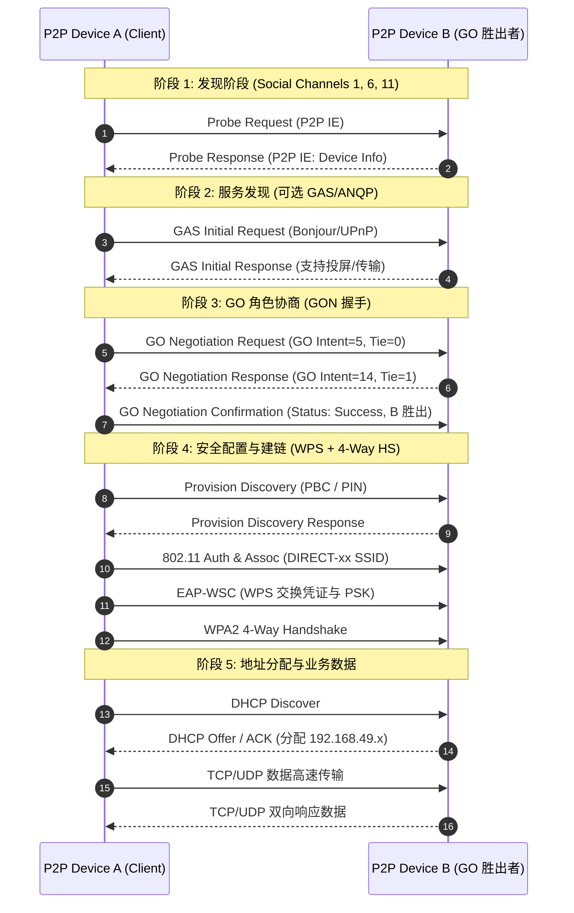

Wi-Fi P2P（商业推广名 **Wi-Fi Direct**）允许支持该协议的无线设备在**无需传统无线路由器（AP）介入**的前提下，直接建立点对点的无线局域网。它被广泛应用于无线投屏（Miracast / Wi-Fi Display）、文件快传（如基于 Wi-Fi Direct 的无线快传）、无线打印和无人机图传等场景。

然而在工程实现与驱动适配中，Wi-Fi P2P 包含**社交信道发现、服务查询、GO 角色协商（Intent 竞选）、WPS 配对、内部 DHCP 分配以及多角色并发（SCC/MCC）**等完整状态机。

---

## 1. 架构角色与 Group 模型

Wi-Fi Direct 在拓扑上仍然复用了经典的 802.11 基础设施架构，核心差异在于**AP 角色是在设备间动态竞选产生的**：

```
                 ┌─────────────────────────┐
                 │    P2P Group Owner      │
                 │   (GO - 充当自主 AP)    │
                 │  * 广播 Beacon/SSID     │
                 │  * 运行内部 DHCP Server  │
                 └───────────┬─────────────┘
                             │
            ┌────────────────┴────────────────┐
            ▼                                 ▼
┌───────────────────────┐         ┌───────────────────────┐
│      P2P Client       │         │      P2P Client       │
│ (充当 STA，获取 IP)   │         │ (充当 STA，获取 IP)   │
└───────────────────────┘         └───────────────────────┘
```

1. **P2P Device**：
   - 处于发现阶段的未入组实体，仅具备扫描与协商能力。
2. **P2P Group Owner (GO)**：
   - 在建立连接时被推选出来的“主设备”。GO 会对外广播以 `DIRECT-` 开头的 Beacon 帧，维护 BSSID，并在内核/用户态启动轻量级 DHCP Server（通常分配 `192.168.49.x` 网段），负责为 Client 分配 IP。
3. **P2P Client**：
   - 组内的“从设备”，以传统 Station 身份关联至 GO，通过 DHCP 获取 IP 地址。
4. **Autonomous GO (自主 GO)**：
   - 设备不经过双向协商，单方面直接以 GO 模式建组，其他设备通过扫码或输入 PIN 码直接加入。

---

## 2. P2P 连接全流程与状态机

一次完整的 Wi-Fi Direct 建链过程包含以下 5 个核心阶段：



### 2.1 设备发现（Discovery Phase）

为了避免在 2.4GHz 和 5GHz 所有频段盲目轮询造成耗电与延迟，Wi-Fi Direct 定义了 **3 个社交信道（Social Channels: 1, 6, 11）**：
- **Listen 状态**：随机选取 1、6、11 某信道作为 Listen Channel，静默监听 Probe Request；
- **Search 状态**：在 1、6、11 信道轮流发送携带 P2P Information Element (IE) 的 Probe Request 广播帧；
- 状态机在 Search 与 Listen 之间随机切换，直到双方在同一社交信道上相遇并完成响应。

### 2.2 GO 角色协商（GO Negotiation）

当用户发起连接时，两端通过 3 次握手协商出由谁当 AP：
- **GO Intent（意愿值，0 ~ 15）**：
  - 双方在 `GO Negotiation Request/Response` 报文中携带自己的 Intent 值；
  - **Intent 规则**：拥有持续供电的设备通常配置较高的 Intent 值。当双方 Intent 不同时，**Intent 较大的一方胜出成为 GO**；
  - **平局处理**：若双方 Intent 相同（$<15$），则比对协商报文中的 `Tie-Breaker` 比特位决定胜负；
  - **特殊情况**：若双方均设置了最高意愿值 `Intent = 15`（均要求强制为 GO），协议规定协商失败（返回状态码 `FAIL_BOTH_GO_INTENT_15`），无法建立连接。
- **Operating Channel 协商**：双方确定建组后的最终工作信道（可切至干净的 5GHz 频段）。

### 2.3 安全与入网（WPS + 4-Way Handshake）

- **WPS 配对**：支持 PBC（Push Button Configuration，虚拟按键确认）或 PIN 码；
- **凭证分发**：通过 EAP-WSC 交互后，GO 向 Client 分发预共享密钥（PSK）与动态 SSID；
- **4 次握手**：基于生成的 PSK 立即执行标准的 802.11i WPA2-PSK (AES-CCMP) 四次握手生成 PTK/GTK。

---

## 3. 多角色并发：SCC vs MCC

在移动终端上，常见的并发场景为：手机既连接无线路由器上网（STA 模式），又要通过 Wi-Fi Direct 投屏到电视（P2P Client 或 P2P GO）。

```
        ┌─────────────┐
        │  家用路由器 │ (例如工作在 Channel 36)
        └──────┬──────┘
               │ (STA 链路)
               ▼
        ┌─────────────┐ (单 RF 射频芯片)
        │   智能终端  │
        └──────┬──────┘
               │ (P2P 链路)
               ▼
        ┌─────────────┐
        │   智能电视  │ (若 P2P 工作在 Channel 149 -> 产生 MCC)
        └─────────────┘
```

### 3.1 单信道并发（SCC - Single Channel Concurrency）
- **原理**：STA 接口与 P2P 接口工作在**完全相同的信道**（例如均为 Ch 36）；
- **优势**：单 RF 射频无需在多个频点间跳变，开销最低，吞吐性能最好；
- **限制**：要求 GO 协商或建组时服从当前已有 STA 连接的信道。

### 3.2 多信道并发（MCC - Multi Channel Concurrency）
- **原理**：当 STA 必须工作在 Ch 36，而 P2P 必须工作在 Ch 149 时，单 RF 芯片需以**时分复用（Time Division Multiplexing）**方式在两个信道间切换；
- **特点与机制**：
  1. **吞吐下降**：由于信道切换存在锁相环稳定时间与空口保护时间，有效吞吐通常显著降低；
  2. **TBTT 同步**：需协调两个信道的 Beacon 接收，防止错过 STA 端的信标帧；
  3. **NoA (Notice of Absence) 与 CTWindow**：P2P GO 可在 Beacon 帧或管理帧中携带 NoA（缺席通知）或使用 Client Traffic Window（CTWindow）机制声明离信道时间，协调组内 Client 在 GO 切换至另一信道期间暂缓发包。

---

## 4. Linux 下 `wpa_cli` 实操与调试

在 Linux 系统下，`wpa_supplicant` 完整实现了 P2P 协议状态机。以下是通过 `wpa_cli` 调试 P2P 的常用命令链路：

```bash
# 1. 启动 P2P 设备搜索
$ wpa_cli -i wlan0 p2p_find

# 2. 列出附近发现的 P2P 节点信息
$ wpa_cli -i wlan0 p2p_peers
$ wpa_cli -i wlan0 p2p_peer <PEER_MAC_ADDR>

# 3. 向对端设备发起 PBC 按钮配对连接
$ wpa_cli -i wlan0 p2p_connect <PEER_MAC_ADDR> pbc go_intent=14

# 4. (可选) 以自主 GO (Autonomous GO) 方式直接建组
$ wpa_cli -i wlan0 p2p_group_add freq=5180

# 5. 查看当前 P2P 状态与组接口名 (如 p2p-wlan0-0)
$ wpa_cli -i wlan0 p2p_group_status
$ wpa_cli status
```

---

## 5. 总结

1. **架构本质**：Wi-Fi P2P 是建立在 802.11 传统架构上的“动态 AP/STA 临时组网”，通过意愿值（GO Intent）协商与自主 GO 实现灵活自治。
2. **三步核心**：**社交信道发现（1/6/11）** $\rightarrow$ **GON 握手与 WPS 配对** $\rightarrow$ **内部 DHCP 分配与 WPA2 通信**。
3. **驱动适配重点**：在单芯片多接口场景下，优先推动系统策略实现 **SCC（同信道并发）**；若必须使用 **MCC（多信道时分切换）**，需严格校验 NoA 机制与 Beacon 保护时序，防止投屏或传输卡顿。
