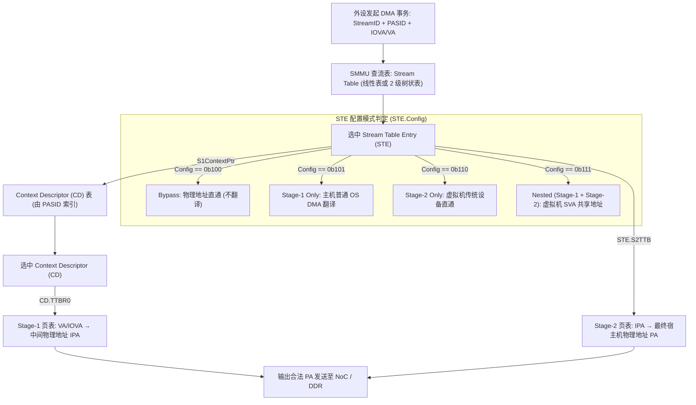
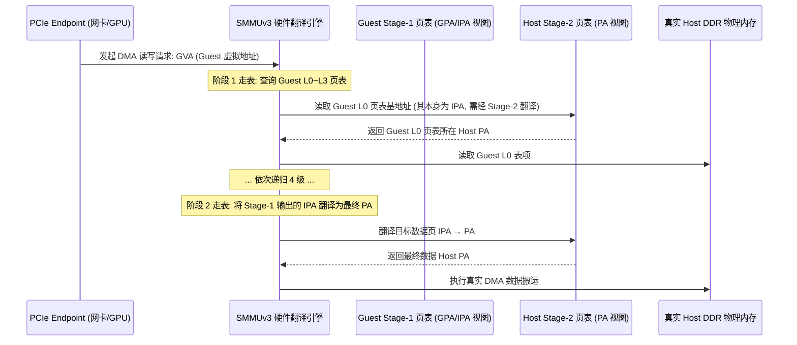
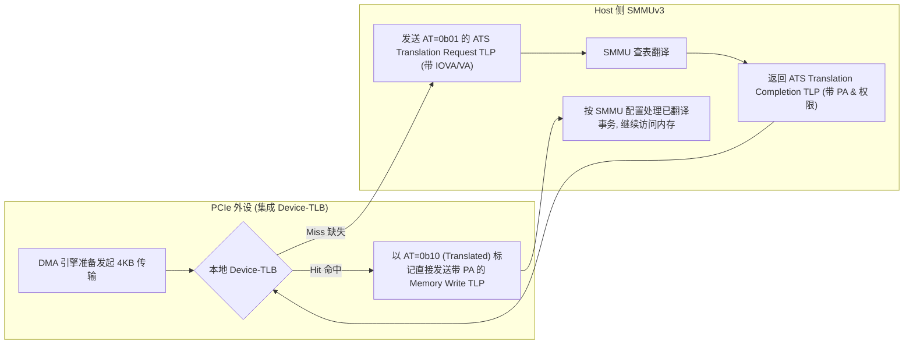
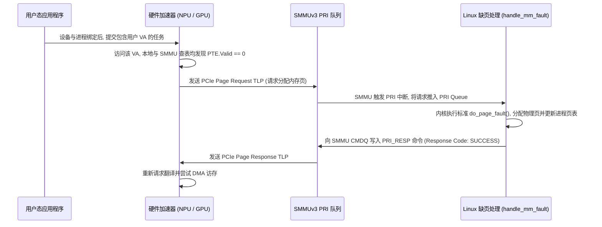
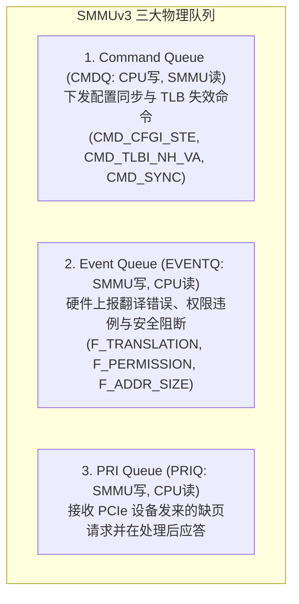

# SMMUv3 嵌套翻译、PCIe ATS、PRI 与共享虚拟寻址（SVA）深度解析

## 1. SMMUv3 两级流表与上下文描述符（CD）硬件查找架构

在系统级 IOMMU（ARM SMMUv3）中，外设发起的每一个 DMA 事务都携带 **StreamID（标识具体物理外设，通常由 PCIe RequesterID/BDF 派生）** 与可选的 **PASID（Process Address Space ID，标识进程）**。

`STE.Config` 的编码为：`0b000` Abort、`0b100` Bypass、`0b101` 仅 Stage-1、`0b110` 仅 Stage-2、`0b111` 两阶段翻译。图中省略了 Abort 分支。编码见 [Arm SMMUv3 规范 G.b §5.2 的 Config 字段](https://documentation-service.arm.com/static/6813b2bbefb0f21122c144c2#page=217)，可与 [Linux 的 `STRTAB_STE_0_CFG_*` 定义](https://github.com/torvalds/linux/blob/master/drivers/iommu/arm/arm-smmu-v3/arm-smmu-v3.h)交叉核对。

---

## 2. 虚拟机直通两阶段嵌套翻译（Nested Translation）的硬件开销

在云计算虚拟化场景下（KVM / VFIO），当虚拟机内部运行的 Guest OS 试图让直通网卡直接使用用户进程虚拟地址（VA）时，SMMU 必须进行 **Stage-1（Guest 虚拟化）与 Stage-2（Hypervisor 隔离）的嵌套翻译**：

- **嵌套走表的开销**：若两阶段都采用 4 级页表，且相关翻译与页表项均未命中缓存，可按 **$(4+1) \times (4+1) - 1 = 24$ 次**页表项读取估算这个简化模型的开销。这不是每次 DMA 都发生的固定访问次数。
- **IOTLB 与 Walk Cache**：缓存命中可减少重复翻译和走表访问，实际收益取决于页大小、访问局部性、缓存容量和实现方式，不能统一写成平均 2~3 次。嵌套翻译与缓存行为可参阅 [Arm SMMUv3 架构规范](https://documentation-service.arm.com/static/63d7a2d5e4378a55c5e045b9)。

---

## 3. PCIe ATS（地址翻译服务）与 Device-TLB 硬件协议

**ATS（Address Translation Services）**允许支持该能力的 PCIe 设备请求地址翻译，并在本地 **Device-TLB / ATC** 中缓存结果，减少重复请求。设备、Root Complex 和 IOMMU 都需要支持并正确配置相应能力；缓存失效、权限和隔离检查仍然存在，命中路径也有实际时延。参见 [Arm SMMUv3 规范的 PCIe、PASID、PRI 与 ATS 章节](https://documentation-service.arm.com/static/63d7a2d5e4378a55c5e045b9)。

PCIe TLP 的 AT（Address Type）是两位字段：`0b00` 表示 Untranslated，`0b01` 表示 Translation Request，`0b10` 表示 Translated。因此图中的已翻译 Memory Write 使用 `0b10`。编码见 [Intel VT-d 规范 Rev. 5.0 §4.1、§4.1.1 与 §4.1.3](https://cdrdv2-public.intel.com/831418/vt-directed-io-spec.pdf)；SMMU 对 Translation Request 与 Translated 事务的处理见 [Arm SMMUv3 规范 G.b §3.9.1](https://documentation-service.arm.com/static/6813b2bbefb0f21122c144c2#page=71)。

### ATS Invalidation 协议与失联死锁
- 移除设备可能缓存的映射时，需要让相关设备的地址翻译缓存失效，再按协议完成同步。
- 设备处理 **ATS Invalidation Request TLP** 后回复 **ATS Invalidation Completion TLP**。
- 若设备未按要求回复，应检查设备状态、链路和驱动的超时处理。超时上限与故障后果取决于平台和实现，不能据此断言整条总线必然死锁。映射失效与设备缓存的关系可参阅 [Linux SVA 说明](https://www.kernel.org/doc/html/latest/arch/x86/sva.html)。

---

## 4. 共享虚拟寻址（SVA）与 PRI（Page Request Interface）缺页握手

对需要长期访问用户缓冲区的传统 DMA 方案，驱动通常需要固定相关页面并建立设备可用的映射。**SVA（Shared Virtual Addressing）**让支持它的设备与 CPU 使用进程的虚拟地址空间；配合 ATS 和 PRI，可在支持可恢复缺页的平台上减少预先固定全部页面的需要。驱动仍要绑定设备与进程地址空间、管理 PASID 和队列，不能把图中的直接提交理解为完全无需驱动。参见 [Linux SVA 文档](https://www.kernel.org/doc/html/latest/arch/x86/sva.html)。

---

## 5. SMMUv3 三大硬件环形队列管理与命令

SMMUv3 使用命令队列、事件队列和可选的 PRI 队列传递命令与事件。驱动还要配置寄存器、流表和上下文描述符；队列并不是唯一接口。PRI 能力应按实现检查，相关寄存器与能力位可对照 [Linux arm-smmu-v3 定义](https://github.com/torvalds/linux/blob/master/drivers/iommu/arm/arm-smmu-v3/arm-smmu-v3.h)。

---

## 6. 常见关键直通陷阱与排查手册

### 陷阱 1：VFIO 直通网卡触发 `F_PERMISSION` 导致网卡死锁
- **故障现象**：在 KVM 虚拟机中将物理网卡通过 VFIO 直通给虚拟机，驱动加载时网卡直接超时，宿主机 `dmesg` 疯狂报错：`arm-smmu-v3: event 0x07: F_PERMISSION for StreamID 0x1800, IOVA 0x82000000`。
- **微架构根因**：
  - Event `0x07` 为 **Permission Fault**。
  - KVM 在初始化该直通设备的 Stage-2 映射时，错误地将 DMA 描述符环形缓冲区所在的内存页映射为了 **只读（`IOMMU_READ`）**。
  - 网卡在接收到网络数据包后，DMA 试图将写回状态（Descriptor Status）写入该物理页，触发 SMMU 权限阻断，DMA 事务被丢弃。
- **排查法则**：检查 VFIO 分配映射时的标志位，确保包含 `IOMMU_WRITE` 读写双向权限。

### 陷阱 2：DMA 寻址超出硬件 DMA Mask
- **故障现象**：设备在某些 64GB 内存服务器上运行正常，在 512GB 内存服务器上随机触发 `F_ADDR_SIZE` 错误。
- **根因**：
  - 设备硬件只支持 32 位或 36 位 DMA 寻址能力，但驱动未调用 `dma_set_mask_and_coherent(dev, DMA_BIT_MASK(36))` 显式声明；
  - 操作系统给设备分配了超出 36 位物理边界（`> 64GB`）的高位物理页，STE 检测到地址越界直接抛出 `F_ADDR_SIZE` 严重异常事件。
