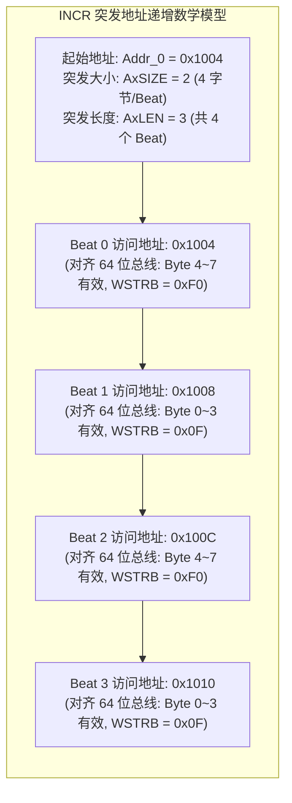
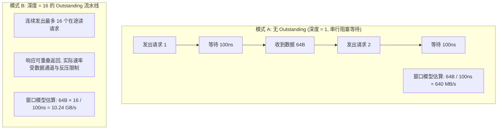
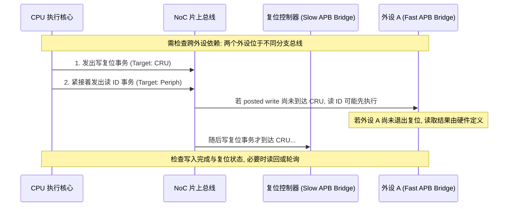

# AXI 突发地址计算、Outstanding 延迟隐藏与总线拥塞深度推演

## 1. AXI4 Burst 突发传输边界与字节使能（WSTRB）计算

AXI 协议支持三种突发模式：`FIXED`（FIFO 专用）、`INCR`（常规内存自增）和 `WRAP`（Cacheline 环绕回填）。



### 4KB 边界对齐规范（4KB Boundary Rule）
- **规范约束**：AXI 协议严格禁止一次突发（Burst）跨越 **4KB 物理地址边界**（例如从 `0x1FF0` 发起 64 字节传输）。
- **地址解码考虑**：4KB 边界规则便于保证一次突发落在同一地址解码范围内。它是 AXI 的协议约束，不能反推所有 MMU/SMMU 或从机的最小粒度都是 4KB。协议定义见 [Arm AMBA AXI 规范](https://developer.arm.com/-/media/Arm%20Developer%20Community/PDF/IHI0022H_amba_axi_protocol_spec.pdf)。

---

## 2. Outstanding 传输如何隐藏总线延迟：数学模型推演

假设外部 DDR 访存平均往返延迟（Round-trip Latency）为 **$t_{\text{latency}} = 100\text{ns}$**，单次 AXI Burst 传输 64 字节有效数据。下图按在途数据窗口除以往返时间估算吞吐，忽略了数据传输占线、仲裁、反压与请求生成开销。10.24 GB/s 是这个简化窗口模型的结果，不能直接证明某条总线已经跑满；还要与位宽、时钟和 DDR 的可用带宽比较。



- **设计取舍**：带宽受往返延迟和在途窗口限制时，增加 Outstanding 深度有助于重叠请求；若瓶颈已经是数据通道或 DDR，继续加深队列不一定提高吞吐。位宽、突发长度、请求速率和队列深度需要一起评估，不能仅凭其中一个参数判断。Outstanding 的完成条件和实现上限可参阅 [AMD NoC 文档](https://docs.amd.com/r/en-US/pg406-network-on-chip/Outstanding-Transaction-Support)。

---

## 3. 跨外设访问无序性与 I/O 屏障推演

假设 CPU 顺序执行以下两行代码：
```c
writel(0x1, CRU_RESET_RELEASE_REG); /* 1. 写复位控制器：释放外设 A 的复位 */
val = readl(PERIPH_A_ID_REG);        /* 2. 读外设 A 的 ID 寄存器 */
```



- **排查手段**：存在跨外设依赖时，要区分访问顺序、写事务到达设备，以及复位动作真正完成。Linux 的 `writel()` / `readl()` 已提供相应的访问顺序保证；对 posted write，可能还需从同一设备的安全寄存器读回以排空写入。若复位控制器提供完成状态，则还需按手册轮询或等待规定时间。不能概括为加一个 `mb()` 就保证所有这些条件，详见 [Linux MMIO 访问说明](https://docs.kernel.org/driver-api/device-io.html)。
