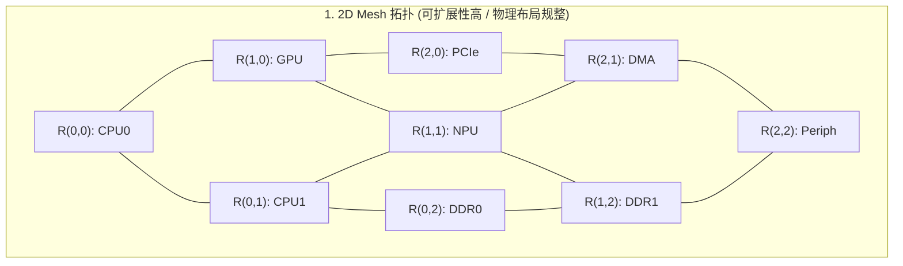

# NoC 路由算法、基于信用的流控（Credit Flow Control）与拓扑深度剖析

## 1. NoC 典型物理拓扑与权衡

在现代异构多核与 AI 芯片中，片上网络（NoC）根据 IP 数量与物理布局选用不同拓扑：

### 拓扑性能与成本对比矩阵
| 拓扑类型 | 节点连接度（Degree） | 网络直径（Diameter） | 典型跳数（Average Hops） | 面积布线开销 | 适用场景 |
| :--- | :--- | :--- | :--- | :--- | :--- |
| **Crossbar** | $N$ | 1 | 1 | $O(N^2)$ 极高 | 8 个节点以内的紧耦合 Cluster |
| **2D Mesh** | 4 | $2 \times (\sqrt{N} - 1)$ | $\frac{2}{3}\sqrt{N}$ | $O(N)$ 极低，适合平面布线 | 16~128 核大型 SoC / 服务器芯片 |
| **Ring（环形）** | 2 | $N / 2$ | $N / 4$ | 极低（环状走线） | 8~16 核桌面与移动端 CPU |
| **Fat-Tree（胖树）** | 随着树高增加 | $2 \times \text{Depth}$ | $\log N$ | 根节点处布线密集 | 多级分层异构处理器 |

---

## 2. 路由算法：X-Y 确定性路由与自适应路由

### 2.1 X-Y 维度确定性路由（Dimension-Order Routing, DOR）
- **算法规则**：设源节点为 $(X_s, Y_s)$，目标节点为 $(X_d, Y_d)$。报文必须先沿水平 X 轴移动至 $X_d$，当且仅当 $X_s == X_d$ 时，方可沿垂直 Y 轴移动至 $Y_d$。
- **通道依赖**：在这里讨论的无回绕二维 Mesh 中，X-Y 路由禁止 $Y \to X$ 转向，可以避免路由通道形成循环依赖。这不代表整套互联没有死锁，还需要检查请求/响应依赖、缓冲区和端点行为。

通道依赖图与路由死锁的关系，可参见 Dally 和 Seitz 的论文 [Deadlock-Free Message Routing in Multiprocessor Interconnection Networks](https://authors.library.caltech.edu/records/fd0yr-br438)。

### 2.2 自适应路由（Adaptive Routing）与重排缓冲
- **机制**：当 X 轴发生拥塞（下级 Router 满）时，报文可动态拐入 Y 轴绕行。
- **代价**：同一事务流的多个 Flit 可能经过不同物理路径到达，**导致报文乱序（Out-of-Order）**。网络出口必须配备重排缓冲区（Reorder Buffer, ROB）以恢复 AXI/CHI 的顺序语义。

---

## 3. 基于信用额度的流控制（Credit-Based Flow Control）机制

当链路或 Router 的往返延迟较长时，直接回传 `VALID/READY` 可能难以满足单周期时序。**Credit 流控**是一种处理接收缓冲容量和发送节奏的方式，下面说明它的基本过程：

```mermaid
sequenceDiagram
    participant Sender as 上游路由器 (Sender)
    participant Receiver as 下游路由器 (Receiver)

    Note over Sender: 初始化: Sender 获知 Receiver 具有 3 个可用槽位 (Credit = 3)

    Sender->>Receiver: 发送 Flit 0 (消耗 1 个 Credit -> 剩余 Credit = 2)
    Sender->>Receiver: 发送 Flit 1 (消耗 1 个 Credit -> 剩余 Credit = 1)
    Sender->>Receiver: 发送 Flit 2 (消耗 1 个 Credit -> 剩余 Credit = 0)

    Note over Sender: Credit 耗尽: Sender 暂停发送，等待接收方归还 Credit

    Receiver->>Receiver: 消费并转发 Flit 0 (释放 1 个接收缓冲槽位)
    Receiver-->>Sender: 沿反向专用信用线归还 1 个 Credit (Credit Return Signal)

    Note over Sender: Sender 收到信用点: Credit 恢复为 1, 恢复发送 Flit 3!
```

### 满带宽运行所需的最小 Credit 缓冲深度计算公式
$$\text{Buffer Depth}_{\min} = \text{Round-Trip Latency (Cycles)} \times \text{Flit Injection Rate}$$
- **算例**：假设包含发送、接收处理和 Credit 回传在内，总往返延迟为 8 周期，目标是每周期传输 1 个 Flit，则这个简化模型需要至少 8 个槽位。具体深度还要考虑流水线、仲裁和拥塞条件。
