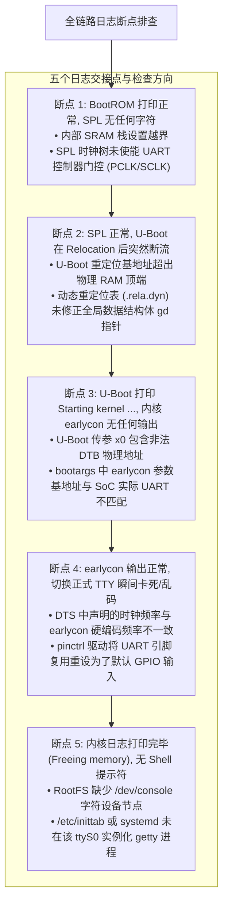
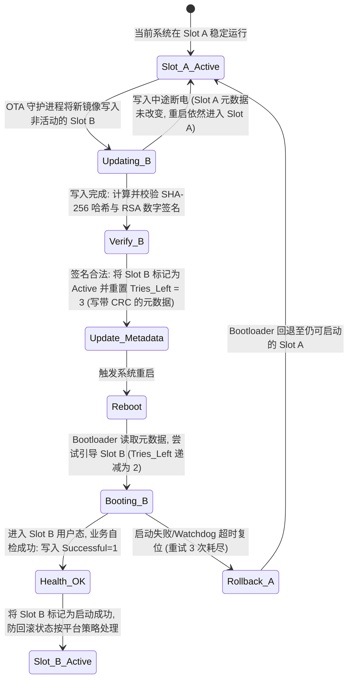

# 启动交接断点推演、A/B 分区抗掉电状态机与热复位数据踩踏深度分析

## 1. 串口日志丢失五大断点精确定界时序图

在 SoC 冷启动链路上，控制台日志（Console Log）是判断启动进度的常用线索。日志突然消失，既可能是执行停在了某个阶段，也可能是 UART 时钟、引脚或控制台配置发生变化。下面按五个交接点列出排查方向，具体原因还需结合寄存器、调试器和其他启动记录确认。Linux 的控制台配置可参阅[串口控制台说明](https://www.kernel.org/doc/html/latest/admin-guide/serial-console.html)。



---

## 2. 设备树 `reg` 地址偏差引发的物理总线行为推演

假设某外设在 SoC 互联中的物理基地址为 `0x01C28000`，若 DTS 中因笔误写为 `0x01C29000`（偏移了 4KB），系统会发生何种行为？

```mermaid
flowchart LR
    Access["CPU 访问错误基地址: 0x01C29000"] --> Bus_Decode{"NoC / AXI 总线解码器匹配"}

    Bus_Decode -->|情况 A: 命中相邻外设寄存器窗口| Wrong_Reg["可能读写相邻外设 (如定时器或看门狗)"]
    Bus_Decode -->|情况 B: 命中片上未映射地址空洞 (Unmapped Hole)| DecErr["可能返回 DECERR, CPU 侧异常表现取决于平台"]
    Bus_Decode -->|情况 C: 命中安全受保护区域 (TrustZone Carveout)| SlvErr["TZC 防火墙阻断并返回 SLVERR / 产生安全入侵警报"]
```

- **驱动检查**：`ioremap` 成功表示建立了访问映射，不表示外设已经正常响应。若硬件提供可安全读取的 `IP_VERSION` 或 `IP_MAGIC`，可在满足时钟、电源和复位条件后核对其值；没有这类寄存器时，应按设备手册选择状态检查。访问接口与映射语义见 [Linux MMIO 文档](https://docs.kernel.org/driver-api/device-io.html)。

---

## 3. A/B 双分区 OTA 升级防断电状态机推演

OTA 写入过程中掉电可能留下不完整镜像。A/B 分区通过写入非活动槽位、启动尝试计数和成功标记提供回退路径，但还需要可靠的元数据更新与镜像校验。下面的重试次数、哈希和签名算法是示例，槽位状态可参照 [Android A/B 更新说明](https://source.android.com/docs/core/ota/ab)。若使用不可逆的防回滚计数或熔丝，还要确认更新后旧槽位是否仍被允许启动，不能只以一次业务自检成功作为烧写依据。



---

## 4. 热复位（Warm Reset）残留 DMA 内存踩踏与防御

- **故障场景**：Linux 发生软件复位（`reboot`）或看门狗热复位。
- **微架构根因**：
  - CPU 核心和部分外设控制器被复位，**但外部 PCIe 网卡或自研高速 DMA 引擎可能未接收到硬件复位信号，仍保持运行态**；
  - 外部网卡继续向先前的 DDR 接收缓冲区执行 DMA 写入；
  - 此时新启动的 U-Boot 或 Linux 内核将该片物理内存重新分配给页表或内核堆栈；
  - **残留的 DMA 写入直接覆盖破坏了新内核的内存数据，导致随机、难以复现的启动崩溃**。
- **防御机制**：
  - 在可修改的早期固件（如 SPL）中读取复位原因，并核对该复位路径覆盖哪些 CPU、互联和外设；BootROM 的处理能力取决于芯片实现；
  - 在重新使用旧 DMA 缓冲区之前，按平台支持的顺序停止或隔离相关 Bus Master、等待在途事务结束，并复位需要清理的设备。是否有全局隔离命令、如何处理外部 PCIe 设备，应以 SoC 和板级复位设计为准。Linux 的[复位控制器接口](https://docs.kernel.org/driver-api/reset.html)也区分具体控制器与复位线，不能用一个通用调用替代平台时序分析。
