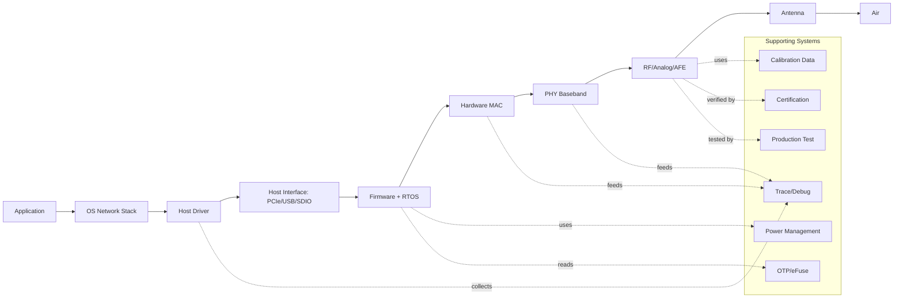
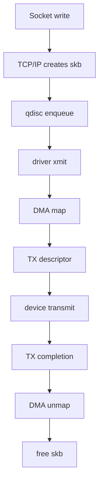
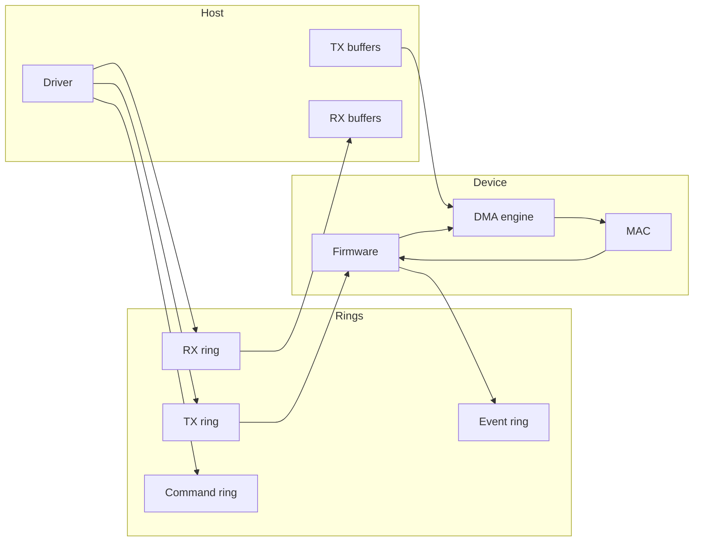
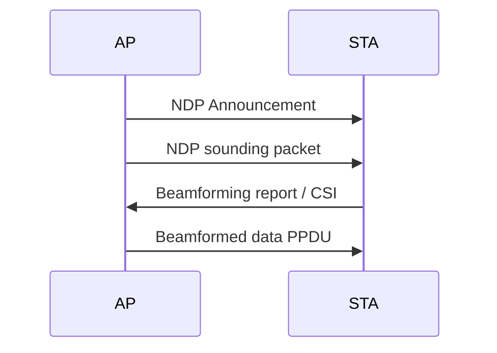
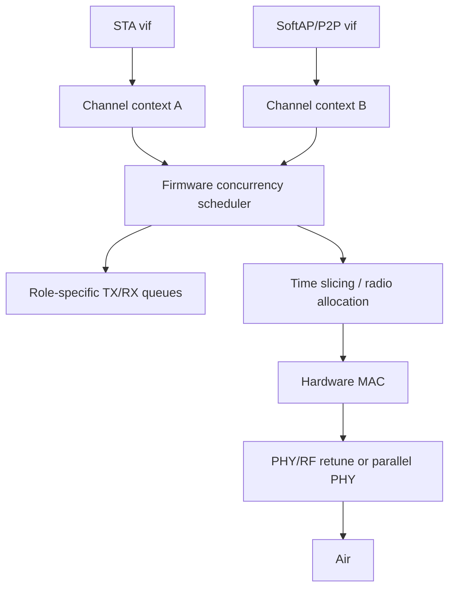
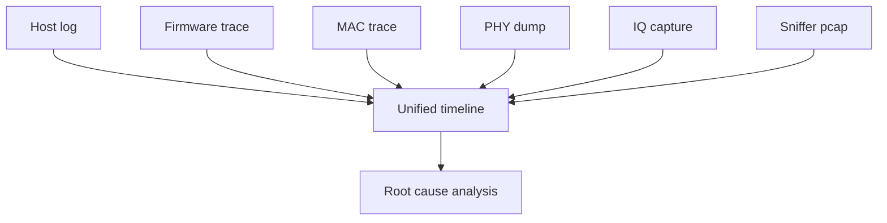
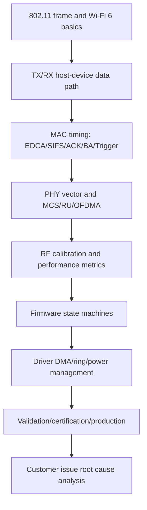

# Wi-Fi 芯片设计公司知识全景文档

本文面向在 Wi-Fi 芯片设计公司工作的工程师，目标不是只背协议名词，而是把一个 Wi-Fi 芯片从 host driver、firmware、hardware MAC、PHY、RF、验证、认证、量产到客户问题定位的关键知识点具体展开。

如果你已经理解了 `skb -> driver -> shared memory -> firmware -> hardware MAC -> PHY -> RF -> air` 这条 TRX 主链路，本文就是下一层：每个模块里具体要懂什么、为什么重要、出问题时看什么。

建议先读 `docs/wifi6-host-device-trx.md`，建立单包 TX/RX 的主线；再读本文，把主线扩展到芯片公司的工程现实：多角色并发、firmware 状态机、RF 校准、验证、认证、量产和客户问题定位。

本文不是 IEEE 802.11 标准逐条翻译。不同芯片公司的 FullMAC/SoftMAC 边界、descriptor 字段、firmware 分工、DBAC/DBDC/DBS 命名会有差异。读到具体项目时，要以该芯片的架构文档、寄存器手册、firmware interface 和认证需求为准。

## 1. 总体架构图



最核心的问题永远是四个：

1. 数据怎么流动：buffer、descriptor、DMA、queue。
2. 控制怎么下发：command、register、firmware state machine。
3. 实时动作在哪里完成：SIFS、ACK、BA、Trigger response、AGC、PHY detect。
4. 出问题怎么定位：host log、firmware log、MAC trace、PHY dump、RF instrument、sniffer。

## 2. Host Driver / OS 侧

### 2.1 Linux mac80211 / cfg80211 / nl80211

`cfg80211` 是 Linux Wi-Fi 配置框架，负责把用户态的 Wi-Fi 控制请求传给内核 driver，例如扫描、连接、断开、设置信道、添加 key。

`nl80211` 是用户态和内核之间的 netlink 接口。`wpa_supplicant`、`hostapd`、`iw` 等工具通过 nl80211 控制 Wi-Fi。

`mac80211` 是 SoftMAC 框架，提供很多 802.11 MAC 层通用逻辑，例如管理帧处理、队列、速率控制接口、AMPDU session、RX/TX status。SoftMAC driver 会接入 mac80211；FullMAC driver 则通常绕过大部分 mac80211 数据面逻辑。

你需要知道：

- 用户态连接 AP 的命令如何进入 driver。
- driver 注册了哪些 cfg80211/mac80211 ops。
- TX/RX status 如何回到 mac80211。
- 扫描、关联、加密 key 安装在哪里完成。

### 2.2 FullMAC driver 和 SoftMAC driver

`SoftMAC`：host 负责较多 802.11 MAC 逻辑，firmware/hardware 负责实时底层动作。优点是 Linux 通用逻辑多，调试透明；缺点是 host 参与多，功耗和实时性压力更大。

`FullMAC`：firmware 负责扫描、关联、漫游、省电、AP station 管理等更多逻辑，host driver 主要发送命令和收事件。优点是芯片可控性强、省电好、跨 OS 更容易；缺点是 firmware 更复杂，问题定位更依赖 firmware trace。

芯片公司常见问题：

- 某个行为到底在 host 还是 firmware 做。
- 连接失败时 host 只看到 timeout，但真正原因在 firmware state machine。
- FullMAC offload 过多导致 Linux 标准工具看到的信息不完整。

### 2.3 netdev、ndo_start_xmit 和 skb 生命周期

`netdev` 是 Linux 网络设备抽象。Wi-Fi STA、AP、P2P interface 都可能表现为一个 netdev。

`ndo_start_xmit` 是网络栈把 skb 交给 driver 的入口。driver 在这里或 mac80211 的 TX callback 中完成 classify、封装、排队。

`skb` 生命周期：



必须搞清楚：

- skb 什么时候归 driver 所有。
- skb 什么时候可以释放。
- TX completion 是成功发到空口、收到 ACK，还是仅表示 device 收走了 descriptor。
- 出错路径是否释放 skb，避免 leak 或 double free。

### 2.4 skb priority 到 TID/AC 的映射

`skb->priority`、DSCP、802.1D priority 会映射到 802.11 QoS `TID`，再映射到 WMM `AC`。

典型映射：

| TID | AC | 含义 |
| --- | --- | --- |
| 0 | BE | Best Effort |
| 1 | BK | Background |
| 2 | BK | Background |
| 3 | BE | Best Effort |
| 4 | VI | Video |
| 5 | VI | Video |
| 6 | VO | Voice |
| 7 | VO | Voice |

这个映射影响：

- 走哪个 EDCA 队列。
- AIFS/CW/TXOP 参数。
- AMPDU session 粒度。
- BlockAck/reorder buffer 粒度。
- 低延迟业务是否被后台流量堵住。

### 2.5 qdisc、TX queue stop/wake

qdisc 是 host 侧排队和调度层。Wi-Fi driver 还会根据 device ring/credit 控制 netdev queue：

- TX ring 满时 `stop queue`。
- TX completion 或 credit update 后 `wake queue`。
- 多 AC 队列可能分别 stop/wake。

常见 bug：

- stop 后没 wake，表现为网络突然不发包。
- wake 太早，ring overflow。
- completion 丢失，host 认为还有包在飞。
- 某个 AC 队列堵住，但其他 AC 正常。

### 2.6 NAPI、RX polling 和 RX buffer refill

高吞吐 RX 不能每个包都中断一次，Linux 常用 NAPI：

1. device 触发 RX interrupt。
2. driver disable RX interrupt。
3. NAPI poll 一批 RX descriptor。
4. budget 用完或 ring 清空。
5. refill RX buffer。
6. 重新 enable interrupt。

需要关注：

- NAPI budget 是否经常打满。
- RX ring 是否 refill 不及时。
- page pool/skb allocation 是否失败。
- RX interrupt moderation 是否导致延迟变大。

### 2.7 DMA mapping、scatter-gather 和 cache coherency

DMA mapping 把 CPU 地址映射成 device 可访问地址。PCIe 系统可能经过 IOMMU，所以 descriptor 中通常写 IOVA，而不是普通虚拟地址。

scatter-gather 允许一个包由多个 fragment 组成，device 按多个 DMA segment 读取。这样可以减少复制，但 descriptor 更复杂。

cache coherency 是嵌入式平台常见坑：

- TX 前 CPU 写了 buffer，但 cache 没 flush，device 读到旧数据。
- RX 后 device 写了 buffer，但 CPU cache 没 invalidate，host 读到旧数据。
- descriptor ownership bit 没有 memory barrier，双方看到顺序不一致。

### 2.8 suspend/resume、runtime PM、WoWLAN

Wi-Fi 芯片通常要支持系统睡眠：

- suspend 前 host 把 WoWLAN pattern、GTK、ARP/NS offload 配给 firmware。
- host 进入低功耗，device 保持低功耗监听。
- 收到 magic packet、pattern、disconnect、GTK rekey 等事件后唤醒 host。

常见问题：

- suspend 后断线。
- WoWLAN 不唤醒。
- 唤醒后 firmware/driver 状态不同步。
- 低功耗电流高，通常是某个模块没关或唤醒周期过密。

### 2.9 regulatory、DFS、hostapd/wpa_supplicant、Android HAL

`regulatory domain` 决定国家码、允许信道、最大发射功率、DFS 要求。

`DFS` 信道需要雷达检测。AP 在 DFS 信道上发射前可能要 CAC，检测到 radar 后要 channel switch。

`wpa_supplicant` 负责 STA 连接、认证、漫游；`hostapd` 负责 AP 模式。Android 还多一层 Wi-Fi HAL 和 framework。

芯片公司常见适配点：

- 国家码变化后 channel plan 是否正确。
- DFS radar event 是否上报 hostapd。
- WPA3/PMF/SAE 参数是否正确传给 firmware。
- Android HAL 期望的 vendor event 是否完整。

## 3. Host-Device Interface

### 3.1 PCIe / USB / SDIO 总线差异

PCIe 吞吐高、延迟低，适合高性能 Wi-Fi 6/6E/7 芯片。要关注 MSI/MSI-X、中断亲和性、DMA/IOMMU、ASPM 低功耗。

USB 通用性好，但 host controller 调度、bulk transfer、URB 聚合会影响延迟。USB Wi-Fi 常见问题是高吞吐下 CPU load 高、延迟抖动大。

SDIO 嵌入式常见，成本低、功耗低，但吞吐和中断效率受限。SDIO driver 经常需要把多个 packet 聚合成一次 bus transaction。

### 3.2 TX/RX/Event/Command ring

典型 host-device ring：



TX ring 放发送 descriptor；RX ring 放 host 预分配的接收 buffer 或 device 写好的 RX descriptor；command ring 放控制命令；event ring 回报异步事件。

### 3.3 Doorbell、mailbox、interrupt

`doorbell` 是 host 告诉 device：“ring 里有新 descriptor”。可能是 MMIO register write、mailbox write 或 USB/SDIO command。

`interrupt` 是 device 告诉 host：“有 completion、RX packet 或 event”。高吞吐下通常要 interrupt moderation，减少中断频率。

`mailbox` 常用于低速控制消息、boot handshake、power state 切换。

问题定位要看：

- host 写 doorbell 后 device 有没有消费。
- interrupt 是否被屏蔽。
- MSI vector 是否正确。
- mailbox 状态机是否卡住。

### 3.4 Descriptor format

descriptor 是 host-device 之间最重要的契约。TX descriptor 常见字段：

- buffer address、length。
- vif id、sta id、tid、queue id。
- frame type、flags。
- key index、encrypt flag。
- checksum/offload flag。
- packet id/cookie。
- rate policy 或 rate index。
- power/antenna/chain 配置。

RX descriptor 常见字段：

- buffer address、packet length。
- RX status。
- RSSI/SNR/channel。
- RX vector 摘要。
- decrypt/FCS/MIC/replay 状态。
- vif/sta/tid。
- timestamp。

descriptor 版本兼容很关键。host driver 和 firmware 如果字段理解不一致，会出现非常隐蔽的问题。

### 3.5 Credit-based flow control

credit 表示 device 当前还能接收多少 TX work。例如：

- TX descriptor slot 数。
- firmware queue 空间。
- per AC/per STA credit。
- bus aggregation credit。

host 发送前消耗 credit，completion 或 credit event 回来后归还。credit 错误会导致：

- host 发太多，device overflow。
- host 以为没 credit，队列永久停住。
- 某个 AC 饿死。

### 3.6 Firmware download、boot flow、OTP/eFuse

芯片上电后通常流程：

```mermaid
sequenceDiagram
    participant Host
    participant BootROM
    participant FW
    participant OTP

    Host->>BootROM: reset chip
    BootROM->>OTP: read strap / trim / security config
    Host->>BootROM: download firmware
    BootROM->>FW: verify and jump
    FW->>OTP: read calibration / MAC address
    FW->>Host: ready event
    Host->>FW: configure rings / features
```



OTP/eFuse 里可能有：

- MAC address。
- RF calibration data。
- TX power limit。
- crystal trim。
- board id。
- security key/hash。
- feature enable bits。

boot 问题常见表现是 firmware ready event 不来、版本不匹配、校验失败、OTP 读错。

## 4. Firmware

### 4.1 RTOS、scheduler、command dispatcher

Firmware 通常运行在芯片内部 MCU 上，可能有 RTOS，也可能是事件循环。它负责把 host command、MAC event、PHY event、timer event 组织成状态机。

关键点：

- 高优先级任务：SIFS 相关准备、RX/TX completion、beacon/trigger 实时调度。
- 中优先级任务：scan、connect、roam、rate control。
- 低优先级任务：统计、log、background calibration。

command dispatcher 要处理 host 下发的命令，例如 add vif、add sta、set key、start scan、start AP、set channel。

### 4.2 Scan state machine

扫描分主动扫描和被动扫描：

- 主动扫描：切到目标信道，发 Probe Request，等 Probe Response。
- 被动扫描：只听 Beacon，常用于 DFS 信道或限制主动发送的地区。

firmware 要处理：

- home channel 和 scan channel 切换。
- scan dwell time。
- 扫描期间数据业务暂停或 off-channel buffering。
- P2P/STA/AP 并发时的时间切片。

### 4.3 Authentication / association offload

FullMAC firmware 可能直接处理 authentication、association、reassociation。它要解析 Beacon/Probe Response 中的 capability，并生成 Association Request。

需要关注：

- HE/VHT/HT capability 是否正确填入。
- WPA/WPA2/WPA3 RSN IE 是否与 supplicant 一致。
- AP 返回 status code 的处理。
- AID、listen interval、QoS capability 保存。

### 4.4 VIF / STA / key context 管理

Firmware 维护很多上下文：

- VIF context：接口类型、MAC 地址、BSSID、信道、beacon 参数。
- STA context：peer MAC、AID、capability、rate table、QoS、power state。
- key context：key type、key id、PN、cipher、pairwise/group。

这些 context 最终会被 hardware MAC 查表使用。典型问题是 host 更新了 key 或 STA，但 firmware/hardware table 未同步。

### 4.5 Rate control 和 power control

rate control 选择 MCS/NSS/BW/GI；power control 选择 TX power index。两者会互相影响：

- 高 MCS 需要高 SNR。
- 小 RU 下功率谱密度和目标 RSSI 约束不同。
- 过高功率可能违反法规或造成 EVM 变差。
- 过低功率导致 retry 上升。

Firmware 需要根据 ACK/BA、RSSI、PER、EVM、移动性动态调整。

### 4.6 Roaming logic

漫游包括扫描候选 AP、评估 RSSI/质量、触发 reassociation。802.11k/v/r 可以辅助：

- 11k：邻居报告和测量。
- 11v：BSS transition management。
- 11r：快速切换，减少认证时间。

常见问题是漫游过慢、粘住弱 AP、漫游后密钥/队列状态异常。

### 4.7 Beacon、PS、TWT、U-APSD

AP 模式下 firmware 要定时发 Beacon，并维护 TIM/DTIM。STA 省电时，AP 缓存其下行包。

STA 模式下 firmware 要按 listen interval 醒来听 Beacon。TWT 则是 Wi-Fi 6 中更精确的醒来调度。

U-APSD 用于 WMM power save，STA 通过 trigger frame 触发 AP 下发缓存包，常见于语音业务。

### 4.8 AMPDU session、ADDBA/DELBA

Firmware 可能负责发起或响应 ADDBA，维护 per STA/TID 的 AMPDU session：

- 是否允许聚合。
- BA window size。
- starting sequence number。
- timeout。
- reorder state。

DELBA 用于关闭 BlockAck session。某些兼容性问题需要针对特定 AP 调整 AMPDU 参数。

### 4.9 Trigger response、OFDMA/MU scheduler

STA 侧：firmware/hardware 要预先准备 trigger response buffer。收到 Basic Trigger 后，在 SIFS 内解析 trigger 并发 HE TB PPDU。

AP 侧：scheduler 决定下行 OFDMA/MU-MIMO 和上行 trigger：

- 哪些 STA 被调度。
- RU 分配。
- 每个 STA 的 MCS/NSS。
- trigger 周期和长度。
- fairness 和 throughput 折中。

### 4.10 BT/Wi-Fi coexistence

2.4 GHz 下 Bluetooth 和 Wi-Fi 会互相干扰。coexistence manager 需要处理：

- PTA 信号仲裁。
- Wi-Fi TX/RX 与 BT slot 避让。
- A2DP、BLE、SCO 等不同 BT 业务优先级。
- Wi-Fi scan、AP mode、high throughput 与 BT 音频的冲突。

典型问题是蓝牙耳机播放时 Wi-Fi 吞吐下降或 ping 抖动。

### 4.11 Watchdog、assert、crash dump、trace

Firmware 必须有可靠的故障恢复：

- watchdog 检测死锁。
- assert 记录文件/行号或 error code。
- crash dump 保存寄存器、stack、heap、关键 ring 状态。
- trace 记录状态机事件。

客户问题通常只能靠这些信息复现和定位。

## 5. Hardware MAC

### 5.1 Frame parser、header generation、filter

MAC RX 要解析 802.11 header，识别 frame type/subtype、地址、QoS、sequence、HT/HE control。

TX 要生成或补齐 header 字段，例如 sequence number、duration、QoS control、FCS。

过滤器包括：

- RA 是否匹配本机。
- BSSID 是否匹配。
- multicast/broadcast 是否允许。
- monitor/promiscuous 模式是否放行。

### 5.2 Sequence number、duplicate detection、PN replay

每个 TID 有独立 sequence number。RX 侧用 sequence number 做 duplicate detection。

加密帧还要做 PN replay check，防止旧包重放。PN 与 key/context 绑定，重装 key 或漫游时要特别小心。

### 5.3 Encryption/decryption engine

硬件加密引擎处理 CCMP/GCMP 等 cipher：

- TX：插入 CCMP/GCMP header，递增 PN，加密 payload，生成 MIC。
- RX：根据 key index 找 key，检查 PN，解密并校验 MIC。

加密错误通常表现为 RX decrypt error、MIC error、replay error，不应误判为 PHY 问题。

### 5.4 EDCA engine

EDCA engine 维护四个 AC 的 AIFS、CWmin、CWmax、backoff、TXOP。

它必须和 CCA/NAV 协同：

- 物理 CCA busy 时暂停 backoff。
- NAV busy 时暂停 backoff。
- AIFS 满足后才继续退避。
- TXOP 内可以连续发送，受时长限制。

### 5.5 SIFS response：ACK/BA/CTS

SIFS 响应必须非常快，host 和普通 firmware 任务来不及介入。hardware MAC 通常自动完成：

- 收到单播 data 后回 ACK。
- 收到 A-MPDU 后回 BlockAck。
- 收到 RTS 后回 CTS。
- 收到 trigger 后准备 HE TB response，部分实现由 MAC/PHY 联合完成。

### 5.6 AMPDU/AMSDU、retry、rate fallback

MAC 聚合引擎把多个 MPDU 组成 A-MPDU。RX 侧拆聚合并生成 BA bitmap。

retry engine 根据 ACK/BA 结果重传失败 MPDU。rate fallback 可能在每次 retry 后换更稳的速率。

需要关注：

- 最大聚合长度。
- delimiter/padding 正确性。
- BA bitmap 解析。
- retry limit。
- long retry/short retry 统计。

### 5.7 TSF、beacon scheduler、TBTT

`TSF` 是 Timing Synchronization Function，是 802.11 的时间基准。AP 通过 Beacon 传播 TSF；STA 用 Beacon 同步。

AP firmware/MAC 要在 TBTT 附近准时发 Beacon。STA 省电也依赖 TBTT 唤醒听 Beacon。

Beacon 晚发或 TSF 漂移会导致省电、漫游、同步问题。

### 5.8 Trigger parser、HE TB response、Multi-STA BA

Wi-Fi 6 MAC 要能解析 trigger frame：

- AID 是否匹配自己。
- RU allocation。
- UL length。
- MCS/NSS/GI/LTF。
- target RSSI。

STA 响应 HE TB PPDU；AP 接收多个 STA 后生成 Multi-STA BA。这个路径对 MAC/PHY timing 要求很高。

## 6. PHY Baseband

### 6.1 Packet detection、preamble detection、AGC interface

PHY 首先要判断空口是否有包。packet detection 依赖能量检测、相关检测、preamble pattern。

AGC 负责调 RX gain，使 ADC 不饱和且信号足够大。PHY 和 AGC 协作很紧：

- detection 太敏感会 false alarm。
- detection 太保守会漏包。
- AGC 收敛慢会影响前导码解码。

### 6.2 Timing sync、CFO/SFO、channel estimation

`timing synchronization` 找到 OFDM symbol 边界。

`CFO` 是 carrier frequency offset，来自晶振偏差和多普勒。CFO 不补偿会导致星座旋转、ICI。

`SFO` 是 sampling frequency offset，采样时钟偏差会造成子载波相位随时间漂移。

`channel estimation` 利用 LTF/pilot 估计信道响应，用于均衡。

### 6.3 FFT/IFFT、subcarrier、RU mapping

TX 侧 IFFT 把频域子载波变成时域信号；RX 侧 FFT 把时域信号变回频域。

OFDMA 中，不同用户占用不同 RU。PHY 必须正确做 RU mapping：

- AP 下行：把不同用户数据映射到不同 RU。
- STA 下行：只解自己的 RU。
- STA 上行 HE TB：按 trigger 指定 RU 发。
- AP 上行：同时解多个 RU。

### 6.4 Coding、interleaving、modulation

编码提供纠错能力。常见 BCC 和 LDPC。LDPC 性能更好，但硬件复杂。

调制阶数决定每个 symbol 承载多少 bit：

- BPSK：稳，速率低。
- QPSK：稳健。
- 16-QAM、64-QAM：中高速。
- 256-QAM：Wi-Fi 5/6 高速。
- 1024-QAM：Wi-Fi 6 高速，要求高 SNR。

interleaving 把连续错误打散，提升纠错效果。

### 6.5 MCS、NSS、GI、LTF、DCM、STBC

`MCS` 综合调制和编码率。MCS 越高吞吐越高，也越脆弱。

`NSS` 是空间流数量，多流需要多天线和 MIMO 信道支持。

`GI` 是保护间隔，短 GI 提升吞吐，长 GI 抗多径。

`LTF` 用于信道估计，多 LTF 支持多流和更稳的估计。

`DCM` 牺牲速率提高可靠性。

`STBC` 用空间编码提高可靠性。

### 6.6 Beamforming、sounding、CSI

Beamforming 通过多天线相位/幅度控制，把能量朝接收端方向集中。

流程：



CSI/beamforming report 的精度影响 MU-MIMO 性能。移动场景下 CSI 过期会导致性能下降。

### 6.7 RSSI、SNR、RCPI、EVM、PER

`RSSI` 是接收信号强度。不同芯片定义可能不同，绝对值不可盲目横向比较。

`SNR` 是信号噪声比，和可用 MCS 强相关。

`RCPI` 是标准化接收信道功率指标。

`EVM` 是误差向量幅度，衡量调制质量。TX EVM 差会导致对端解调困难；RX EVM 差可能来自信道、RF、PHY。

`PER` 是 packet error rate，是系统最终可靠性指标。

### 6.8 PHY error classification、TX/RX vector

PHY 要能区分错误类型：

- preamble detect fail。
- SIG CRC fail。
- unsupported format。
- LDPC decode fail。
- FCS fail。
- radar detect。
- AGC saturation。

TX vector/RX vector 是 MAC/PHY 接口核心。调试时要把 vector、sniffer、实际 air 行为对齐。

## 7. RF / Analog

### 7.1 LNA、PA、Mixer、PLL、VCO、ADC、DAC

`LNA` 放大接收弱信号，噪声系数很关键。

`PA` 放大发射信号，影响 TX power、EVM、功耗、线性度。

`Mixer` 完成上/下变频。

`PLL/VCO` 生成本振，影响频偏、相位噪声、spur。

`ADC/DAC` 在模拟和数字之间转换，动态范围和采样质量影响 PHY 性能。

### 7.2 TX/RX gain table、AGC loop

TX gain table 把目标发射功率映射到 PA/driver/BB gain 设置。

RX gain table 把不同 LNA/VGA/BB gain 组合组织起来，供 AGC 快速选择。

AGC loop 要在前导码早期收敛，否则后续 LTF/SIG 解码质量下降。

### 7.3 Calibration

常见校准：

- TX power calibration：保证输出功率准确。
- RX gain calibration：保证 RSSI/AGC 准确。
- DC offset calibration：去除直流偏移。
- IQ imbalance calibration：修正 I/Q 幅度和相位不匹配。
- LO leakage calibration：降低本振泄漏。
- crystal calibration：修正频率偏差。
- temperature compensation：温度变化时修正功率和频偏。

校准数据通常存在 OTP/eFuse/flash/board data。

### 7.4 Spur、phase noise、spectral mask、ACLR

`spur` 是杂散，可能来自 PLL、电源、数字时钟耦合。

`phase noise` 会恶化高阶调制，尤其 1024-QAM。

`spectral mask` 是法规对发射频谱形状的限制。

`ACLR` 是邻道泄漏比，衡量对邻近信道的污染。

这些指标常用频谱仪、信号分析仪、综测仪验证。

### 7.5 FEM、antenna switch、band support

FEM 包括 PA、LNA、switch、filter 等前端器件。芯片需要控制 FEM GPIO 或 RFFE 接口。

多 band 支持要关注：

- 2.4 GHz 干扰多，BT 共存重要。
- 5 GHz 信道多，有 DFS。
- 6 GHz 是 Wi-Fi 6E/7 重点，法规更复杂。

## 8. Wi-Fi 6 / HE 协议

### 8.1 HE Capability / HE Operation IE

HE Capability IE 声明设备支持什么，例如 OFDMA、MU-MIMO、MCS/NSS、LDPC、TWT、BSS color。

HE Operation IE 描述 BSS 如何运行，例如 BSS color、default PE duration、basic MCS/NSS、operation channel width。

如果 IE 填错，AP/STA 可能协商出错误能力，导致 HE 特性不启用或连接失败。

### 8.2 HE SU / HE MU / HE TB / HE ER SU

`HE SU`：单用户发送，类似传统单用户高速数据。

`HE MU`：多用户下行，一个 AP 同时给多个 STA 发，使用 OFDMA/MU-MIMO。

`HE TB`：trigger-based 上行，STA 按 AP trigger 响应。

`HE ER SU`：扩展覆盖单用户，提升远距离可靠性。

### 8.3 RU allocation

RU 是 OFDMA 资源单位。常见 26/52/106/242/484/996 tone RU。调度器要根据包大小、链路质量、用户数选择 RU。

小 RU 的特点：

- 多用户并发能力强。
- 单用户吞吐低。
- 对同步、功率控制更敏感。

大 RU 的特点：

- 单用户吞吐高。
- 可并发用户少。

### 8.4 Trigger types

`Basic Trigger`：最常见，用于调度 STA 发上行数据。

`BSRP Trigger`：询问 STA buffer status，帮助 AP 决定后续 UL OFDMA 调度。

`MU-BAR Trigger`：让多个 STA 回 BlockAck。

`BFRP Trigger`：请求 beamforming report。

`NFRP Trigger`：用于特定反馈场景。

Trigger 共同点：AP 发出控制，STA 在 SIFS 后响应。

### 8.5 UORA、BSR、UL power control

`UORA` 允许 STA 在 AP 指定的随机接入 RU 上竞争发送，适合大量设备偶发小包。

`BSR` 告诉 AP STA 还有多少上行数据，AP 根据它调度 RU。

`UL power control` 让多个 STA 到达 AP 的功率更均衡，避免强 STA 压制弱 STA。

### 8.6 BSS Coloring、OBSS_PD、Spatial Reuse

BSS Color 用于区分同频不同 BSS。设备发现是 OBSS 帧时，可以根据 OBSS_PD 门限决定是否更积极地复用信道。

Spatial Reuse 的目标是提高密集部署吞吐，但配置不当会增加干扰和重传。

### 8.7 TWT

TWT 让 AP 和 STA 协商唤醒时间。它适合 IoT、手机省电、低占空比业务。

实现要点：

- TWT setup/teardown action frame。
- TWT schedule 存储。
- 睡眠期间 buffering。
- 与 beacon/TBTT/DTIM 的关系。

### 8.8 Multi-STA BlockAck、Packet Extension、preamble puncturing

Multi-STA BA 用于 AP 一次确认多个 STA 的上行结果，配合 UL OFDMA。

Packet Extension 给接收端额外处理时间，帮助硬件完成解码和响应准备。

Preamble puncturing 允许宽带传输避开部分不可用子信道，Wi-Fi 6/6E/7 中都可能遇到相关能力和兼容性问题。

## 9. 多角色、多信道、多频段并发

Wi-Fi 芯片公司里经常会听到 `SCC`、`MCC`、`DBAC`、`DBDC`、`DBS`。它们不是单个包的 TX/RX 机制，而是描述一个芯片如何同时支撑多个 Wi-Fi 角色、多个 channel context、多个 band 的活跃业务。

典型并发角色包括：

- STA：连接上级 AP。
- SoftAP：手机热点或设备热点。
- P2P Client / P2P GO：Wi-Fi Direct。
- NAN：Neighbor Awareness Networking。
- Monitor/sniffer。
- Scan/off-channel operation。

这些角色会共享 host interface、firmware scheduler、MAC queue、PHY/RF、功耗预算和天线资源。

### 9.1 SCC：Single Channel Concurrency

`SCC` 是单信道并发。多个 Wi-Fi 角色工作在同一个 channel。

例子：

```text
STA: 2.4 GHz channel 6
SoftAP: 2.4 GHz channel 6
```

SCC 是最容易实现的并发：

- RF 不需要切信道。
- PHY 不需要 retune。
- Beacon、listen、TX/RX 调度相对简单。
- 多个 vif 可以共享同一个 channel context。

限制是所有角色必须使用同一个信道。实际产品中，SoftAP 的信道经常被 STA 连接的 AP 约束。例如手机连上 2.4G channel 6 的路由器后，如果同时开热点，热点可能也被迫开在 channel 6。

### 9.2 MCC：Multi Channel Concurrency

`MCC` 是多信道并发。多个 Wi-Fi 角色工作在不同 channel，可能在同一个 band，也可能跨 band。

例子：

```text
STA: 2.4 GHz channel 1
P2P GO: 2.4 GHz channel 11
```

或者：

```text
STA: 5 GHz channel 36
P2P Client: 5 GHz channel 149
```

如果芯片只有一套 radio/PHY，MCC 通常靠 time slicing 实现：

```mermaid
gantt
    title Single-radio MCC time slicing
    dateFormat X
    axisFormat %L
    section STA ch1
    RX/TX on STA channel :0, 35
    RX/TX on STA channel :70, 105
    section P2P ch11
    RX/TX on P2P channel :35, 35
    RX/TX on P2P channel :105, 35
```



MCC 的难点：

- channel switch/retune 有时间开销。
- STA 不能长期离开 home channel，否则会 beacon miss。
- SoftAP/P2P GO 必须准时发 Beacon。
- P2P 需要 NoA/OppPS 等机制通知对端自己何时不在。
- 扫描、漫游和业务 TX/RX 会互相抢时间片。
- 时延和抖动通常比 SCC 更差。

### 9.3 DBAC：Dual Band Active Concurrency

`DBAC` 是 Dual Band Active Concurrency，双频活跃并发。它强调两个或多个活跃 Wi-Fi 角色分布在不同 band，例如一个在 2.4 GHz，另一个在 5 GHz。

例子：

```text
STA: 2.4 GHz AP
SoftAP: 5 GHz hotspot
```

或者：

```text
STA: 5 GHz AP
P2P GO: 2.4 GHz
```

DBAC 可以看成 MCC 的跨 band 场景，但在芯片实现上更特殊，因为跨 band 可能涉及：

- RF band switch。
- 不同 FEM/antenna path。
- 不同 PA/LNA/gain table。
- 不同 regulatory power limit。
- 不同 calibration data。
- 2.4G 与 BT coexistence。

单 radio DBAC 仍然是分时：

```text
2.4G STA time slice
-> retune to 5G
-> 5G SoftAP time slice
-> retune back to 2.4G
```

双 radio DBAC 则更接近真正并行：

```text
2.4G MAC/PHY/RF handles STA
5G MAC/PHY/RF handles SoftAP
```

DBAC 典型问题：

- STA ping 抖动变大。
- SoftAP beacon 漏发。
- STA beacon miss 后断线。
- P2P/SoftAP 吞吐低。
- scan 触发后另一个角色卡顿。
- BT 音频与 2.4G 角色互相影响。
- 切 band retune 时间过长。
- firmware scheduler 给某个 role 的 airtime 不够。

### 9.4 DBDC 和 DBS

`DBDC` 是 Dual Band Dual Concurrent，双频双并发。它通常更强调硬件能力：芯片有两套较独立的并发链路，可以 2.4G 和 5G 同时工作。

`DBS` 是 Dual Band Simultaneous，双频同时。很多产品资料会把 DBS 和 DBDC 接近使用，都表示 2.4G + 5G 同时在线或同时传输。

区别可以这样理解：

- DBAC：强调双频 active concurrency，可能是单 radio 分时，也可能是双 radio 真并发。
- DBDC/DBS：更强调双频同时能力，通常暗示硬件资源更独立。

实际厂商命名不完全统一，读规格时要确认：

- 是否能同时收发。
- 是否只有时分切换。
- 是否支持两个 STA。
- 是否支持 STA + SoftAP。
- 是否支持 P2P/NAN 并发。
- 两条链路是否共享天线、PA/LNA、MAC、PHY。

### 9.5 并发能力对 TRX 的影响

并发能力会改变普通 TX/RX 流程中的调度层：



对 TX：

- classify 不只找到 vif/sta/tid，还要找到 channel context。
- firmware 要判断当前 radio 是否在该角色的 channel 上。
- 如果不在，需要等待时间片或触发 channel switch。
- TX completion 延迟可能包含等待调度的时间。

对 RX：

- 单 radio 分时离开某个 channel 时，该 channel 上的包无法接收。
- STA 可能错过 Beacon 或 data。
- SoftAP/P2P GO 需要通过 Beacon/NoA 告诉对端可用窗口。
- RX ring 里的包来自多个 role，需要正确标记 vif/channel/status。

### 9.6 并发调度需要看的指标

调试 SCC/MCC/DBAC/DBDC 时，除了普通 TX/RX 指标，还要看：

- 每个 role 的 airtime。
- 每个 channel context 的 dwell time。
- channel switch 次数和耗时。
- retune latency。
- beacon miss count。
- SoftAP/P2P beacon jitter。
- NoA/OppPS 配置。
- scan off-channel 时间。
- per role TX queue depth。
- per role RX drop。
- BT coexistence grant/deny 统计。
- power state 切换次数。

### 9.7 同类概念对比表

| 概念 | 全称 | 核心含义 | 是否同信道 | 是否跨 band | 常见实现 |
| --- | --- | --- | --- | --- | --- |
| SCC | Single Channel Concurrency | 多角色同信道并发 | 是 | 不一定 | 共享同一 channel context |
| MCC | Multi Channel Concurrency | 多角色多信道并发 | 否 | 不一定 | 单 radio 分时或多 radio |
| DBAC | Dual Band Active Concurrency | 双频活跃并发 | 否 | 是 | 单 radio 分时或双 radio |
| DBDC | Dual Band Dual Concurrent | 双频双并发 | 否 | 是 | 通常双 MAC/PHY/RF 或接近独立 |
| DBS | Dual Band Simultaneous | 双频同时 | 否 | 是 | 通常强调产品级同时能力 |

## 10. 802.11 通用协议

### 10.1 Management / Control / Data frame

Management frame：Beacon、Probe、Auth、Assoc、Action，用于建链和管理。

Control frame：ACK、BA、RTS、CTS、Trigger，用于实时控制。

Data frame：承载业务数据，包括 QoS Data、Null Data、QoS Null。

### 10.2 Beacon、Probe、Authentication、Association

Beacon 广播 BSS 信息。Probe 用于主动发现 AP。Authentication 和 Association 建立 802.11 连接。

Association Request/Response 中携带能力协商。任何 IE 错误都可能导致兼容性问题。

### 10.3 TIM/DTIM、PS-Poll、QoS Null

TIM 告诉省电 STA：AP 为哪些 AID 缓存了单播数据。

DTIM 指示广播/组播缓存释放时机。

PS-Poll 或 QoS Null 用于 STA 告诉 AP 自己醒来或切换省电状态。

### 10.4 Roaming、11k/11v/11r

Roaming 是 STA 从一个 AP 切到另一个 AP。

11k 提供测量和邻居信息；11v 提供 BSS transition 建议；11r 提供快速切换认证。

### 10.5 PMF、WPA2/WPA3、SAE、GTK rekey

PMF 保护部分管理帧，防止伪造 deauth/disassoc。

WPA2 常见 PSK + CCMP。WPA3 使用 SAE，抗离线字典攻击能力更强。

GTK rekey 是组播密钥更新。低功耗时可由 firmware offload，否则 host 睡眠期间可能掉线。

## 11. 性能指标

### 11.1 Throughput、latency、jitter、loss

Throughput 看吞吐，TCP 受拥塞控制和 ACK 影响，UDP 更接近裸数据能力。

Latency 是时延，受 queue、power save、bus、firmware scheduling、air contention 影响。

Jitter 是时延抖动，语音/游戏敏感。

Packet loss 需要区分 host drop、MAC retry 后失败、PHY decode fail、对端丢弃。

### 11.2 PER、FER、retry、MCS distribution

PER/FER 高说明链路可靠性差。retry rate 高会降低吞吐并增加延迟。

MCS distribution 能看 rate control 是否激进或保守。如果 RSSI 很高但 MCS 上不去，要查 EVM、NSS、带宽、能力协商。

### 11.3 Aggregation、BA bitmap、airtime

AMPDU 长度影响效率。聚合太短吞吐低；聚合太长在差链路下重传代价高。

BA bitmap hole rate 能看哪些 MPDU 经常失败。

Airtime 是空口占用时间。公平调度通常应该看 airtime，而不是只看 byte。

### 11.4 Sensitivity、EVM、RSSI、SNR、noise floor

Sensitivity 是最低可接收信号强度，通常以某 MCS 下 PER 达标为准。

EVM 衡量调制质量。RSSI/SNR/noise floor 帮助判断链路预算。

### 11.5 Power consumption

功耗指标包括：

- active TX/RX current。
- idle associated current。
- scan current。
- DTIM sleep current。
- TWT sleep current。
- suspend/WoWLAN current。
- wake latency。

功耗问题常常需要 firmware、PMU、RF、host driver 一起看。

## 12. 验证 / Bring-up

### 12.1 RTL simulation、UVM、coverage

RTL 仿真验证硬件逻辑。UVM testbench 用 transaction 随机/定向驱动设计。

Coverage 包括 code coverage、functional coverage、assertion coverage。没有覆盖到的协议角落，后期很容易变成芯片 bug。

### 12.2 FPGA bring-up、emulation

FPGA 或 emulation 用于在流片前跑更接近真实速度的系统测试。

关注：

- host interface 是否能跑。
- firmware 是否能启动。
- MAC/PHY loopback 是否通。
- 基本 TX/RX 是否通。

### 12.3 Golden model、MATLAB/Python bit-true model

PHY 算法通常有 golden model。RTL 输出要和 bit-true model 对齐。

常见对齐内容：

- scrambler。
- coding。
- modulation。
- FFT/IFFT。
- channel estimation。
- LDPC decode。
- EVM/PER。

### 12.4 Loopback、packet generator、sniffer validation

MAC loopback 验证 MAC 数据路径。PHY loopback 验证基带。RF conducted test 通过线缆连接仪表，避免空口不确定性。

sniffer validation 用第三方设备确认空口帧格式、速率、trigger、BA 是否符合预期。

### 12.5 Trace 对齐

芯片 bring-up 最重要能力是多源 trace 对齐：



要能回答：host 什么时候交包、firmware 什么时候调度、MAC 什么时候发、PHY vector 是什么、sniffer 是否看到、对端是否 ACK。

## 13. 认证 / 法规

### 13.1 Wi-Fi Alliance 认证

Wi-Fi Alliance 认证验证互操作性和功能：

- Wi-Fi 6 certification。
- WPA3。
- WMM。
- PMF。
- Agile Multiband。
- EasyMesh，如果产品支持 mesh。

认证失败常常不是“协议完全不懂”，而是某个 IE、状态机、timing 或兼容性细节不符合测试用例。

### 13.2 FCC / CE / TELEC / SRRC / KC

法规认证关注发射功率、频谱、杂散、信道、DFS、SAR 等。

不同国家地区允许的信道和功率不同。driver/firmware 必须正确执行 country code 和 regulatory 限制。

### 13.3 DFS radar detection

DFS 信道要求检测雷达。AP 使用 DFS 信道前要 CAC，检测到 radar 后必须停止并切信道。

难点：

- 雷达波形检测准确性。
- false alarm 不能太多。
- channel switch announcement 正确。
- hostapd/firmware 状态一致。

### 13.4 SAR、spectral mask、spurious emission

SAR 限制人体吸收功率，移动设备常需要动态降功率。

Spectral mask 和 spurious emission 限制发射频谱外泄。RF/PA/DPD/calibration 都会影响。

## 14. 量产测试

### 14.1 ATE、non-signaling、signaling test

ATE 是自动测试设备。量产为了速度，常用 non-signaling test：不建立完整 Wi-Fi 连接，直接让芯片进入测试模式发包/收包。

signaling test 会建立真实协议连接，更接近用户场景，但耗时更长。

### 14.2 TX/RX 测试项

TX：

- TX power。
- EVM。
- frequency error。
- spectral mask。
- flatness。
- PA linearity。

RX：

- sensitivity。
- PER。
- RSSI accuracy。
- blocking。
- adjacent channel rejection。

### 14.3 Calibration data、efuse/OTP、board data

量产会写入或生成：

- MAC address。
- TX power table。
- RX gain table。
- crystal trim。
- IQ/DC calibration。
- board id。
- country/SKU 限制。

这些数据如果错，芯片可能能连上网，但性能、功耗、法规都会异常。

### 14.4 Factory mode firmware

工厂测试通常使用特殊 firmware 或 test mode：

- 快速进入指定信道。
- 固定 MCS/NSS/BW。
- 连续发包。
- 读取 PER/RSSI/EVM。
- 写 OTP/eFuse。

生产命令必须稳定、可恢复，写 OTP 这类动作要防止误写。

## 15. 客户问题定位

### 15.1 连接类问题

连不上 AP：

- scan 是否看到 Beacon/Probe Response。
- auth/assoc status code。
- RSN/SAE/PMF 参数。
- country code 信道是否合法。
- firmware 是否安装 key。

4-way handshake 失败：

- EAPOL 是否收发。
- replay counter 是否正确。
- PTK/GTK 是否安装。
- MIC 是否错误。

### 15.2 吞吐和延迟问题

吞吐低：

- MCS/NSS/BW 是否达到预期。
- AMPDU 长度是否足够。
- retry 是否高。
- CCA busy 是否高。
- CPU/bus 是否瓶颈。
- power save 是否误开。

延迟高或 ping 抖动：

- 队列积压。
- interrupt moderation 太大。
- firmware scheduler 延迟。
- BT coexistence 抢占。
- TWT/PS 导致周期性睡眠。

### 15.3 掉线、漫游、省电

掉线：

- deauth/disassoc reason code。
- Beacon miss。
- firmware assert。
- RF link poor。
- AP 兼容性。

漫游慢：

- scan dwell 太长。
- candidate selection 不合理。
- 11r 未启用或失败。

省电异常：

- TIM/DTIM 是否正确。
- listen interval。
- WoWLAN pattern。
- GTK rekey offload。

### 15.4 OFDMA/MU-MIMO 不生效

检查：

- AP 是否支持并启用。
- STA HE capability 是否声明。
- sniffer 是否看到 HE MU/Trigger。
- RU allocation 统计。
- BSR/BSRP 是否工作。
- beamforming sounding/report 是否完成。

### 15.5 RF/PHY 类问题

远距离差：

- sensitivity。
- noise figure。
- RX gain/AGC。
- antenna/FEM。

近距离速率上不去：

- TX/RX EVM。
- AGC saturation。
- rate control 保守。
- 1024-QAM SNR 不够。

RX FCS error 高：

- 干扰。
- CFO/SFO。
- AGC。
- channel estimation。
- RF calibration。

### 15.6 三方对齐定位法

客户现场问题最好同时收：

- Host log。
- Firmware assert/trace。
- MAC/PHY counters。
- Sniffer pcap。
- AP log。
- RF 环境信息。

分析时按时间线回答：

```text
包有没有从 host 出来？
device 有没有收到 descriptor？
firmware 有没有调度？
MAC 有没有发？
sniffer 有没有看到？
对端有没有 ACK/BA？
completion 怎么报？
```

## 16. 推荐学习顺序



优先级最高的是：

1. TX/RX 主链路和 buffer ownership。
2. MAC 实时机制：EDCA、SIFS、ACK/BA、Trigger。
3. PHY 指标：MCS、RSSI、SNR、EVM、PER。
4. Firmware 状态机和 trace。
5. RF calibration 和法规限制。
6. 用 host log、firmware log、sniffer、PHY counter 做统一时间线分析。
