# Wi-Fi 6 Host-Device TRX 链路全流程说明

本文把一个 Wi-Fi 6 芯片/模组里的 TRX 链路按端到端路径串起来：发送方向从上层网络栈的一个包，到 host driver、device/firmware、hardware MAC、PHY/RF，再到空口；接收方向从空口信号，到 PHY 解调、MAC 处理、shared memory 回传，再到 host 网络栈。

文中的 `host` 通常指运行 Linux/macOS/RTOS 网络栈和 Wi-Fi 驱动的主处理器；`device` 指 Wi-Fi 芯片侧的 firmware、DMA/ring、hardware MAC、PHY 和 RF。不同厂商会把功能切分得不完全一样，但主链路和关键概念基本一致。

如果只想先抓主线，可以先记住三句话：

1. TX 是把上层 `skb` 变成空口 `PPDU`：host 做分类和排队，device/MAC/PHY 做实时发送。
2. RX 是把空口 `PPDU` 变回上层 `skb`：PHY 先解调，MAC 再校验/解密/重排，host 最后上交网络栈。
3. Wi-Fi 6 的 OFDMA、Basic Trigger、TWT、BSS Color、DBAC/MCC 等能力，本质上都会落到“调度谁、何时发、用哪个信道/RU/速率、谁来实时响应”这些问题上。

读这份文档时建议按这个顺序：

```text
先看 1-3 章：建立 TX 主链路
再看 5-6 章：建立 RX 主链路
然后看 13-18 章：补 802.11/Wi-Fi 6 概念
最后看 19-24 章：补芯片实现、调试和并发
```

## 1. 总体分层

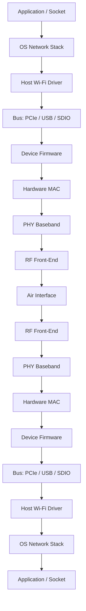

可以把职责粗略分成三类：

1. Host 软件路径：`skb`、分类、队列、station/interface 上下文、加密上下文配置、速率控制策略、buffer 管理、上交网络栈。
2. Device MAC 路径：descriptor 解析、DMA、实时调度、AMPDU 聚合/拆聚合、ACK/BA、重传、trigger 响应、硬件队列。
3. PHY/RF 空口路径：preamble、TX vector、RX vector、编码调制、OFDMA RU、AGC、同步、信道估计、功率控制。

## 2. 关键术语先串起来

### 2.1 Host/driver 侧术语

`skb` 是 Linux 网络栈里承载数据包的 socket buffer。发送时，host driver 从网络栈拿到 skb；接收时，driver 通常重新构造 skb 并上交网络栈。

`classify` 是发送分类过程。driver 根据 skb 的优先级、DSCP、802.1D priority、vif 类型、目的地址、QoS 能力等，把包归入某个队列、某个 TID、某个 STA。

`vif` 是 virtual interface。一个物理 Wi-Fi 芯片可以同时有多个逻辑接口，例如 STA、AP、P2P、monitor。vif 决定了 BSSID、本机 MAC 地址、工作模式、密钥、信道上下文等。

`sta` 是 peer station 上下文。AP 模式下，一个 sta 对应一个关联客户端；STA 模式下，peer sta 多数时候就是 AP。sta 保存对端能力、速率能力、QoS 能力、HT/VHT/HE 能力、BlockAck 状态、功率状态等。

`tid` 是 Traffic Identifier，QoS 数据流编号，常见范围是 0-7。TID 通常映射到四个 EDCA AC：BK、BE、VI、VO。AMPDU 聚合、BlockAck 窗口、序列号和重排缓存通常按 `sta + tid` 管理。

`AMPDU` 是 Aggregated MPDU，把多个 MPDU 聚合到一个 PPDU 里发。它显著降低前导码、ACK、竞争等待等固定开销，是 Wi-Fi 高吞吐的核心机制。

### 2.2 MAC/PHY 空口术语

`preamble` 是物理帧前导码。接收端靠它做包检测、同步、信道估计，并识别后续 PPDU 类型。Wi-Fi 6 使用 HE 相关 preamble，例如 HE SU、HE MU、HE TB、HE ER SU。

`TX vector` 是发送侧给 PHY 的参数集合，可以理解为“这次 PPDU 怎么发”。它包括 PPDU 格式、MCS、NSS、带宽、GI/LTF、长度、功率、RU 分配、编码方式、空间复用参数等。

`RX vector` 是接收侧 PHY/MAC 解出来的接收元信息，可以理解为“这次 PPDU 是怎么被收到的”。它包括 PPDU 格式、MCS、NSS、带宽、GI/LTF、RSSI/SNR、RU、长度、解码状态等。

`PHY` 是物理层基带处理，包括扰码、编码、交织、调制、OFDM/OFDMA、IFFT/FFT、CP、信道估计、均衡、解调、解码等。

`AGC` 是 Automatic Gain Control，自动增益控制。你写的“acg 检查”大概率是 AGC 检查。它在 RX 前端调节接收增益，避免信号过强饱和或过弱淹没在噪声中。

### 2.3 Wi-Fi 6 调度/时序术语

`OFDMA` 是 Orthogonal Frequency Division Multiple Access。Wi-Fi 6 把一个信道切成多个 RU，允许多个用户在同一个 PPDU 时间内并行收发。

`Basic Trigger` 是 AP 发送的 Trigger frame 类型之一，用来调度一个或多个 STA 进行上行 trigger-based 传输。它告诉 STA：你使用哪个 RU、发多长、用什么 MCS/功率/空间流等。

`SIFS` 是 Short Interframe Space，是非常短的帧间隔，用于 ACK、BlockAck、CTS、Trigger response 等立即响应。Basic Trigger 后，STA 通常在 SIFS 后发送 HE TB PPDU。

`TBTT` 是 Target Beacon Transmission Time，即 Beacon 目标发送时间。它是 Beacon 周期的时间锚点，和同步、省电、TIM/DTIM、调度周期有关。

`TBAC` 需要结合讲座上下文确认。常见可能含义是 Trigger-Based Access Control，或者 Trigger-Based + Access Category 的厂商简称。为了避免误解，本文按“trigger-based 上行接入控制/调度”理解：AP 通过 trigger 控制 STA 何时、在哪个 RU、用什么参数发上行。

## 3. TX 总览：一个包从上层到空口

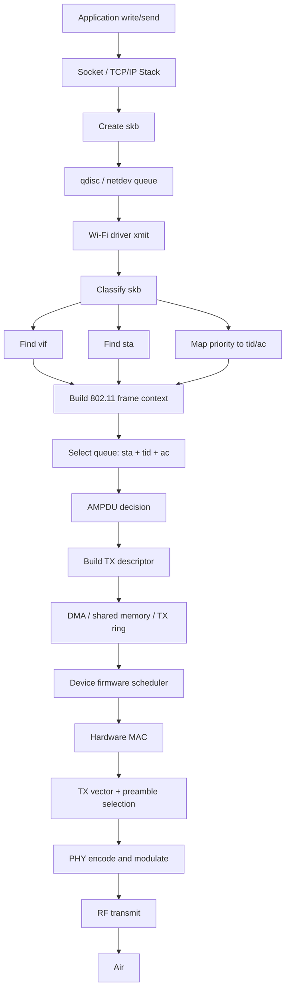

下面按实际链路逐步展开。

### 3.1 应用和网络栈生成 skb

应用通过 socket 写数据。TCP/UDP/IP 层处理分段、路由、邻居解析、校验和 offload、GSO/TSO 等。最终网络栈把待发送的数据封装到 `skb`。

skb 里不仅有 payload，还有大量 metadata，例如：

- `skb->priority`：业务优先级，后续可映射到 TID/AC。
- 协议类型：IPv4、IPv6、ARP、EAPOL 等。
- 目的 MAC/IP 信息。
- checksum/GSO/offload 标志。
- 所属 netdev，也就是某个 Wi-Fi vif 对应的网络设备。

如果是 AP 模式，网络栈要发给某个已关联 STA；如果是 STA 模式，绝大多数上行包最终都发给 AP。

### 3.2 qdisc 和 netdev 队列

skb 先进入 Linux qdisc。qdisc 做主机侧排队、整形、优先级控制。之后 skb 被送到 Wi-Fi netdev 的 `ndo_start_xmit` 或 mac80211/cfg80211 相关发送入口。

此时还不一定是最终的 802.11 空口帧。以 Linux mac80211 为例，host 可能会先构造 802.11 header，再交给底层 driver；fullmac 芯片则可能由 firmware 负责更多 802.11 封装。

### 3.3 classify：把 skb 归入正确的发送上下文

driver/mac80211 对 skb 做 classify，核心目标是回答四个问题：

1. 这个包属于哪个 `vif`？
2. 这个包发给哪个 `sta`？
3. 这个包属于哪个 `tid/ac`？
4. 这个包应该走普通 EDCA、AMPDU、management path，还是 trigger response buffer？

典型分类逻辑包括：

- 根据 netdev 找到 vif。
- 根据目的地址和 BSSID 找 peer sta。
- 根据 skb priority、DSCP、802.1D priority 映射到 TID。
- TID 再映射到 EDCA AC：VO、VI、BE、BK。
- 判断是否是管理帧、控制帧、EAPOL、ARP、DHCP、QoS data。
- 判断是否允许聚合：management/control 不走 AMPDU；某些 EAPOL 或低延迟包可能禁止聚合。

`tid` 很关键，因为后续许多状态都是 per `sta + tid`：

- 802.11 sequence number。
- AMPDU session。
- BlockAck agreement。
- retry/reorder window。
- queue depth 和 airtime accounting。

### 3.4 构造 802.11 MAC 帧上下文

如果 host 负责构造 802.11 header，driver 会根据 vif/sta/tid 生成或补齐：

- Frame Control：Data/QoS Data/Management 等。
- 地址字段：RA、TA、DA、SA、BSSID。
- Sequence Control：序列号和 fragment number。
- QoS Control：TID、EOSP、Ack policy 等。
- HT Control/HE Control：某些能力或控制信息。
- 加密相关字段：PN/IV、key index 等，具体取决于硬件/firmware 是否 offload。

如果 device/firmware 负责更多封装，host descriptor 中至少要携带足够上下文，让 firmware/hardware MAC 能补齐这些字段。

### 3.5 排队：software queue 到 hardware queue

发送队列通常不止一层：

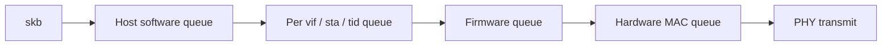

常见队列维度：

- per AC：对应 EDCA 的四类竞争参数。
- per STA：避免单个 STA 占满所有资源。
- per TID：服务 AMPDU 和 BlockAck。
- per hardware queue：映射到硬件 DMA/ring。

调度器通常还会考虑 airtime fairness、PS mode、U-APSD、TWT、buffered traffic、rate control、retry budget 等。

### 3.6 AMPDU 聚合

如果目标 STA 和 TID 已经建立 BlockAck agreement，并且队列里有足够包，发送侧会尝试做 A-MPDU。

聚合流程可以理解为：

1. 从某个 `sta + tid` 队列中取多个 MPDU。
2. 为每个 MPDU 分配 sequence number。
3. 检查 BlockAck window 是否允许继续塞入。
4. 生成 delimiter、padding、FCS 等硬件需要的信息。
5. 形成一个 PPDU 的发送计划。

A-MPDU 的收益是一次竞争/一次 preamble 可以带多个 MAC frame。但它也带来限制：

- 同一个 A-MPDU 通常属于同一个 TID。
- 受最大 PPDU duration、最大聚合长度、BlockAck window 限制。
- 某个 MPDU 失败后需要按 BlockAck bitmap 重传。
- 低延迟小包可能不适合过度等待聚合。

### 3.7 TX descriptor：host 交给 device 的契约

host 不会只把 payload 扔给 device，还会写 TX descriptor。descriptor 是 host 和 device 之间的契约，常见字段包括：

- buffer 地址和长度。
- frame 类型和 flags。
- vif id、sta id、tid、queue id。
- 是否 QoS、是否 AMPDU、是否加密、是否需要 ACK。
- key id 或加密上下文索引。
- rate control 信息或 rate table 索引。
- retry 限制。
- packet id / cookie，用于 TX completion 回报。
- 802.11 header 长度、payload offset、checksum/offload 信息。
- 特殊控制：NoAck、RTS/CTS、CTS-to-self、固定速率、注入帧、test mode。

descriptor 和数据 buffer 通过 PCIe/USB/SDIO 等总线进入 device。常见实现方式是 TX ring、DMA descriptor ring、mailbox、shared memory 队列。

### 3.8 Firmware/device 调度

device firmware 会从 TX ring 取 descriptor，并把包纳入 firmware 内部调度。这里开始进入更强实时性的区域。

firmware 可能负责：

- 选择硬件队列。
- 管理 per STA/TID 的聚合状态。
- 做最终速率选择或调整。
- 根据当前信道状态和监管限制选择 TX power。
- 处理 STA 省电缓存。
- 处理上行 trigger response 的候选 buffer。
- 与 hardware MAC 协同完成 retry、BA、NAV、CCA 等。

在 Wi-Fi 6 芯片中，很多 trigger-based 响应无法等 host 决策，因为 Basic Trigger 到响应 PPDU 之间只有 SIFS。host 只能提前准备数据和上下文，实时响应必须由 firmware/hardware 完成。

### 3.9 Hardware MAC 发射前处理

hardware MAC 是靠近 PHY 的实时 MAC 引擎，常见职责包括：

- EDCA 退避、CCA、NAV 判断。
- RTS/CTS、ACK、BlockAck、BAR 控制。
- MPDU/A-MPDU 组装。
- MAC header 部分字段补齐。
- 加密和 MIC/ICV/FCS 处理。
- 序列号、PN 递增。
- retry 和 rate fallback。
- 统计计数器更新。
- 生成给 PHY 的 TX vector。

如果是普通 EDCA 发送，hardware MAC 需要先竞争信道。竞争成功后，开始准备 PPDU。

如果是 trigger-based uplink，hardware MAC 不是自己竞争信道，而是在收到 AP 的 Trigger 后，按 trigger 指定时序在 SIFS 后发 HE TB PPDU。

### 3.10 TX vector 和 preamble

TX vector 是 MAC 交给 PHY 的关键参数集合。不同芯片字段名不同，但本质通常包括：

- PPDU format：Legacy、HT、VHT、HE SU、HE MU、HE TB、HE ER SU。
- Preamble 类型：对应接收端如何识别和解调。
- Channel bandwidth：20/40/80/160 MHz。
- MCS：调制编码方式。
- NSS：空间流数。
- GI/LTF：Guard Interval 和 Long Training Field 配置。
- Coding：BCC 或 LDPC。
- STBC、beamforming、spatial reuse 等标志。
- PSDU length 或 PPDU duration。
- TX power。
- RU allocation：OFDMA 场景中使用哪个 RU。
- User info：MU 场景下每个 user 的参数。

Preamble 的作用非常关键：

1. 让接收端检测到有包。
2. 完成时间同步和频偏估计。
3. 做信道估计。
4. 告诉接收端后续字段如何解释。

Wi-Fi 6 的 HE preamble 会携带 HE-SIG-A/HE-SIG-B 等信息。HE MU/OFDMA 下，接收端需要知道自己被分配到了哪个 RU、对应的 MCS/NSS 等。

### 3.11 PHY/RF 把比特变成无线信号

PHY 根据 TX vector 做基带处理：

1. Scrambler：扰码。
2. FEC encoding：前向纠错编码，BCC 或 LDPC。
3. Puncturing/repetition：按速率和格式处理编码比特。
4. Interleaving：交织，改善突发错误。
5. Modulation mapping：BPSK/QPSK/16-QAM/64-QAM/256-QAM/1024-QAM。
6. OFDM/OFDMA mapping：映射到子载波或 RU。
7. Pilot insertion：插入导频。
8. IFFT：频域到时域。
9. Guard Interval/Cyclic Prefix：加保护间隔。
10. Digital front-end：滤波、增益、预失真等。
11. DAC/RF：数模转换、上变频、PA 放大、天线发射。

到这里，一个 host 上层包已经变成空口上的一个或多个 MPDU，可能被聚合在某个 PPDU 内。

## 4. Wi-Fi 6 TX 特性插入点

### 4.1 OFDMA 下行

AP 做下行 OFDMA 时，一个 PPDU 可以同时发给多个 STA。AP 的调度器会决定：

- 哪些 STA 一起发。
- 每个 STA 分配哪个 RU。
- 每个 STA 的 MCS/NSS。
- PPDU 总长度和 padding。
- 是否 MU-MIMO 与 OFDMA 结合。

Host/driver 侧仍然是 skb、vif、sta、tid、queue，但 device 侧会把多个用户的数据组合成一个 HE MU PPDU。

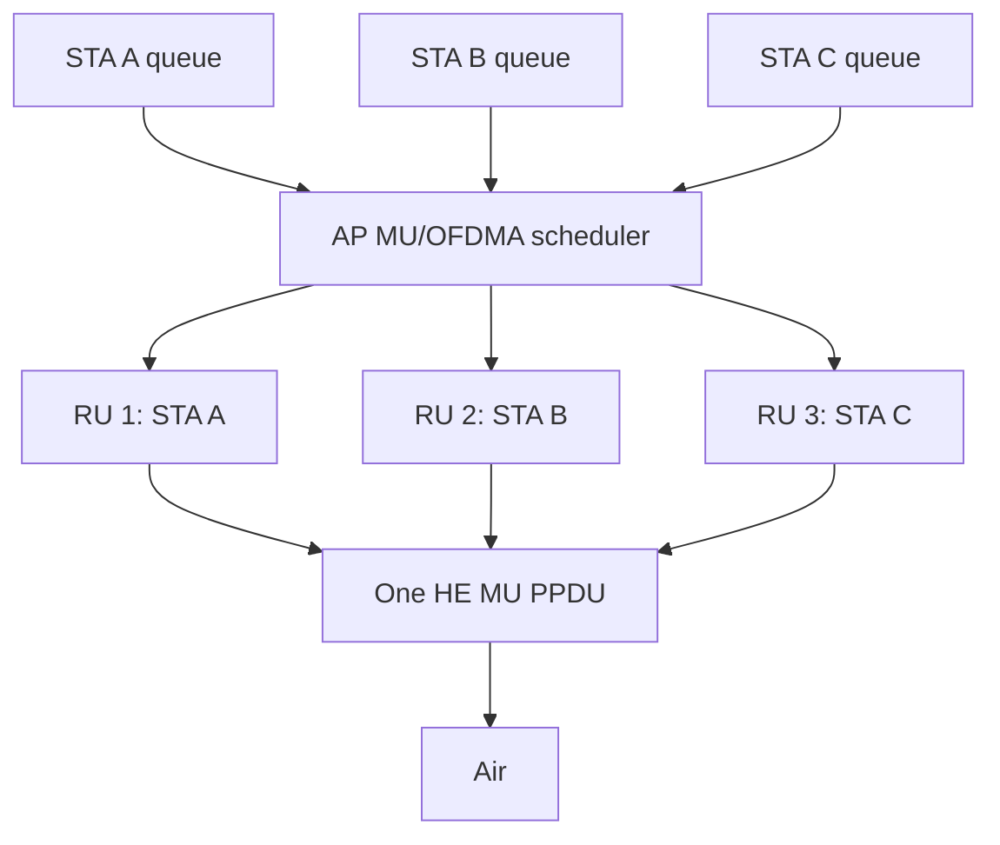

### 4.2 Trigger-based 上行

上行 OFDMA 的难点是多个 STA 同时发，必须由 AP 调度。Basic Trigger 的核心作用就是把上行发送参数提前告诉 STA。

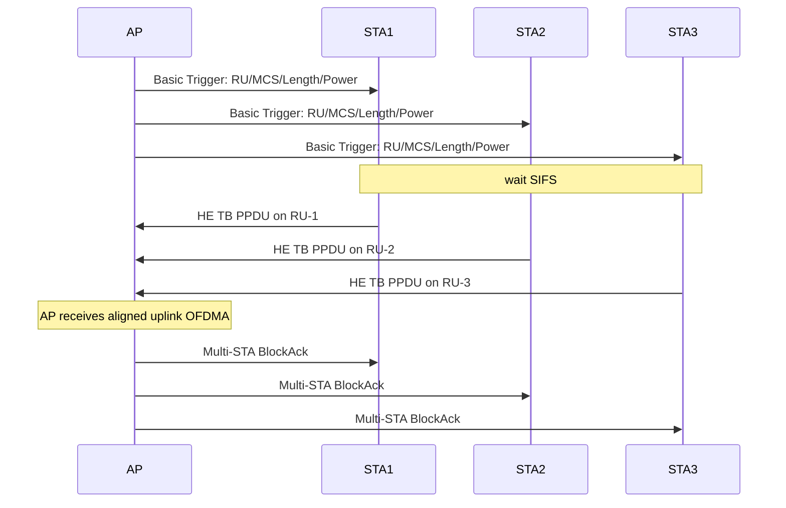

STA 侧接收到 Basic Trigger 后，需要在 SIFS 后响应。这个路径非常短，host 通常来不及参与。所以实现上常见做法是：

- Host 提前把可用于 trigger response 的数据放到 device 队列。
- Firmware/hardware 解析 Trigger。
- Hardware MAC/PHY 根据 Trigger 生成 HE TB PPDU 的 TX vector。
- 在 SIFS 后按 RU 和功率发射。

Basic Trigger 里常见关键信息包括：

- AID12：被调度 STA 的标识。
- RU allocation：给该 STA 的 RU。
- UL MCS。
- UL DCM、SS allocation、LDPC、GI/LTF。
- Target RSSI 或功率控制相关字段。
- UL length 或 duration。
- Trigger type。

### 4.3 TBTT、Beacon、TIM/DTIM 和省电

TBTT 是 Beacon 周期的目标时间点。AP 在 TBTT 附近发送 Beacon，Beacon 中可能包含：

- SSID、BSSID、capability。
- TIM：哪些 AID 有缓存下行数据。
- DTIM：组播/广播缓存释放周期。
- HE capability/operation。
- BSS color、TWT、空间复用等 Wi-Fi 6 信息。

对 TRX 链路的影响：

- STA 省电时，会在特定 TBTT 醒来听 Beacon。
- AP 需要在 TIM/DTIM 后安排下行缓存包发送。
- TWT 场景下，STA 和 AP 可以协商更明确的唤醒时间窗口。
- Beacon/TBTT 对 firmware 实时调度很重要，host 通常不能精确控制每个 Beacon 的微秒级发送时刻。

### 4.4 TWT、BSS Coloring、Spatial Reuse

虽然你列的名词里没有这些，但它们是 Wi-Fi 6 TRX 经常一起出现的补充概念。

`TWT` 是 Target Wake Time。AP 和 STA 协商未来的唤醒时间，STA 可以长时间睡眠，到约定时间醒来收发。它影响 TX 队列是否能立即发，也影响 AP 是否要缓存某个 STA 的包。

`BSS Coloring` 给 BSS 标颜色，用来区分同频邻居 BSS。接收侧可以基于 color 判断一个 PPDU 是本 BSS 还是 OBSS，从而辅助空间复用和 CCA/OBSS_PD 策略。

`Spatial Reuse` 允许在一定条件下更积极地复用空间资源。例如检测到 OBSS 信号但强度较低时，设备可能仍然允许发送，提升密集部署吞吐。

### 4.5 1024-QAM 和速率控制

Wi-Fi 6 引入 1024-QAM，对应更高 MCS。它要求更高 SNR，因此速率控制需要结合：

- RSSI/SNR。
- PER/重传率。
- 历史成功率。
- 带宽和 NSS。
- 是否 OFDMA RU，小 RU 上的链路表现。
- 移动性和信道变化。

TX vector 中的 MCS/NSS/BW/GI 不是固定的，它们通常由 rate control 和 firmware/hardware 根据实时反馈动态选择。

## 5. RX 总览：一个包从空口到上层

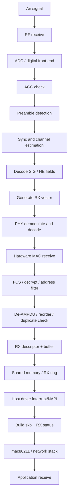

### 5.1 RF 接收和 AGC

天线收到的是模拟无线信号。RF 前端先做：

- LNA 增益控制。
- 下变频。
- 滤波。
- ADC 采样。
- 数字前端校正。

AGC 的目标是在很短时间内把信号调到合适幅度。检查点包括：

- 信号是否过强导致 ADC 饱和。
- 信号是否过弱导致无法可靠检测。
- 增益是否稳定。
- 动态范围是否足够。

AGC 失败可能表现为：

- preamble detect 失败。
- RX vector 不完整。
- FCS error 增多。
- RSSI/SNR 异常。
- 高 MCS 下 PER 高。

### 5.2 Preamble detect、同步和信道估计

PHY 通过 preamble 判断“这里有一个 802.11 PPDU”。之后做：

- packet detection。
- timing synchronization。
- carrier frequency offset estimation。
- channel estimation。
- 识别 PPDU format。

Legacy/HT/VHT/HE 的 preamble 结构不同。Wi-Fi 6 HE PPDU 中，接收端还需要解析 HE-SIG-A/HE-SIG-B 等字段，才能知道后续数据字段如何解调。

### 5.3 RX vector 生成

RX vector 是 PHY/MAC 给上层的接收元信息。它对驱动、速率控制、monitor 抓包、调试都很重要。

常见字段：

- PPDU format：HE SU、HE MU、HE TB、VHT、HT、Legacy。
- Channel width。
- Primary channel / puncturing 信息。
- MCS、NSS、GI/LTF。
- RU allocation 和 user position。
- RSSI、SNR、EVM、RCPI。
- Length/duration。
- Coding：LDPC/BCC。
- STBC、beamformed、DCM 等标志。
- CRC/FCS 状态。
- 时间戳 TSF。

RX vector 不等于 packet payload。它是“怎么收到这个包”的状态说明。

### 5.4 PHY 解调和解码

PHY 根据 RX vector 和 SIG 字段解调数据：

1. FFT：时域到频域。
2. Channel equalization：信道均衡。
3. Pilot tracking：跟踪相位/频偏。
4. Demapping：QAM 星座点转软比特。
5. Deinterleaving。
6. FEC decoding：BCC/LDPC 解码。
7. Descrambling。
8. 输出 PSDU/MPDU 给 MAC。

如果是 OFDMA，PHY 只解自己所在 RU 的子载波；AP 接收 trigger-based UL 时，会同时处理多个 STA 的 RU。

### 5.5 Hardware MAC 接收处理

MAC 收到 PHY 输出后，继续做：

- FCS 校验。
- 地址过滤：RA/BSSID 是否匹配。
- 帧类型过滤：data、management、control。
- 解密：WEP/TKIP/CCMP/GCMP 等，现代常见 CCMP/GCMP。
- PN replay check。
- QoS/TID 解析。
- A-MPDU deaggregation。
- BlockAck bitmap 生成或处理。
- duplicate detection。
- reorder：按 TID 重排乱序 MPDU。
- management/action frame 交给 firmware 或 host。

如果是 A-MPDU，接收端可能在一个 PPDU 中得到多个 MPDU。每个 MPDU 可能独立成功或失败，BlockAck 用 bitmap 表示哪些序列号收到了。

### 5.6 RX descriptor 和 shared memory

device 把接收到的数据和状态写入 RX ring/shared memory。通常包括：

- buffer 地址/长度。
- packet type。
- vif id、sta id 或 peer id。
- tid。
- RX vector 摘要。
- RSSI/SNR。
- channel/frequency。
- FCS/decrypt/MIC 状态。
- 是否 AMPDU。
- 是否 duplicate。
- 是否需要 reorder。
- 时间戳。

Host driver 收到中断或通过轮询/NAPI 发现 RX ring 有新包，然后取出 buffer 和 descriptor。

### 5.7 Host driver 上交网络栈

host driver 做最后的 host 侧处理：

- DMA unmap/cache sync。
- 从 RX descriptor 中解析状态。
- 构造或补齐 skb。
- 如果是 mac80211，填 `ieee80211_rx_status`。
- monitor 模式下可能生成 radiotap header。
- 普通 data frame 去掉 802.11 header，转换成 802.3/Ethernet frame。
- 上交 netif_receive_skb 或 mac80211 RX 路径。

之后进入 OS 网络栈：

- bridge/routing/firewall。
- IP/TCP/UDP。
- socket receive buffer。
- application read/recv。

## 6. RX 中 Wi-Fi 6 特性的体现

### 6.1 接收 HE MU / OFDMA

下行 OFDMA 时，AP 发一个 HE MU PPDU，不同 STA 只解自己对应的 RU。

STA 接收侧流程：

1. 检测 HE preamble。
2. 解析 HE-SIG-A/HE-SIG-B。
3. 判断自己是否被调度。
4. 找到自己的 RU 和 user field。
5. 按对应 MCS/NSS/GI/LTF 解调。
6. 输出自己的 MPDU/A-MPDU。

如果 STA 没有被调度，它可能只解析部分头部后丢弃，不继续解完整 payload。

### 6.2 AP 接收 HE TB PPDU

AP 发 Basic Trigger 后，多个 STA 在 SIFS 后同时发送 HE TB PPDU。AP 的 PHY/MAC 接收要处理：

- 多个 RU 上的并发信号。
- 每个 STA 的频偏、功率差异。
- trigger 中预期的 RU/user 对应关系。
- 每个用户的 CRC/FCS/BA 状态。
- Multi-STA BlockAck 生成。

AP 接收 HE TB 的难点是多个 STA 的同步必须足够好，所以 Trigger 中会约束长度、RU、功率等。

### 6.3 BSS Color 和 OBSS 判断

接收侧解析 HE 字段后，可以知道 BSS color。device 可以用它判断：

- 这是本 BSS 的 PPDU，需要正常接收。
- 这是 OBSS 的 PPDU，可能只用于 CCA/NAV/统计。
- 在 spatial reuse 策略下，是否允许更积极地发送。

这类判断通常更多影响 MAC/PHY 的实时行为，不一定完整上报给 host。

## 7. 普通 EDCA TX 与 Trigger-Based TX 对比

```mermaid
flowchart TB
    subgraph EDCA[Normal EDCA Uplink]
        E1[Host queues skb] --> E2[Device selects AC queue]
        E2 --> E3[CCA and random backoff]
        E3 --> E4[Win contention]
        E4 --> E5[Transmit PPDU]
        E5 --> E6[Receive ACK or BA]
    end

    subgraph TBUL[Trigger-Based Uplink]
        T1[Host preloads data] --> T2[AP sends Basic Trigger]
        T2 --> T3[STA parses trigger]
        T3 --> T4[Wait SIFS]
        T4 --> T5[Transmit HE TB PPDU on assigned RU]
        T5 --> T6[Receive Multi-STA BA]
    end
```

核心差别：

- EDCA 是 STA 自己竞争信道。
- Trigger-based UL 是 AP 调度 STA。
- EDCA 的发送时刻由本 STA 的退避结果决定。
- Trigger-based UL 的发送时刻由 AP Trigger + SIFS 决定。
- Trigger-based UL 的实时路径更依赖 firmware/hardware。

## 8. Host-Device shared memory 的角色

shared memory 或 DMA ring 是 host 和 device 之间的主要接口。它承载三类东西：

1. TX 数据和 TX descriptor。
2. RX 数据和 RX descriptor。
3. 控制/状态消息，例如 firmware event、TX completion、scan result、station update。

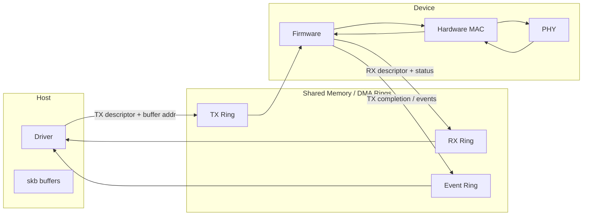

TX completion 很重要。一个 skb 被交给 device 不代表已经成功发到空口，更不代表对端成功收到。TX completion 可能包含：

- 发送成功/失败。
- ACK/BA 结果。
- retry 次数。
- final rate/MCS。
- airtime。
- aggregation 信息。

driver 用这些信息释放 skb、更新速率控制、更新统计、唤醒队列。

## 9. 一次完整 TX 的细粒度清单

下面用更细的 checklist 形式描述普通 data TX：

1. 应用调用 `send/write`。
2. TCP/UDP/IP 生成网络层数据。
3. OS 创建 skb。
4. qdisc 对 skb 排队。
5. skb 进入 Wi-Fi netdev/mac80211/driver。
6. driver 根据 netdev 定位 vif。
7. driver 根据目的地址/BSSID 定位 sta。
8. driver 根据 skb priority/DSCP 映射 TID。
9. TID 映射到 AC。
10. 检查是否 QoS data、management、EAPOL 或特殊帧。
11. 检查目标 STA 是否 asleep；如果 asleep，AP 可能缓存。
12. 检查是否允许 AMPDU。
13. 选择 per `sta + tid` 队列。
14. 分配 sequence number 或预留由硬件分配。
15. 构造 802.11 header 或提供 header context。
16. 设置加密上下文。
17. 放入 software queue。
18. 调度器决定何时推给 device。
19. 构造 TX descriptor。
20. DMA map skb buffer。
21. 写 TX ring/shared memory。
22. doorbell/interrupt 通知 device。
23. firmware 拉取 TX descriptor。
24. firmware 校验 vif/sta/tid/key/queue。
25. firmware 或 hardware MAC 做 AMPDU 聚合。
26. hardware MAC 做 EDCA CCA/backoff，或等待 trigger。
27. rate control 决定 MCS/NSS/BW/GI。
28. MAC 生成 TX vector。
29. PHY 生成 preamble。
30. PHY 编码、调制、映射子载波/RU。
31. RF 上变频、放大并发射。
32. 对端接收并返回 ACK/BlockAck。
33. hardware MAC 处理 ACK/BA。
34. 失败则重传或 rate fallback。
35. firmware 生成 TX completion。
36. host driver 收到 completion。
37. driver 释放 skb、更新统计、唤醒队列。

## 10. 一次完整 RX 的细粒度清单

普通 data RX 可以拆成：

1. 天线收到无线信号。
2. RF 前端下变频、滤波、采样。
3. AGC 调整接收增益。
4. PHY 做 packet detection。
5. PHY 检测 preamble。
6. PHY 做时间同步、频偏估计、信道估计。
7. PHY 解析 L-SIG/HT-SIG/VHT-SIG/HE-SIG。
8. PHY 生成 RX vector。
9. 如果是 OFDMA/MU，判断本设备是否是目标用户。
10. PHY 按 MCS/NSS/BW/GI/RU 解调。
11. PHY 做 FEC 解码和 descramble。
12. MAC 收到 MPDU/A-MPDU。
13. MAC 做 FCS 校验。
14. MAC 做地址/BSSID/vif 过滤。
15. MAC 做解密和 PN replay check。
16. MAC 解析 QoS Control，得到 TID。
17. 如果是 A-MPDU，拆出多个 MPDU。
18. MAC 做 duplicate detection。
19. MAC 做 reorder。
20. MAC 生成 ACK/BlockAck 响应。
21. device 把 payload 写入 RX buffer。
22. device 把 RX status/RX vector 摘要写入 RX descriptor。
23. device 通过 interrupt/event/doorbell 通知 host。
24. host driver NAPI/poll RX ring。
25. driver DMA unmap/cache sync。
26. driver 解析 RX descriptor。
27. driver 构造 skb。
28. driver 填 RX status 或 radiotap。
29. mac80211 做必要的 802.11 到 802.3 转换。
30. skb 上交 OS 网络栈。
31. IP/TCP/UDP 处理。
32. 应用从 socket 读取数据。

## 11. 调试时应该看哪些点

### 11.1 TX 不出去

优先看：

- skb 是否进入 driver。
- classify 是否找到正确 vif/sta/tid。
- 队列是否 stopped。
- STA 是否处于省电状态。
- AMPDU session 是否异常。
- TX ring 是否满。
- firmware 是否回 TX completion。
- completion 中是 no ack、excessive retry、filtered、dropped 还是 descriptor error。
- 空口是否有 PPDU。

### 11.2 RX 收不到

优先看：

- AGC/RSSI 是否正常。
- preamble detect 是否成功。
- RX vector 是否生成。
- FCS error 是否高。
- 地址/BSSID filter 是否丢弃。
- 解密/PN replay 是否失败。
- reorder 是否卡住。
- RX ring 是否满。
- host 是否及时 poll RX。

### 11.3 Wi-Fi 6/OFDMA 问题

重点看：

- HE capability/operation 是否协商成功。
- AP 是否真的启用 OFDMA。
- Basic Trigger 是否发出。
- STA 是否在 SIFS 后发 HE TB PPDU。
- RU allocation 是否正确。
- Trigger 中 MCS/length/power 是否合理。
- AP 是否收到 HE TB。
- Multi-STA BA 是否正确。
- 小 RU 下 MCS 是否过高导致 PER。

## 12. 把所有名词放回一张图

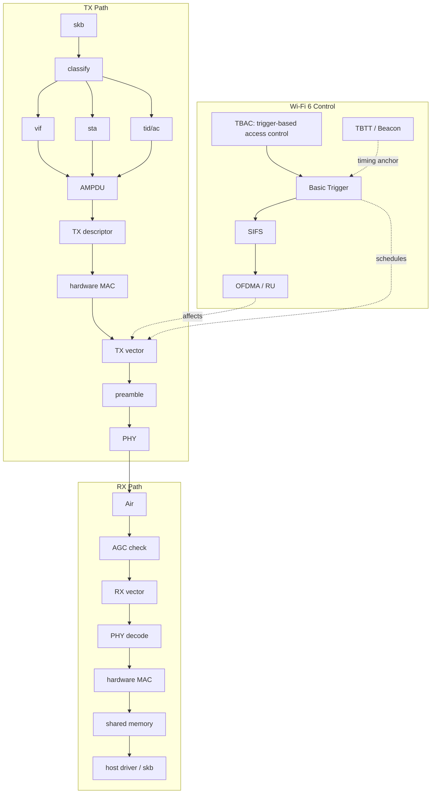

## 13. 802.11 数据单位：MSDU、MPDU、PSDU、PPDU

理解 TRX 链路时，最容易混的是几个“包”的层级：

- `MSDU`：MAC Service Data Unit，来自上层网络栈的以太网负载。可以粗略理解为 802.3/Ethernet frame 进入 Wi-Fi MAC 前的业务数据。
- `A-MSDU`：多个 MSDU 聚合在一个 MPDU 里。它减少 MAC header 开销，但其中任意部分出错通常会影响整个 MPDU。
- `MPDU`：MAC Protocol Data Unit，一个完整 802.11 MAC 帧，包含 MAC header、frame body、FCS 等。
- `A-MPDU`：多个 MPDU 聚合在一个 PPDU 里。每个 MPDU 有自己的 FCS，所以可以通过 BlockAck bitmap 独立确认。
- `PSDU`：PHY Service Data Unit，MAC 交给 PHY 的比特序列。一个 PPDU 里的数据字段承载 PSDU。
- `PPDU`：PHY Protocol Data Unit，真正空口上的物理层帧，包含 preamble、SIG 字段、data 字段等。

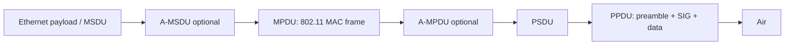

常见组合：

- 小包多、链路好：可能 `A-MSDU + A-MPDU` 双聚合，效率最高。
- 误码高或低延迟：可能降低聚合长度，避免重传代价过大。
- 管理帧/控制帧：通常不走普通数据聚合。

## 14. 802.11 接入控制：DCF、EDCA、CCA、NAV、ACK

Wi-Fi 是共享介质，发送前必须解决“谁先说话”的问题。

### 14.1 CCA 和退避

`CCA` 是 Clear Channel Assessment，空闲信道评估。设备会通过能量检测、前导码检测、NAV 等判断信道是否忙。

普通 EDCA 发送流程：

1. MAC 队列中有待发帧。
2. 检查信道是否空闲。
3. 如果空闲持续 AIFS，开始或继续随机 backoff。
4. backoff 计数到 0 后发送。
5. 等待 ACK/BlockAck。
6. 如果失败，增加重传计数，可能扩大 contention window 并降速。

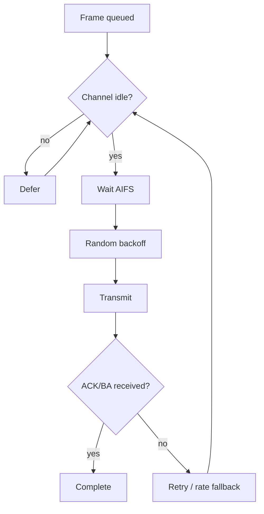

### 14.2 EDCA 四个 AC

802.11e/WMM 把业务分成四个 Access Category：

- `AC_VO`：Voice，最高优先级，AIFS 短，竞争窗口小。
- `AC_VI`：Video，较高优先级。
- `AC_BE`：Best Effort，普通数据。
- `AC_BK`：Background，后台流量。

TID 到 AC 的常见映射：

- TID 0、3 -> BE。
- TID 1、2 -> BK。
- TID 4、5 -> VI。
- TID 6、7 -> VO。

不同 AC 有不同 AIFS、CWmin、CWmax、TXOP limit。TXOP 表示赢得信道后可以连续占用一段时间，用来发多个帧或一个较长聚合。

### 14.3 NAV、RTS/CTS、保护机制

`NAV` 是 Network Allocation Vector，虚拟载波监听。设备听到别人声明的 duration 后，即使物理层能量不强，也会认为信道在这段时间内被预订。

`RTS/CTS` 用于降低隐藏节点冲突。发送方先发 RTS，接收方回 CTS，周围设备根据 duration 设置 NAV。代价是额外控制帧开销，所以通常只在大包、差链路、隐藏节点明显时启用。

`CTS-to-self` 是另一种保护方式，发送方给自己发 CTS，让 legacy 设备设置 NAV。

## 15. 管理帧和连接状态：扫描、认证、关联、能力协商

一个 data packet 能正常 TRX，前提是 STA 和 AP 已完成管理面流程。

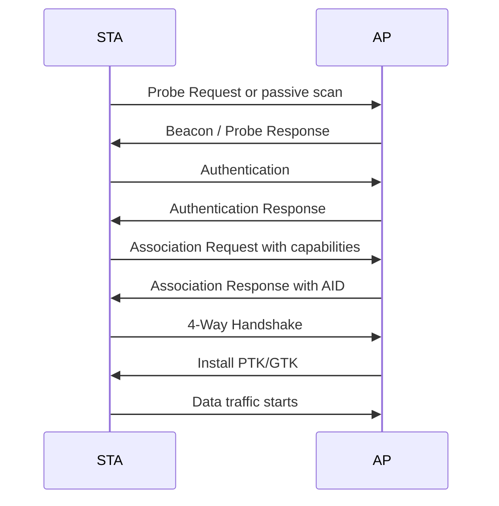

关联阶段会协商大量能力：

- 支持的 band、channel、带宽。
- HT/VHT/HE capabilities。
- MCS/NSS map。
- AMPDU/A-MSDU 能力。
- LDPC、STBC、beamforming。
- 802.11k/v/r roaming 能力。
- Wi-Fi 6 的 OFDMA、TWT、BSS color、spatial reuse、MU-MIMO 等能力。

能力协商会直接影响 TX/RX：

- 对端不支持 HE，就不能用 HE PPDU。
- 对端不支持某个 NSS/MCS，就不能选该速率。
- 没有 BlockAck agreement，就不能对该 TID 做 A-MPDU。
- 密钥未安装，data frame 不能正常加解密。

## 16. 安全加密路径：EAPOL、PN、CCMP/GCMP

Wi-Fi data path 通常会经过加密。现代网络常见 WPA2/WPA3：

- WPA2-Personal 常见 CCMP/AES。
- WPA3-Personal 使用 SAE 认证，数据加密仍常见 CCMP/GCMP。
- 企业网可能涉及 802.1X/EAPOL/RADIUS。

### 16.1 4-Way Handshake 和密钥安装

连接 AP 后，STA 和 AP 通过 4-Way Handshake 派生并安装密钥：

- `PTK`：单播数据密钥。
- `GTK`：组播/广播数据密钥。
- `IGTK/BIGTK`：管理帧保护相关密钥，取决于 PMF 配置。

EAPOL 帧在密钥安装前后有特殊处理，很多驱动会禁止聚合或走高优先级队列，避免握手超时。

### 16.2 TX 加密

TX 时需要：

1. 找到 vif/sta 对应 key。
2. 选择 key index。
3. 递增 PN/packet number。
4. 生成 CCMP/GCMP header。
5. 对 payload 加密并生成 MIC。
6. 写入 FCS 或交给硬件生成。

PN 必须单调递增，重用 PN 是严重安全问题。很多芯片把 PN 递增放在 hardware MAC，host 只配置 key context。

### 16.3 RX 解密和 replay check

RX 时需要：

1. 根据 frame 和 key index 找到 key。
2. 检查 PN 是否大于已接收 PN。
3. 解密 payload。
4. 校验 MIC。
5. 失败则丢弃，并更新安全统计。

如果 RX descriptor 报 decrypt error、MIC error、replay error，问题可能不在 PHY，而是在密钥安装、PN 管理或帧重放检查。

## 17. 聚合、BlockAck、重排和重传

### 17.1 BlockAck 建立

A-MPDU 依赖 BlockAck agreement。建立过程通常通过 ADDBA Request/Response 完成：

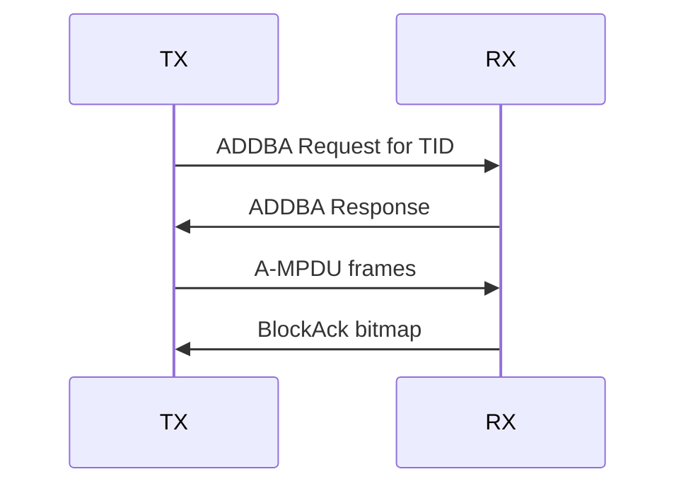

BlockAck agreement 关键参数：

- TID。
- buffer size。
- starting sequence number。
- timeout。
- immediate BA 或 delayed BA，现代高速链路一般使用 immediate BA。

### 17.2 BA bitmap 和 selective retry

A-MPDU 中多个 MPDU 独立确认。接收方回 BlockAck bitmap：

- bit = 1：对应 sequence number 收到。
- bit = 0：没收到或校验失败。

发送方只重传失败的 MPDU，而不是整个聚合。这是 A-MPDU 高效的原因。

### 17.3 RX reorder

因为重传和聚合，MPDU 可能乱序到达。RX reorder buffer 按 `sta + tid` 维护：

- 连续序列号到齐后上交。
- 缺洞等待一段时间。
- 超时后释放后续包，避免卡死。
- duplicate sequence 会丢弃。

reorder 卡住会表现为底层收到包，但上层 TCP/UDP 看不到或延迟很大。

## 18. Wi-Fi 6 更完整的 HE 特性清单

### 18.1 HE PPDU 类型

Wi-Fi 6 中常见 HE PPDU：

- `HE SU`：单用户发送。
- `HE MU`：多用户下行，支持 OFDMA 和/或 MU-MIMO。
- `HE TB`：trigger-based 上行，由 AP trigger 后 STA 发送。
- `HE ER SU`：Extended Range SU，偏覆盖增强。

### 18.2 RU 大小

OFDMA 的基本资源是 RU。常见 RU size：

- 26-tone RU。
- 52-tone RU。
- 106-tone RU。
- 242-tone RU，约等于 20 MHz。
- 484-tone RU，约等于 40 MHz。
- 996-tone RU，约等于 80 MHz。
- 2x996-tone RU，约等于 160 MHz。

小 RU 适合低速率、小包、多用户并发；大 RU 适合高吞吐。

### 18.3 Trigger frame 类型

除了 Basic Trigger，还有其他 trigger 类型，具体支持取决于芯片和 AP：

- `Basic Trigger`：调度 UL data。
- `BSRP Trigger`：Buffer Status Report Poll，询问 STA 有多少上行数据。
- `MU-BAR Trigger`：Multi-User BlockAck Request，请多个 STA 回 BA。
- `BFRP Trigger`：Beamforming Report Poll，请 STA 回 beamforming report。
- `NFRP Trigger`：用于特定反馈场景。

这些 trigger 的共同点是 AP 控制时序，STA 在 SIFS 后响应。

### 18.4 UORA：OFDMA Random Access

`UORA` 是 Uplink OFDMA Random Access。AP 可以在 trigger 中分配随机接入 RU，让没有被精确调度的 STA 竞争某些 RU。它介于完全调度和传统 EDCA 之间，适合大量 STA 偶发小包。

### 18.5 BSR/BSRP：上行缓存状态

AP 要调度上行 OFDMA，需要知道 STA 有没有数据、数据量多大。STA 可以通过 Buffer Status Report 告诉 AP 自己各 AC/TID 的 buffer 情况。AP 也可以用 BSRP Trigger 主动询问。

### 18.6 MU-MIMO 和 Beamforming

OFDMA 是频域切 RU；MU-MIMO 是空间域同时服务多个用户。Wi-Fi 6 可以结合两者。

Beamforming 需要信道状态信息：

1. AP 发 sounding/NDP。
2. STA 测量信道。
3. STA 回 beamforming report。
4. AP 根据 CSI 做 precoding。

TX vector 中可能包含 beamformed、NSS、user position 等信息。RX vector 也可能报告是否 beamformed 以及相关接收质量。

### 18.7 GI、LTF、DCM、LDPC、1024-QAM

`GI` 是保护间隔。短 GI 吞吐高，但抗多径能力弱；长 GI 更稳。

`LTF` 用于信道估计。更多 LTF 有助于多空间流和复杂信道估计，但开销更大。

`DCM` 是 Dual Carrier Modulation，通过两个子载波承载相同信息增强可靠性，牺牲吞吐换覆盖。

`LDPC` 是低密度奇偶校验码，通常比 BCC 有更好纠错能力，但实现复杂度更高。

`1024-QAM` 是 Wi-Fi 6 高阶调制，需要非常好的 SNR，通常在近距离、干净信道下才稳定。

### 18.8 Packet Extension 和 preamble puncturing

`Packet Extension` 是 HE 中为接收端处理时间预留的额外尾部时间，帮助硬件完成解码和响应准备。

`Preamble puncturing` 允许在较宽带宽中避开某些不可用的 20 MHz 子信道，提升频谱使用弹性。是否可用取决于带宽、监管、AP 配置和芯片能力。

## 19. Host-device 实现细节：总线、ring、credit、offload

### 19.1 PCIe、USB、SDIO 差异

不同 host-device 总线会影响 TRX 性能和软件设计：

- PCIe：吞吐高、延迟低，常见于高性能 Wi-Fi 模块。
- USB：通用性好，但调度和批量传输会引入额外延迟。
- SDIO：嵌入式常见，吞吐和中断效率更受限，需要更谨慎的聚合和批处理。

### 19.2 Ring 和 credit

TX ring/RX ring 通常是生产者-消费者模型：

- Host 往 TX ring 填 descriptor，device 消费。
- Device 往 RX ring 填 descriptor，host 消费。
- Doorbell 通知对方有新工作。
- Interrupt/MSI 或 polling 通知 completion。

`credit` 用来做流控。device 告诉 host 还有多少 TX slot、buffer、firmware queue 空间。credit 用完时，host 必须 stop queue，等 completion 或 credit update 后再 wake queue。

### 19.3 Zero-copy、scatter-gather、cache coherency

为了性能，driver 会尽量避免复制数据：

- 使用 DMA map 让 device 直接读 skb fragment。
- scatter-gather 支持一个 descriptor 指向多个 buffer fragment。
- RX 侧可能预先投递 page pool/buffer pool。
- DMA 前后必须处理 cache coherency，否则 device 和 CPU 看到的数据可能不一致。

### 19.4 FullMAC、SoftMAC、offload 边界

Wi-Fi 芯片大致有两类：

- `SoftMAC`：host/mac80211 负责较多 MAC 管理逻辑，device 负责低层实时 MAC/PHY。
- `FullMAC`：firmware 负责更多 802.11 管理和数据路径，host 通过命令接口控制。

常见 offload：

- 加解密 offload。
- checksum offload。
- TCP segmentation 相关 offload，取决于芯片。
- ARP/NS offload，低功耗时 device 代答。
- GTK rekey offload。
- WoWLAN pattern match。
- scan offload。
- beacon filter。
- keepalive。

offload 越多，host 越省电、实时性越好，但调试时也更依赖 firmware log 和硬件计数器。

## 20. 速率控制和链路自适应

TX vector 里的 MCS/NSS/BW/GI/LDPC 不应该理解成固定配置，它们通常来自 rate control。

rate control 的输入包括：

- 每个 rate 的成功率。
- ACK/BA 成功或失败。
- retry 次数。
- RSSI/SNR/EVM。
- 当前带宽、NSS、RU 大小。
- 是否移动、信道是否快速变化。
- 包大小和业务类型。

rate control 的输出包括：

- 初始发送 rate。
- retry chain，每次失败后用什么 fallback rate。
- 是否使用 RTS/CTS。
- 是否缩小带宽。
- 是否降低 NSS。
- 是否降低 MCS。

在 OFDMA 中，rate control 更复杂，因为小 RU、不同用户、trigger-based uplink 的链路预算都不同。AP 调度器还要在公平性和总吞吐之间折中。

## 21. 功耗、省电和调度

省电会显著影响 TRX。

常见机制：

- Legacy PS：STA 睡眠，周期性醒来听 Beacon/TIM。
- U-APSD/WMM-PS：适合语音等业务，通过 trigger frame 触发 AP 下发缓存包。
- TWT：Wi-Fi 6 的目标唤醒时间，AP 和 STA 约定更精确的收发窗口。
- WoWLAN：主机休眠时，device 监听特定模式包唤醒 host。

AP 侧必须知道 STA 是否 asleep。如果 asleep：

- 单播下行包可能缓存。
- Beacon TIM 中设置对应 AID bit。
- STA 醒来后通过 PS-Poll、trigger 或 QoS Null 等方式取包。
- 组播/广播通常等 DTIM。

省电问题常见现象：

- TX 队列有包但不发，因为 peer asleep。
- RX 延迟呈 Beacon interval 周期性。
- WoWLAN 下 host 看不到普通包，但 device 可能已经处理。

## 22. 调试指标和抓包视角

### 22.1 Host 侧指标

看 host driver/mac80211：

- TX queue stopped/waked 次数。
- TX ring available/free descriptor。
- TX completion latency。
- dropped skb 原因。
- per sta/per tid queue depth。
- AMPDU session 状态。
- reorder buffer 状态。
- RX ring refill 失败次数。
- NAPI poll budget 是否打满。

### 22.2 Firmware/hardware 指标

看 firmware/hardware：

- CCA busy time。
- channel busy ratio。
- TX retry histogram。
- PER/FER。
- BA bitmap 缺口。
- AGC gain index。
- false detect。
- RX FCS error。
- decrypt/MIC/replay error。
- PHY error code。
- Trigger received/responded count。
- RU allocation 统计。
- TX power backoff。

### 22.3 空口抓包要点

用 monitor/sniffer 看 Wi-Fi 6 时，要注意：

- 抓包网卡是否支持 HE radiotap 字段。
- 是否能抓到 control frame、trigger frame。
- monitor 网卡所在信道和带宽是否匹配。
- OFDMA 下 sniffing 不一定能完整解所有 RU。
- 加密数据即使抓到也可能无法解密 payload，但 MAC/PHY metadata 仍有价值。

### 22.4 常见问题定位矩阵

| 现象 | 可能层次 | 优先检查 |
| --- | --- | --- |
| skb 进入 driver 但空口无包 | host/device 队列 | TX ring、credit、queue stop、firmware drop |
| 空口有包但无 ACK | MAC/PHY/对端 | rate、TX power、信道、地址、对端省电 |
| ACK 有但吞吐低 | 聚合/速率/竞争 | AMPDU 长度、MCS、retry、CCA busy |
| RX FCS error 高 | PHY/RF | RSSI、SNR、AGC、频偏、干扰 |
| decrypt error | 安全 | key index、PN、GTK/PTK、rekey |
| 上层丢包但底层收到 | reorder/host | reorder timeout、duplicate、RX ring、NAPI |
| OFDMA 不生效 | 能力/调度 | HE capability、AP 配置、Trigger、RU 统计 |

## 23. 从讲座名词到系统全景的记忆框架

可以按五条线记：

1. 数据线：`skb -> MSDU -> MPDU -> A-MPDU -> PSDU -> PPDU -> air`，反向则是 RX 解调、MAC 处理、skb 上交。
2. 上下文线：`vif -> sta -> tid/ac -> key -> queue -> descriptor`。
3. 实时线：`EDCA/CCA/backoff/NAV/SIFS/ACK/BA/Trigger`，这些通常由 device/firmware/hardware MAC 保证。
4. PHY 线：`preamble -> SIG -> TX/RX vector -> MCS/NSS/BW/GI/LTF/RU -> PHY/RF`。
5. Wi-Fi 6 线：`HE PPDU -> OFDMA/RU -> Basic Trigger/HE TB -> TWT/BSS Color/Spatial Reuse -> MU-MIMO/Beamforming`。

## 24. 多角色并发：SCC、MCC、DBAC、DBDC、DBS

TRX 主链路默认只看一个 vif、一个 channel context。但真实芯片经常要同时跑多个角色，例如 STA + SoftAP、STA + P2P、STA + NAN、连接同时扫描。这时就会遇到一组并发概念。

`SCC` 是 Single Channel Concurrency，单信道并发。多个角色在同一个信道上工作，例如 STA 和 SoftAP 都在 2.4 GHz channel 6。它对 TX/RX 链路影响最小，因为 RF 不需要切信道。

`MCC` 是 Multi Channel Concurrency，多信道并发。多个角色在不同信道上工作，例如 STA 在 channel 1，P2P GO 在 channel 11。单 radio 芯片通常靠 time slicing：一段时间服务 STA channel，一段时间切到 P2P channel。

`DBAC` 常见解释是 Dual Band Active Concurrency，双频活跃并发。它强调活跃角色分布在不同 band，例如 STA 连 2.4 GHz AP，同时 SoftAP 开在 5 GHz。DBAC 可能是单 radio 分时，也可能是双 radio 真并行，取决于芯片架构和厂商定义。

`DBDC` 是 Dual Band Dual Concurrent，双频双并发，通常更强调有两套较独立的 MAC/PHY/RF 或接近独立的硬件链路，可以 2.4G 和 5G 同时工作。

`DBS` 是 Dual Band Simultaneous，双频同时。很多产品规格会把 DBS 和 DBDC 接近使用，表示 2.4G + 5G 同时在线或同时传输。看规格时不要只看缩写，要确认是否真能同时收发、是否共享天线/PHY/RF、支持哪些 role 组合。

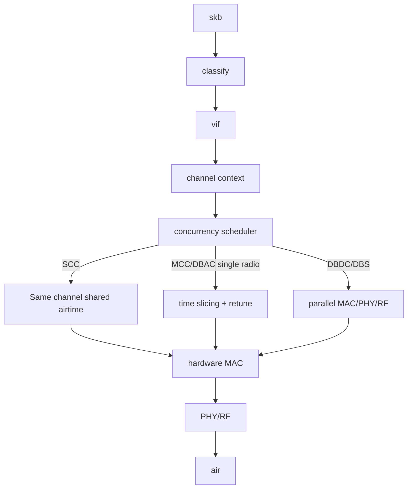

这些并发能力会改变 TX/RX 的关键点：

- TX classify 不只找 `vif + sta + tid`，还要关联到 channel context。
- firmware scheduler 要决定当前 radio 服务哪个 role。
- 单 radio MCC/DBAC 下，TX completion 可能因为等待时间片而延迟。
- RX 在 radio 离开某个 channel 时无法接收该 channel 的包。
- SoftAP/P2P GO 要保证 Beacon 准时，STA 要避免 beacon miss。
- scan、BT coexistence、省电、TWT 都会进一步抢占时间片。

调试 DBAC/MCC 问题时要额外看：

- per role airtime。
- dwell time。
- channel switch/retune latency。
- beacon miss count。
- SoftAP/P2P beacon jitter。
- per role queue depth。
- scan off-channel 时间。
- BT coexistence grant/deny。

更完整的芯片公司视角说明见 `docs/wifi-chip-company-knowledge-map.md` 的“多角色、多信道、多频段并发”章节。

## 25. 一句话总结

发送方向，host 负责把 skb 分类成 `vif + sta + tid` 的发送上下文，并通过 descriptor/shared memory 把数据交给 device；device 的 firmware/hardware MAC 负责实时队列、聚合、竞争或 trigger 响应，并生成 TX vector 让 PHY 发射。接收方向，PHY 先通过 AGC、preamble、RX vector 和解调得到 MPDU，hardware MAC 做校验、解密、拆聚合、重排，再通过 shared memory 把数据和状态交给 host，最终变回 skb 上交网络栈。Wi-Fi 6 的 OFDMA、Basic Trigger、SIFS、TBTT、TWT、BSS Coloring 等机制，主要影响的是 device 侧实时 MAC/PHY 调度，以及 host 侧如何提前准备队列和上下文。
